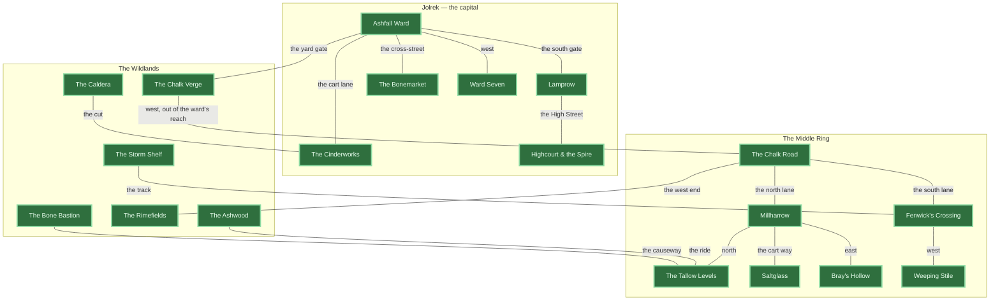

# 12 — An Atlas of Azo

Where everything in the game actually is, and which of it you can stand on.

`docs/11_world_of_azo_and_the_kings_contracts.md` is the geography and the plot; it was written
before any of it shipped and it describes the world as intended. This document describes the
world as **built**, derived from `src/`. Per the README's rule — where the docs and the code
disagree, the code wins — the code is the only source consulted here for anything load-bearing.

> **`docs/11` §8 is stale.** It says *"there is no wildland map"*. There is one now: the Chalk
> Verge. Everything else in §8 still holds.

---

## The three states a place can be in

Every entry below carries one of these. The distinction is the entire point of the document.

| State | Meaning |
|---|---|
| 🟢 **Walkable** | An `AreaDef` in `src/district/areas/`. You roam it in 3D, on real ground, with collision. |
| 🟡 **Arena only** | Fights happen *there* — a registered `EncounterDef` names it — but it is a combat grid, not a place. You never walk to it; you accept a contract and the board loads. |
| ⚪ **Named only** | Appears in flavour text or dialogue. Nothing in code references it as a location. |

**Nineteen named places. All nineteen are walkable.**

---

## 1. The world at a glance



**The same thing in one sentence, for anyone reading this in a terminal:** every named place in
Azo is now walkable and every edge on that graph is a crossing you can take on foot — nineteen
areas and eighteen crossings, from the Caldera in the west to the Storm Shelf in the east. It was
three edges and four places not long ago — Ashfall through the yard-wall gate onto the Chalk Verge,
Ashfall through the south gate into Lamprow, and the Verge west onto the Chalk Road — and every
other connection above is fiction the player travels by accepting a contract.

---

## 2. The walkable world

The four places with ground under them. All four are `defineArea` calls; `TILE = 4` world units,
and every coordinate below is in world units as the code writes them.

They are deliberately not four versions of the same thing. Ashfall has pavement and a Warden and
nothing roaming it; the Verge has roaming packs and no pavement at all; **Lamprow has both**, which
makes it the only ward where you can watch a pack's cone go dark as you step up onto the flags; and
the **Chalk Road** is a corridor rather than a room, built long so that three roam circles can
overlap on one stretch and a Combat Ring has something to pull.

### 2.1 Ashfall Ward 🟢

`src/district/areas/ashfall.ts` — 20 × 20, `safety: 'sidewalk'`, `horizon: 'city'`

```
     col 0         1         2
         0123456789012345678901
row  0   WWWWWWWWWWWWWWWWWWWW     the canal
     1   WWWWWWWWWWWWWWWWWWWW
     2   ##cccccccccccccccc##     quay
     3   ##cccc......cccccc##     the sealed yard
     4   ##cccccccccccccccc##
     5   ##VVVVVVVVVVVVVVVV##     yard wall — the GATE is here, col 11
     6   #cccccccccSSccccccc#
     7   #ccBBBBBBcSScBBBBBB#
     8   #cc......cSSc......#     west: warehouse yard (the Warden)  east: back alley
     9   #cc......cSSc......#
    10   #cc......cSSc......#
    11   #ccBBBBBBcSScBBBBBB#     ARTIFICER (west)      FIELD JOURNAL (east)
    12   #SSSSSSSSSSSSSSSSSS#     the cross-street
    13   #SSSSSSSSSSSSSSSSSS#
    14   #ccBBBBBBcSScBBBBBB#     APOTHECARY (west)     VIVARIUM (east)
    15   #ccBBBBBBcSScBBBBBB#
    16   #ccccccccSSSScccccc#     Vex, the Dispatcher
    17   ##cccccSSSSSSSScccc#     the plaza — SPAWN, and the bounty board
    18   ###ccccSSSSSSSScc###
    19   ####################
```

| Char | Tile | Walk | Safe |
|---|---|---|---|
| `S` | sanctioned walkway | ✅ | ✅ **no Warden may see you here** |
| `c` | cobbles | ✅ | ❌ |
| `.` | broken cobbles | ✅ | ❌ |
| `#` | scrub verge | ✅ | ❌ |
| `W` | canal | ❌ | — |
| `B` | building | ❌ | — (4.8–7.0 tall, split silhouette, chimneys) |
| `V` | yard wall | ❌ | — (3.2 tall, unbroken) |

**What stands in it**

| Thing | Where | Note |
|---|---|---|
| Spawn | `(4, 30)` | the plaza, in sight of Vex |
| Vex, the Dispatcher | `(-2, 27)` | Dispatch — the board's owner |
| Bounty board | `(12, 29)` | all three tier posters |
| The Ironworks Artificer | door `(-18, 9.4)` | forge: schematics, ascension, splicing |
| The Field Journal | door `(22, 9.4)` | bestiary / threat ledger |
| The Apothecary | door `(-18, 14.6)` | |
| The Vivarium | door `(22, 14.6)` | companions; the Ignis Trial is taken from here |
| The Warden's beat | `(-24,-6) → (-8,-6) → (-8,2) → (-24,2)` | clockwise round the warehouse yard — see §2.7 for what happens when it catches you |
| Gas lamps | ×10, all on `S` tiles | **the light *is* the safe zone** — they must line up |
| Crates | ×4 | kept clear of the patrol rectangle so it never snags |

**Its four graffiti lines**, anchored to explicit walls rather than to a door's array index:

| Text | Wall | Faces |
|---|---|---|
| `THE ENGINES EAT OUR MARROW` | `(-18, 8.05)` | south |
| `THE CENSUS COUNTS DOWN` | `(22, 8.05)` | south |
| `VANE'S LIGHT IS OUR DARK` | `(-18, 15.95)` | north |
| `DON'T CARRY IT IN` | `(22, 15.95)` | north — *should* be Highcourt's last wall, late-campaign only |

`safety: 'sidewalk'` makes this the only place in the game where the law protects you. The four
trades sit on the cross-street, two facing north and two facing south, so a new Commander can
walk the entire guided lap without once stepping off the pavement. Leaving it is a choice.

### 2.2 The Chalk Verge 🟢

`src/district/areas/chalkVerge.ts` — 24 × 16, `safety: 'none'`, `horizon: 'treeline'`

Deliberately **oblong**. Ashfall is square and every grid routine assumed that silently until
`extractRects` was taught otherwise; an oblong second area is what keeps the assumption from
creeping back.

```
     col 0         1         2
         012345678901234567890123
row  0   TTTTTTTTTTTTTTTTTTTTTTTT   the treeline, north
     1   TT####..####..####..##TT
     2   T#,,,,,,,,,,,,,,,,,,,,#T   the north track
     3   T#,,,,RR,,,,,,,,RR,,,,#T
     4   T#,,,,RR,,,,,,,,RR,,,,#T
     5   T#,,,,,,,,,,,,,,,,,,,,#T
     6   T#..,,,,,,TT,,,,,,,,..#T   the middle thicket
     7   T#..,,,,,,TT,,,,,,,,..#T
     8   T#,,,,,,,,,,,,,,,,,,,,#T
     9   T#,,,,RR,,,,,,,,RR,,,,#T
    10   T#,,,,RR,,,,,,,,RR,,,,#T
    11   T#,,,,,,,,,,,,,,,,,,,,#T   the south track
    12   T#....,,,,,,,,,,,,....#T
    13   TT####..####..####..,,TT   the gate approach — SPAWN at col 20
    14   TTTTTTTTTTTTTTTTTTTT,,TT   the cut back to the ward
    15   TTTTTTTTTTTTTTTTTTTTTTTT
```

| Char | Tile | Walk |
|---|---|---|
| `,` | chalk track | ✅ |
| `#` | scrub | ✅ |
| `.` | spoil | ✅ |
| `R` | rock outcrop | ❌ (2.2–3.6, lumpy, unsplit) |
| `T` | thicket | ❌ (4.0–5.4, tall enough to break a sightline) |

**There is no `S`.** Nothing here is safe ground, and the absence is the design rather than an
oversight — `safety: 'none'` hides the zone chip and the danger vignette entirely instead of
pinning them to EXPOSED for as long as you are here. Out here nothing is watching you because
nothing needs to be; the things on this road do not require a warrant. It gets no gas lamps for
the same reason: lamps *are* the safe zone in Ashfall, so lighting this place with them would
be a lie. Its light comes from the packs and the banked fire at the trailhead.

**What stands in it**

| Thing | Where | Note |
|---|---|---|
| Spawn / trailhead | `(34, 22)` | also where a **lost** fight puts you back |
| Hunt signpost | `(26, 14)` | the twelve Wild Hunts, and the only place the cooldowns are legible |
| Chalk-Road Scavengers | `(-10, 0)`, roam 9 | novice pack |
| The Verge Strays | `(0, 8)`, roam 9 | novice pack |
| Spoil-Heap Hollows | `(6, -4)`, roam 9 | adept pack |
| Crates | ×3 | spoil and abandoned kit |

The three roam circles **overlap deliberately**, and they used to be spread precisely so they
could not — two packs converging on one player was a fight nothing modelled, and the contact
handler was first-come. The **Combat Ring** models it now:

- Walk into a pack off the pavement and your input locks while a ring of light expands from
  the contact point to five units over **2.5 seconds**.
- Any other pack the ring reaches in that window is **pulled in** — capped at two, and a
  third is ignored rather than queued, because being jumped by four things at once is a loss
  with extra steps.
- **The grid then forms on the road itself.** No screen wipe and no swap to a separate board:
  the arena is laid on real district tiles inside the circle, the camera swings from the walk
  framing down to a fixed tactical one, and the Commander and their beast take their places at
  the near edge. The word BATTLE used to flash here to cover the cut to a 2D canvas; there is
  no cut to cover any more. See §2.6.
- There is no pre-combat beat for a pack: an ambush that stops to ask which cards you would
  like is not an ambush.
- Each pulled pack sends the squad its reinforcement budget buys, arriving together at the
  start of **Round 2**, and pays its own spoils. You are compensated **+1 banked Bone and +1
  card per pack pulled**, at the start of your round-two turn.
- Win and every pack that was in the fight goes off the road on the same ten-minute clock.
  Lose and all of them are still standing where you left them.

Out here nothing suppresses a pack's cone, because there is no `S` to stand on. That is what
makes the verge the place the mechanic is taught.

### 2.3 Lamprow 🟢

`src/district/areas/lamprow.ts` — **22 x 20**, `safety: 'sidewalk'`, `horizon: 'city'`,
two rows of the lighters' cut along the north edge.

The ward that pays for its own light. It keeps Ashfall's legend unchanged — the same flags,
cobbles, weeds, canal, terraces and yard wall — because two Jolrek wards should be built out of
the same materials and differ in their plan, not their stone.

**Why it is walkable ground.** It is the only place in the world with **pavement and packs at
once**. Ashfall has a Warden and nothing roaming; the Verge has crews and no pavement; neither
shows what the walkway is actually worth. Here the High Street runs the full width of the map
with the Sink below it, and *both* roam circles reach up over the kerb — so a cone goes out the
moment you step up onto the flags and comes back on the moment you step down.

| Band | Rows | What is there |
|---|---|---|
| The cut | 0–1 | Water, impassable. Trees along the bank at row 2 |
| The quay and wharf lane | 2–3 | Open cobbles the width of the ward |
| The bonded warehouse / lighters' yard | 4–7 | A `B` terrace west, open yard east, a `V` wall on the east corner — **the Warden's beat** |
| The back lane | 8–9 | Cobbles and a second terrace |
| **The High Street** | 10–11 | `S` flags, cols 0–20, **open at the west end** — the mouth back to Ashfall |
| The step down | 12 | Cobbles |
| **The Sink** | 13–16 | Two small blocks, otherwise broken ground — **both packs live here** |
| South lane | 17–19 | Cobbles, then grass |

| | Position |
|---|---|
| Spawn | `(-26, 2)` — on the flags, and it must be: a seizure returns you to the spawn-seeded safe spot |
| Warden beat | `(2,-22) → (30,-22) → (30,-14) → (2,-14)`, clockwise round the yard |
| **The Lampwick Gutter Crew** | `(0, 12)`, roam 7 — novice |
| **The Tithe-Takers** | `(10, 14)`, roam 7 — adept |
| Lamps | 7, every one on High Street flags at `z = 6` |
| Exit | `(-42, 4)` → Ashfall `(26, 32)`. No gate: the frame `world.ts` builds is an east–west wall, wrong for a street leaving the west edge |

The two circles sit 10.2 apart against 14 of combined reach, so the Ring can pull one crew into
the other's fight; and both reach `z = 5` and `z = 7` against a kerb at `z = 8`.

### 2.4 The Chalk Road 🟢

`src/district/areas/chalkRoad.ts` — **32 x 12**, `safety: 'none'`, `horizon: 'treeline'`,
no water. The longest map in the game, and the first tile of the Middle Ring you can stand on.

The atlas already called the Verge "the first wild stretch of the Chalk Road"; this is the same
road further out. Ploughed strips either side, hedgerows north and south, and nothing sanctioned
anywhere on it.

**Why the shape.** A road is a corridor with sightlines down it, so the fighting happens where
those sightlines break. Waystones are set in pairs at rows 5 and 7 and **never on row 6**, which
keeps the artery open end to end while giving three roam circles something to hide behind.

| Band | Rows | What is there |
|---|---|---|
| Hedgerow | 0 | Impassable, the whole width |
| Ploughed strips | 1–3 | `field` paint, broken by two north–south hedge stubs |
| North verge | 4 | Grass with weeds spilling into it |
| **The road** | 5–7 | `chalk` track, cols 1–31. Waystone pairs at rows 5 and 7; **row 6 always clear** |
| South verge | 8 | Grass |
| Ploughed strips | 9–10 | One more hedge stub |
| Hedgerow | 11 | Impassable |

| | Position |
|---|---|
| Spawn | `(54, 2)` — the east trailhead, where a lost fight puts you back |
| **The Waywatch** | `(-30, 2)`, roam 10 — novice |
| **Hedgerow Vermin** | `(-16, 4)`, roam 10 — novice |
| **The Freight-Pickers** | `(-26, -4)`, roam 10 — adept, and the only three-body all-ranged pack in the game |
| Exit | `(62, 2)` → Verge `(-42, -8)`. No gate — it is the same road, and the join is only where the fields start |
| West end | Open. The road runs out of the cut into the Rimefields, which makes it the only map you can cross without stopping |

Pair distances are **14.1 / 7.2 / 12.8** against 20 of combined reach — far tighter than the
Verge. The seven-unit pair is what makes a two-pull something you can walk into on purpose, and
the third crew is close enough to be reached by a ring with room and refused by one without,
which is the `MAX_PULLS` cap where it can actually be seen.

### 2.5 The crossings

Three real edges in the world, and the numbers most likely to drift:

| | Hotspot | Gate collider | Arrives at |
|---|---|---|---|
| Ashfall → Verge | `(4, -15.6)` — on the walkway, south of the wall | `(4, -18)` — the yard wall, row 5 | `(34, 22)` — the verge trailhead |
| Verge → Ashfall | `(34, 26)` | *none* | `(4, -12.4)` — back onto pavement |
| Ashfall → Lamprow | `(26, 35.6)` — the south plaza edge | `(26, 38)` — the south wall, row 19 | `(-36, 4)` — Lamprow's High Street |
| Lamprow → Ashfall | `(-42, 4)` — the west mouth of the High Street | *none* | `(26, 32)` — Ashfall's plaza |
| Verge → Road | `(-46, -8)` — the west cut | *none* | `(56, 2)` — the road's east end |
| Road → Verge | `(62, 2)` | *none* | `(-42, -8)` — back onto the verge |

Only the two **gates** carry a collider, and only Ashfall has them: a gate is the Magistracy
sealing something, and the Magistracy does not seal open country. Both gate meshes face
north–south because that is the only orientation `world.ts` builds — an unrotated
`PlaneGeometry(8, 4.6)` with an 8 x 1.2 collider — which is why the Lamprow crossing is cut
through Ashfall's **south** edge rather than its east.

The gate collider is **explicit data on the exit**, not derived. It used to be computed as a
stride north of the hotspot, which is true of the ward's yard wall and false of any doorway
facing the other way — in the verge that put the wall between the arrival tile and the way out.

---

### 2.6 The fight happens where you were standing

A fight picked up on the road is now played **in the district**, on the ground the ring closed
on. There is no screen swap. The 2D isometric board still exists and is still what a Bounty
Board contract opens; what changed is that the road no longer borrows it.

**How the board finds somewhere to stand.** The combat grid and the district grid share a tile
pitch — `TILE` world units either way — so the arena is snapped onto real district tiles rather
than floated over them. `combat/WorldBoard.ts` scans every window of the area's own ASCII grid
for one that fits the encounter's footprint, scored by distance from the ambush, and takes the
nearest clear one.

"Clear" is narrower than "walkable", deliberately: grass, field, verge and broken cobble are
all fine ground to have a fight on, and demanding walkable ground would rule out most of the
Chalk Road, whose road proper is three rows deep against encounters that want up to nine. Only
**buildings and open water** disqualify a tile.

Every pack shares one 7×6 arena, and every area that roams packs can seat it cleanly — asserted
in `worldBoard.test.ts` against the actual pack list rather than assumed. **Ashfall cannot**,
and does not need to: it roams nothing, and the only fight that starts there is the Warden's.
Its best 7×6 window clips the corner of one terrace, three tiles of forty-two, and those
buildings simply fade out of the way through the same occluder machinery that already fades a
wall standing between the camera and the player.

**What the descent does**, over about two seconds:

| | |
|---|---|
| The grid | Blooms outward from the centre in squares, drawn as light *on* the road so the paving still shows through underneath |
| The camera | Walk framing (fov 28, pitch 50, distance 22) → tactical (fov 42, pitch 42, distance ~36 for a pack arena), yaw snapped to **zero** |
| The bodies | The Commander and their beast walk to the near edge — off the grid but on the field, the same geometry the 2D board draws its portraits in |
| The fog | Scaled down, and this one is not cosmetic — see below |
| The street | Packs and the Warden hold still; the walking HUD hides |

Yaw goes to zero rather than to a diagonal. The 2D board is a 2:1 diamond and matching it was
the obvious move, but the grid out here is laid on district tiles and is therefore
world-axis-aligned: at yaw zero its rows run straight across the screen, with the enemy's home
rows at the top and the player's at the bottom.

**The fog override is load-bearing.** `FogExp2` attenuates by `1 - exp(-(density × distance)²)`.
The walk camera sits 22 units out; framing a whole arena needs about 36. At Lamprow's authored
density of 0.036 that is **95% of the board's contrast gone** — the grid is simply not visible.
So each area's density is scaled to hit a fixed legible depth while the board is up, and
restored on the way out. It is a scale rather than an absolute so every area keeps its own
character: the Chalk Road needs no correction at all and stays the clearest place in the game.

**What was reused, and what is new.** Almost all of it was reused. `CombatSession` is a pure
reducer; `EntityViewMap` already stored positions as fractional *tile* coordinates;
`TargetingController` speaks only `Coord` and has no camera at all; the `Hud` is DOM. `Fx` — the
whole effects layer — asks a camera four questions, none of them isometric, so naming that set
`FxCamera` was enough to run it verbatim over a perspective projection. New: three drawing
layers (`BoardMesh` for the ground, `BodyLayer` for the bodies, `OverlayCanvas` for what floats
above), the placement search, and the descent.

### 2.7 What a Warden does when the cone catches you

It used to be an **arrest**: a flash reading SEIZED, a teleport back to the last flagstone, and
nothing owed. That was deliberate — a lesson rather than a tax, because charging the Pact there
punishes the one player who went to find out what the rule meant, which is precisely the player
who was doing it right.

It is now a **fight**. The Warden serves `warden_writ` — *The Warden's Writ* — and the circle
opens on **the Warden**, not on you.

| | |
|---|---|
| The squad | `anvil_lord` + three `vanguard_footman` — 4+2+2+2 on the same ten-point ladder every pack is costed on |
| Arena | 7×6, `victory: 'rout'`: clear the detail and it is over |
| Filed as | a `PackDef`, so it inherits the budget re-derivation in `packs.test.ts` and the eight balance playouts. It is the one pack in the game never placed on a map |
| Cooldown | the same ten-minute hunt clock, so a beaten Warden does not re-arrest you on the walk home |

**The lesson survives the change.** Losing still returns you to `lastRefuge`, which in a ward
with pavement *is* the last flagstone — so a loss costs the walk back, exactly as the arrest
did. What changed is that the rule now has something behind it.

**Packs stay candidates for that circle**, and that is not an oversight. A Warden only ever
catches you *off* the pavement, which is precisely where packs are live — so an arrest that
drags a gutter crew in with it comes free, out of machinery that already exists, and is the
best thing that can happen in this ward.

**The old escort is still the fallback.** If a contract is already open against your name the
writ cannot be served, and rather than nothing happening you are escorted back onto the flags —
which is what the arrest always was.

## 3. Jolrek, the capital

A city built upward because Vane taxed the ground. Six named places, and you can walk all six.

| Place | State | What is fought there |
|---|---|---|
| **Ashfall Ward** | 🟢 walkable | `curfew_breakers` (N4), `gutter_dispute` (N9) |
| **Lamprow** | 🟢 walkable | `lamprow_tithe` (N1), `lamplighter_escort` (N3), `debt_collected_minor` (N5); packs **Lampwick Gutter Crew**, **Tithe-Takers** |
| **The Bonemarket** | 🟢 walkable | `bonemarket_vermin` (N2) → binds **Cinder-Wasp Swarm** |
| **The Cinderworks** | 🟢 walkable | `poster_work` (N8); `dynamo_flats` (M7, "the flats") → binds **Kinetic Dynamo**; hunt `hunt_cinderworks_salamander` → **Flue Salamander** |
| **Highcourt & the Spire** | 🟢 walkable | `smoke_eaters_rest` (N6, wager) → binds **Dolmen Crab**; `relocation_train` (M8, the undercroft); `the_summons` (M10, the throne room) |
| **Ward Seven** | 🟢 walkable | `fouled_cistern` (N7) → binds **Grave-Gargoyle** |

`clinic_quota` (N10) is a back-alley clinic in Jolrek with no ward named.

---

## 4. The Middle Ring

Towns and farmland. Seven named places, all of them walkable, hung off the Chalk Road with
**Millharrow as the hub** — the crossroads has a road out of each of its four edges, which is
what turns the Ring from a list into a region.

| Place | State | What is fought there |
|---|---|---|
| **The Chalk Road** | 🟢 walkable | the artery to Jolrek; hunts `hunt_chalk_boar` → **Ferrum**, `hunt_chalk_cut_ram` → **Quarry Ram**; packs **Waywatch**, **Hedgerow Vermin**, **Freight-Pickers**. Its first wild stretch *is* the Chalk Verge |
| **Millharrow** | 🟢 walkable | `chalk_road_toll` (A1), `drowned_granary` (A9) → binds **Obsidian Tortoise**, `waystone_duel` (A10, wager) → binds **Voltbriar Serpent** |
| **The Tallow Levels** | 🟢 walkable | `tallow_blight` (A2) → binds **Crimson Treant**; hunt `hunt_tallow_aurochs` → **Moss Aurochs** |
| **Saltglass** | 🟢 walkable | `saltglass_riot` (A3); hunt `hunt_saltglass_seal` → **Saltglass Seal** |
| **Bray's Hollow** | 🟢 walkable | `warrant_of_distraint` (A4) |
| **Fenwick's Crossing** | 🟢 walkable | `night_freight` (A5), `cellar_clearance` (A7) |
| **Weeping Stile** | 🟢 walkable | `hollow_census` (A8) → binds **Murk Heron** |

`ashwood_poacher` (A6) is fought on the Ashwood fringe — see below.

---

## 5. The Wildlands

Six named regions, all walkable. They are the newest ground in the world and the least like
the rest of it — the Caldera and the Rimefields are the only areas with no made surface on them
at all, and the Ashwood is the only one with no visible boundary.

| Region | State | Contracts | Hunts | Packs |
|---|---|---|---|---|
| **The Chalk Verge** | 🟢 walkable | — | signpost to all twelve | **3** — Scavengers, Strays, Hollows |
| **The Caldera** | 🟢 walkable | `caldera_chimera` (M1) → **Chimera of the Caldera** | `hunt_caldera_drake` → **Ignis** | — |
| **The Ashwood** | 🟢 walkable | `ashwood_poacher` (A6, wager) → **Winterthorn Elk**; `wildfire_writ` (M5) | `hunt_ashwood_warden` → **Sylva**; `hunt_ashwood_stag` → **Mortis** | — |
| **The Rimefields** | 🟢 walkable | `rimefield_break` (M2) → **Glacial Juggernaut** | `hunt_rimefield_bear` → **Boreas** | — |
| **The Storm Shelf** | 🟢 walkable | `storm_shelf_binding` (M3) → **Storm-Mantis**; `pylon_nine` (M4) → **Volatile Geist** | `hunt_shelf_lynx` → **Voltara**; `hunt_pylon_kite` → **Conduit Kite** | — |
| **The Bone Bastion** | 🟢 walkable | `bone_bastion` (M9) → **Bone Bastion Sovereign** | `hunt_barrow_jackal` → **Barrow Jackal** | — |

`coldwater_duel` (M6) is fought "on ground of her choosing" — the only contract in the game
that names no place at all.

---

## 6. Where the twenty-seven species live

Every species has exactly one acquisition route, and which kind of route it is says everything
about the design: **the wild repeats, the story does not.**

### The twelve on the hunt rotation — repeatable, 10-minute cooldown

| Species | Title | School | Region | Hunt |
|---|---|---|---|---|
| Ignis | Ember Drake | pyre | The Caldera | `hunt_caldera_drake` |
| Flue Salamander | Chimney Fire | pyre | The Cinderworks | `hunt_cinderworks_salamander` |
| Boreas | Frost Bear | frost | The Rimefields | `hunt_rimefield_bear` |
| Saltglass Seal | Harbor Ghost | frost | Saltglass | `hunt_saltglass_seal` |
| Voltara | Storm Lynx | surge | The Storm Shelf | `hunt_shelf_lynx` |
| Conduit Kite | Pylon Nester | surge | The Storm Shelf | `hunt_pylon_kite` |
| Mortis | Carrion Stag | dusk | The Ashwood | `hunt_ashwood_stag` |
| Barrow Jackal | Grave-Digger | dusk | The Bone Bastion | `hunt_barrow_jackal` |
| Sylva | Thorn Warden | bloom | The Ashwood | `hunt_ashwood_warden` |
| Moss Aurochs | Fallow Warden | bloom | The Tallow Levels | `hunt_tallow_aurochs` |
| Ferrum | Vault Boar | bulwark | The Chalk Road | `hunt_chalk_boar` |
| Quarry Ram | Chalk Breaker | bulwark | The Chalk Road | `hunt_chalk_cut_ram` |

Two per school, and **all six founders are on the list including the one you enrolled with** —
a second Ignis is a different eight cards, a different knack, a different constitution, and a
one-in-a-hundred chance of lustrous.

### The fifteen hybrids — bound once each, off a named enemy

| Species | Title | Schools | Bound off |
|---|---|---|---|
| Chimera of the Caldera | Caldera Chimera | pyre + frost | `caldera_chimera` (M1) |
| Cinder-Wasp Swarm | Ember Swarm | pyre + surge | `bonemarket_vermin` (N2) |
| Cinder Shade | Lamp-Eater | pyre + dusk | `coldwater_duel` (M6, wager) |
| Crimson Treant | Ashwood Warden | pyre + bloom | `tallow_blight` (A2) |
| Obsidian Tortoise | Caldera Bulwark | pyre + bulwark | `drowned_granary` (A9) |
| Storm-Mantis | Rime Conductor | frost + surge | `storm_shelf_binding` (M3) |
| Grave-Gargoyle | Black Ice | frost + dusk | `fouled_cistern` (N7) |
| Winterthorn Elk | Rimebloom | frost + bloom | `ashwood_poacher` (A6, wager) |
| Glacial Juggernaut | Icebreaker | frost + bulwark | `rimefield_break` (M2) |
| Volatile Geist | Aether Siphon | surge + dusk | `pylon_nine` (M4) |
| Voltbriar Serpent | Hedge Lightning | surge + bloom | `waystone_duel` (A10, wager) |
| Kinetic Dynamo | Momentum Engine | surge + bulwark | `dynamo_flats` (M7) |
| Murk Heron | Fen Reaper | dusk + bloom | `hollow_census` (A8) |
| Bone Bastion Sovereign | Marrow Bastion | dusk + bulwark | `bone_bastion` (M9) |
| Dolmen Crab | Hedgefort | bulwark + bloom | `smoke_eaters_rest` (N6, wager) |

All fifteen school pairings, each exactly once. A hybrid on a ten-minute timer would flatten
the arc's most particular rewards into a shopping list.

> **The arithmetic the game never states.** A killed apex pays its contract; a bound one pays
> the same contract *and* joins the roster. Every fight in the game that fields a beast can end
> in a binding instead of a kill. The generous reading is the profitable one, and the game
> leaves the player to notice.

---

## 7. The three clocks

| Kind | Count | Repeats? | Where posted | Pays |
|---|---|---|---|---|
| **Story contracts** | 30 | Never — walked once, in tier order | The bounty board, Ashfall | Novice 40 / Adept 85 + 1 shard + 1 core / Master 160 + 3 shards + 2 cores |
| **Wild Hunts** | 12 | Every **10 minutes** of wall-clock | The verge signpost | its own tier's rate, plus the beast |
| **Roaming packs** | 8 | Respawn where they walk | Nowhere — you walk into them | shards + modest coin |
| **The Warden's Writ** | 1 | Every **10 minutes**, same clock as a hunt | Nowhere — it is served on you (§2.7) | adept rate |

When a tier's story arc is exhausted the board falls back to **rolled pools**:
`novice_duelist` (novice); `narrow_ruin`, `glacial_field` (adept); `ignis_trial` (master). These
four are the only registered fights with no geography at all — they are pure arenas, and the
Trial is also reachable straight off the Vivarium.

The hunt cooldown is **wall-clock, not play-time**: it runs down while the game is closed. That
is deliberate — a ten-minute timer that only ticks while you stare at it is a tax on attention,
and this one is meant to be a reason to go do something else in the ward.

---

## 8. What this atlas makes visible

Not a wishlist. Just the honest read of the table above.

1. **Every named place now has ground under it.** Nineteen areas, eighteen crossings, and the
   deepest point in the world — the Ashwood, or the Bone Bastion — sits five crossings from
   Ashfall's plaza. That distance is the thing the walkable world buys that a menu cannot.
2. **Almost none of it has anything in it.** The wards, towns and wilds were built as places to
   walk, and that is all they are: no packs outside the Chalk Road, the Verge and Lamprow, no
   Wardens outside Ashfall and Lamprow, no doors outside the ward, no boards, no signposts. The
   world is a body with most of its contents still to come.
3. ~~**The contracts still do not know the ground exists.**~~ **Resolved.** The board is a
   briefing surface now: a poster names the job, the pay and the ground, and every story
   contract launches from a walk-to site in the ward its fiction names (`district/sites.ts`
   — one site per contract, plus the three regional apex lairs and the epilogue's four).
   Rolled fallback work and the audit keep click-to-launch, deliberately: they are placeless
   arena dice with no geography to walk to.
4. **`DON'T CARRY IT IN` is on the wrong wall.** It belongs on Highcourt's last safe wall,
   late-campaign; it is on Ashfall's Vivarium wall from turn one because the world does not read
   campaign state. Highcourt now exists to put it on.
5. **`docs/11` §8 says there is no wildland map.** There are five, and nothing catches a design
   doc going stale.
6. **The Chalk Verge's signpost is no longer lying.** It posts hunts for the Caldera, the
   Rimefields, the Storm Shelf, the Ashwood and the Bone Bastion, and every one of those is now
   somewhere the road it stands on actually leads.
7. **Nothing verifies how a place *reads*.** The per-area tests check that a grid is rectangular,
   that its crossings are reciprocal, that you can reach an exit from a spawn and that no prop
   stands in a wall — and every one of those caught a real mistake while these fifteen were
   built. None of them can tell whether a place is worth walking across.