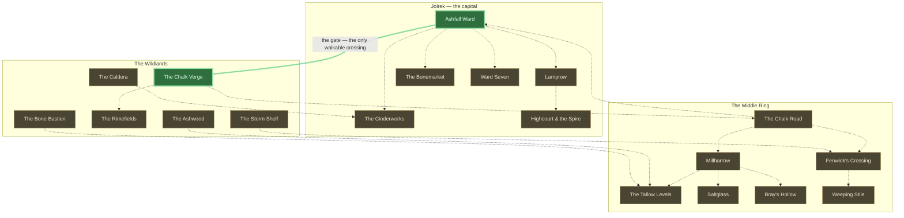

# 12 — An Atlas of Azo

Where everything in the game actually is, and which of it you can stand on.

`docs/11_world_of_azo_and_the_kings_contracts.md` is the geography and the plot; it was written
before any of it shipped and it describes the world as intended. This document describes the
world as **built**, derived from `src/`. Per the README's rule — where the docs and the code
disagree, the code wins — the code is the only source consulted here for anything load-bearing.

> **`docs/11` §8 is stale.** It says *"there is no wildland map"*. There is one now: the Chalk
> Verge. Everything else in §8 still holds.

---

## The three states a place can be in

Every entry below carries one of these. The distinction is the entire point of the document.

| State | Meaning |
|---|---|
| 🟢 **Walkable** | An `AreaDef` in `src/district/areas/`. You roam it in 3D, on real ground, with collision. |
| 🟡 **Arena only** | Fights happen *there* — a registered `EncounterDef` names it — but it is a combat grid, not a place. You never walk to it; you accept a contract and the board loads. |
| ⚪ **Named only** | Appears in flavour text or dialogue. Nothing in code references it as a location. |

**Nineteen named places. Two are walkable.**

---

## 1. The world at a glance



**The same thing in one sentence, for anyone reading this in a terminal:** there is exactly one
edge in the whole world you can walk — Ashfall Ward through the yard-wall gate onto the Chalk
Verge — and every other connection above is fiction the player travels by accepting a contract.

---

## 2. The walkable world

The only two places with ground under them. Both are `defineArea` calls; `TILE = 4` world units,
and every coordinate below is in world units as the code writes them.

### 2.1 Ashfall Ward 🟢

`src/district/areas/ashfall.ts` — 20 × 20, `safety: 'sidewalk'`, `horizon: 'city'`

```
     col 0         1         2
         0123456789012345678901
row  0   WWWWWWWWWWWWWWWWWWWW     the canal
     1   WWWWWWWWWWWWWWWWWWWW
     2   ##cccccccccccccccc##     quay
     3   ##cccc......cccccc##     the sealed yard
     4   ##cccccccccccccccc##
     5   ##VVVVVVVVVVVVVVVV##     yard wall — the GATE is here, col 11
     6   #cccccccccSSccccccc#
     7   #ccBBBBBBcSScBBBBBB#
     8   #cc......cSSc......#     west: warehouse yard (the Warden)  east: back alley
     9   #cc......cSSc......#
    10   #cc......cSSc......#
    11   #ccBBBBBBcSScBBBBBB#     ARTIFICER (west)      FIELD JOURNAL (east)
    12   #SSSSSSSSSSSSSSSSSS#     the cross-street
    13   #SSSSSSSSSSSSSSSSSS#
    14   #ccBBBBBBcSScBBBBBB#     APOTHECARY (west)     VIVARIUM (east)
    15   #ccBBBBBBcSScBBBBBB#
    16   #ccccccccSSSScccccc#     Vex, the Dispatcher
    17   ##cccccSSSSSSSScccc#     the plaza — SPAWN, and the bounty board
    18   ###ccccSSSSSSSScc###
    19   ####################
```

| Char | Tile | Walk | Safe |
|---|---|---|---|
| `S` | sanctioned walkway | ✅ | ✅ **no Warden may see you here** |
| `c` | cobbles | ✅ | ❌ |
| `.` | broken cobbles | ✅ | ❌ |
| `#` | scrub verge | ✅ | ❌ |
| `W` | canal | ❌ | — |
| `B` | building | ❌ | — (4.8–7.0 tall, split silhouette, chimneys) |
| `V` | yard wall | ❌ | — (3.2 tall, unbroken) |

**What stands in it**

| Thing | Where | Note |
|---|---|---|
| Spawn | `(4, 30)` | the plaza, in sight of Vex |
| Vex, the Dispatcher | `(-2, 27)` | Dispatch — the board's owner |
| Bounty board | `(12, 29)` | all three tier posters |
| The Ironworks Artificer | door `(-18, 9.4)` | forge: schematics, ascension, splicing |
| The Field Journal | door `(22, 9.4)` | bestiary / threat ledger |
| The Apothecary | door `(-18, 14.6)` | |
| The Vivarium | door `(22, 14.6)` | companions; the Ignis Trial is taken from here |
| The Warden's beat | `(-24,-6) → (-8,-6) → (-8,2) → (-24,2)` | clockwise round the warehouse yard |
| Gas lamps | ×10, all on `S` tiles | **the light *is* the safe zone** — they must line up |
| Crates | ×4 | kept clear of the patrol rectangle so it never snags |

**Its four graffiti lines**, anchored to explicit walls rather than to a door's array index:

| Text | Wall | Faces |
|---|---|---|
| `THE ENGINES EAT OUR MARROW` | `(-18, 8.05)` | south |
| `THE CENSUS COUNTS DOWN` | `(22, 8.05)` | south |
| `VANE'S LIGHT IS OUR DARK` | `(-18, 15.95)` | north |
| `DON'T CARRY IT IN` | `(22, 15.95)` | north — *should* be Highcourt's last wall, late-campaign only |

`safety: 'sidewalk'` makes this the only place in the game where the law protects you. The four
trades sit on the cross-street, two facing north and two facing south, so a new Commander can
walk the entire guided lap without once stepping off the pavement. Leaving it is a choice.

### 2.2 The Chalk Verge 🟢

`src/district/areas/chalkVerge.ts` — 24 × 16, `safety: 'none'`, `horizon: 'treeline'`

Deliberately **oblong**. Ashfall is square and every grid routine assumed that silently until
`extractRects` was taught otherwise; an oblong second area is what keeps the assumption from
creeping back.

```
     col 0         1         2
         012345678901234567890123
row  0   TTTTTTTTTTTTTTTTTTTTTTTT   the treeline, north
     1   TT####..####..####..##TT
     2   T#,,,,,,,,,,,,,,,,,,,,#T   the north track
     3   T#,,,,RR,,,,,,,,RR,,,,#T
     4   T#,,,,RR,,,,,,,,RR,,,,#T
     5   T#,,,,,,,,,,,,,,,,,,,,#T
     6   T#..,,,,,,TT,,,,,,,,..#T   the middle thicket
     7   T#..,,,,,,TT,,,,,,,,..#T
     8   T#,,,,,,,,,,,,,,,,,,,,#T
     9   T#,,,,RR,,,,,,,,RR,,,,#T
    10   T#,,,,RR,,,,,,,,RR,,,,#T
    11   T#,,,,,,,,,,,,,,,,,,,,#T   the south track
    12   T#....,,,,,,,,,,,,....#T
    13   TT####..####..####..,,TT   the gate approach — SPAWN at col 20
    14   TTTTTTTTTTTTTTTTTTTT,,TT   the cut back to the ward
    15   TTTTTTTTTTTTTTTTTTTTTTTT
```

| Char | Tile | Walk |
|---|---|---|
| `,` | chalk track | ✅ |
| `#` | scrub | ✅ |
| `.` | spoil | ✅ |
| `R` | rock outcrop | ❌ (2.2–3.6, lumpy, unsplit) |
| `T` | thicket | ❌ (4.0–5.4, tall enough to break a sightline) |

**There is no `S`.** Nothing here is safe ground, and the absence is the design rather than an
oversight — `safety: 'none'` hides the zone chip and the danger vignette entirely instead of
pinning them to EXPOSED for as long as you are here. Out here nothing is watching you because
nothing needs to be; the things on this road do not require a warrant. It gets no gas lamps for
the same reason: lamps *are* the safe zone in Ashfall, so lighting this place with them would
be a lie. Its light comes from the packs and the banked fire at the trailhead.

**What stands in it**

| Thing | Where | Note |
|---|---|---|
| Spawn / trailhead | `(34, 22)` | also where a **lost** fight puts you back |
| Hunt signpost | `(26, 14)` | the twelve Wild Hunts, and the only place the cooldowns are legible |
| Chalk-Road Scavengers | `(-30, -12)`, roam 7 | novice pack |
| The Verge Strays | `(0, 12)`, roam 8 | novice pack |
| Spoil-Heap Hollows | `(30, -14)`, roam 7 | adept pack |
| Crates | ×3 | spoil and abandoned kit |

The three roam circles are spread so they cannot overlap: two packs converging on one player is
a fight the feature does not model, and the contact handler is first-come.

### 2.3 The crossing

The one real edge in the world, and the numbers most likely to drift:

| | Ashfall → Verge | Verge → Ashfall |
|---|---|---|
| Hotspot | `(4, -15.6)` — on the walkway, south of the wall | `(34, 26)` |
| Gate collider | `(4, -18)` — the wall itself, row 5 | *none* |
| Arrives at | `(34, 22)` — the verge trailhead | `(4, -12.4)` — back onto pavement |

The gate collider is **explicit data on the exit**, not derived. It used to be computed as a
stride north of the hotspot, which is true of the ward's yard wall and false of any doorway
facing the other way — in the verge that put the wall between the arrival tile and the way out.

---

## 3. Jolrek, the capital

A city built upward because Vane taxed the ground. Six named places; one you can walk.

| Place | State | What is fought there |
|---|---|---|
| **Ashfall Ward** | 🟢 walkable | `curfew_breakers` (N4), `gutter_dispute` (N9) |
| **Lamprow** | 🟡 arena only | `lamprow_tithe` (N1), `lamplighter_escort` (N3), `debt_collected_minor` (N5) |
| **The Bonemarket** | 🟡 arena only | `bonemarket_vermin` (N2) → binds **Cinder-Wasp Swarm** |
| **The Cinderworks** | 🟡 arena only | `poster_work` (N8); `dynamo_flats` (M7, "the flats") → binds **Kinetic Dynamo**; hunt `hunt_cinderworks_salamander` → **Flue Salamander** |
| **Highcourt & the Spire** | 🟡 arena only | `smoke_eaters_rest` (N6, wager) → binds **Dolmen Crab**; `relocation_train` (M8, the undercroft); `the_summons` (M10, the throne room) |
| **Ward Seven** | 🟡 arena only | `fouled_cistern` (N7) → binds **Grave-Gargoyle** |

`clinic_quota` (N10) is a back-alley clinic in Jolrek with no ward named.

---

## 4. The Middle Ring

Towns and farmland. **Nothing here is walkable.** Seven named places, every one of them a
combat grid reached by accepting a contract.

| Place | State | What is fought there |
|---|---|---|
| **The Chalk Road** | 🟡 arena only | the artery to Jolrek; hunts `hunt_chalk_boar` → **Ferrum**, `hunt_chalk_cut_ram` → **Quarry Ram**. Its first wild stretch *is* the Chalk Verge |
| **Millharrow** | 🟡 arena only | `chalk_road_toll` (A1), `drowned_granary` (A9) → binds **Obsidian Tortoise**, `waystone_duel` (A10, wager) → binds **Voltbriar Serpent** |
| **The Tallow Levels** | 🟡 arena only | `tallow_blight` (A2) → binds **Crimson Treant**; hunt `hunt_tallow_aurochs` → **Moss Aurochs** |
| **Saltglass** | 🟡 arena only | `saltglass_riot` (A3); hunt `hunt_saltglass_seal` → **Saltglass Seal** |
| **Bray's Hollow** | 🟡 arena only | `warrant_of_distraint` (A4) |
| **Fenwick's Crossing** | 🟡 arena only | `night_freight` (A5), `cellar_clearance` (A7) |
| **Weeping Stile** | 🟡 arena only | `hollow_census` (A8) → binds **Murk Heron** |

`ashwood_poacher` (A6) is fought on the Ashwood fringe — see below.

---

## 5. The Wildlands

Six named regions. One is walkable, and it is the newest thing in the world.

| Region | State | Contracts | Hunts | Packs |
|---|---|---|---|---|
| **The Chalk Verge** | 🟢 walkable | — | signpost to all twelve | **3** — Scavengers, Strays, Hollows |
| **The Caldera** | 🟡 arena only | `caldera_chimera` (M1) → **Chimera of the Caldera** | `hunt_caldera_drake` → **Ignis** | — |
| **The Ashwood** | 🟡 arena only | `ashwood_poacher` (A6, wager) → **Winterthorn Elk**; `wildfire_writ` (M5) | `hunt_ashwood_warden` → **Sylva**; `hunt_ashwood_stag` → **Mortis** | — |
| **The Rimefields** | 🟡 arena only | `rimefield_break` (M2) → **Glacial Juggernaut** | `hunt_rimefield_bear` → **Boreas** | — |
| **The Storm Shelf** | 🟡 arena only | `storm_shelf_binding` (M3) → **Storm-Mantis**; `pylon_nine` (M4) → **Volatile Geist** | `hunt_shelf_lynx` → **Voltara**; `hunt_pylon_kite` → **Conduit Kite** | — |
| **The Bone Bastion** | 🟡 arena only | `bone_bastion` (M9) → **Bone Bastion Sovereign** | `hunt_barrow_jackal` → **Barrow Jackal** | — |

`coldwater_duel` (M6) is fought "on ground of her choosing" — the only contract in the game
that names no place at all.

---

## 6. Where the twenty-seven species live

Every species has exactly one acquisition route, and which kind of route it is says everything
about the design: **the wild repeats, the story does not.**

### The twelve on the hunt rotation — repeatable, 10-minute cooldown

| Species | Title | School | Region | Hunt |
|---|---|---|---|---|
| Ignis | Ember Drake | pyre | The Caldera | `hunt_caldera_drake` |
| Flue Salamander | Chimney Fire | pyre | The Cinderworks | `hunt_cinderworks_salamander` |
| Boreas | Frost Bear | frost | The Rimefields | `hunt_rimefield_bear` |
| Saltglass Seal | Harbor Ghost | frost | Saltglass | `hunt_saltglass_seal` |
| Voltara | Storm Lynx | surge | The Storm Shelf | `hunt_shelf_lynx` |
| Conduit Kite | Pylon Nester | surge | The Storm Shelf | `hunt_pylon_kite` |
| Mortis | Carrion Stag | dusk | The Ashwood | `hunt_ashwood_stag` |
| Barrow Jackal | Grave-Digger | dusk | The Bone Bastion | `hunt_barrow_jackal` |
| Sylva | Thorn Warden | bloom | The Ashwood | `hunt_ashwood_warden` |
| Moss Aurochs | Fallow Warden | bloom | The Tallow Levels | `hunt_tallow_aurochs` |
| Ferrum | Vault Boar | bulwark | The Chalk Road | `hunt_chalk_boar` |
| Quarry Ram | Chalk Breaker | bulwark | The Chalk Road | `hunt_chalk_cut_ram` |

Two per school, and **all six founders are on the list including the one you enrolled with** —
a second Ignis is a different eight cards, a different knack, a different constitution, and a
one-in-a-hundred chance of lustrous.

### The fifteen hybrids — bound once each, off a named enemy

| Species | Title | Schools | Bound off |
|---|---|---|---|
| Chimera of the Caldera | Caldera Chimera | pyre + frost | `caldera_chimera` (M1) |
| Cinder-Wasp Swarm | Ember Swarm | pyre + surge | `bonemarket_vermin` (N2) |
| Cinder Shade | Lamp-Eater | pyre + dusk | `coldwater_duel` (M6, wager) |
| Crimson Treant | Ashwood Warden | pyre + bloom | `tallow_blight` (A2) |
| Obsidian Tortoise | Caldera Bulwark | pyre + bulwark | `drowned_granary` (A9) |
| Storm-Mantis | Rime Conductor | frost + surge | `storm_shelf_binding` (M3) |
| Grave-Gargoyle | Black Ice | frost + dusk | `fouled_cistern` (N7) |
| Winterthorn Elk | Rimebloom | frost + bloom | `ashwood_poacher` (A6, wager) |
| Glacial Juggernaut | Icebreaker | frost + bulwark | `rimefield_break` (M2) |
| Volatile Geist | Aether Siphon | surge + dusk | `pylon_nine` (M4) |
| Voltbriar Serpent | Hedge Lightning | surge + bloom | `waystone_duel` (A10, wager) |
| Kinetic Dynamo | Momentum Engine | surge + bulwark | `dynamo_flats` (M7) |
| Murk Heron | Fen Reaper | dusk + bloom | `hollow_census` (A8) |
| Bone Bastion Sovereign | Marrow Bastion | dusk + bulwark | `bone_bastion` (M9) |
| Dolmen Crab | Hedgefort | bulwark + bloom | `smoke_eaters_rest` (N6, wager) |

All fifteen school pairings, each exactly once. A hybrid on a ten-minute timer would flatten
the arc's most particular rewards into a shopping list.

> **The arithmetic the game never states.** A killed apex pays its contract; a bound one pays
> the same contract *and* joins the roster. Every fight in the game that fields a beast can end
> in a binding instead of a kill. The generous reading is the profitable one, and the game
> leaves the player to notice.

---

## 7. The three clocks

| Kind | Count | Repeats? | Where posted | Pays |
|---|---|---|---|---|
| **Story contracts** | 30 | Never — walked once, in tier order | The bounty board, Ashfall | Novice 40 / Adept 85 + 1 shard + 1 core / Master 160 + 3 shards + 2 cores |
| **Wild Hunts** | 12 | Every **10 minutes** of wall-clock | The verge signpost | its own tier's rate, plus the beast |
| **Roaming packs** | 3 | Respawn on the verge | Nowhere — you walk into them | shards + modest coin |

When a tier's story arc is exhausted the board falls back to **rolled pools**:
`novice_duelist` (novice); `narrow_ruin`, `glacial_field` (adept); `ignis_trial` (master). These
four are the only registered fights with no geography at all — they are pure arenas, and the
Trial is also reachable straight off the Vivarium.

The hunt cooldown is **wall-clock, not play-time**: it runs down while the game is closed. That
is deliberate — a ten-minute timer that only ticks while you stare at it is a tax on attention,
and this one is meant to be a reason to go do something else in the ward.

---

## 8. What this atlas makes visible

Not a wishlist. Just the honest read of the table above.

1. **Seventeen of nineteen places are combat grids with no ground under them.** The world is
   almost entirely a menu that loads boards.
2. **The Middle Ring has no walkable representation whatsoever.** Ten Adept contracts, six
   towns, and not one tile of it exists. It is the largest single gap.
3. **`the_summons` fights at the throne with no Highcourt to walk through.** The doc's fightless
   cheering walk needs an overworld route beyond the ward — already logged in
   `worldbuild-todo.md` Wave 4.
4. **`DON'T CARRY IT IN` is on the wrong wall.** It belongs on Highcourt's last safe wall,
   late-campaign; it is on Ashfall's Vivarium wall from turn one because the world does not read
   campaign state.
5. **`docs/11` §8 says there is no wildland map.** There is one, and nothing catches a design
   doc going stale.
6. **The Chalk Verge is one area doing the work of six regions.** The signpost on it posts
   hunts for the Caldera, the Rimefields, the Storm Shelf, the Ashwood and the Bone Bastion —
   places the road it stands on does not lead to.
