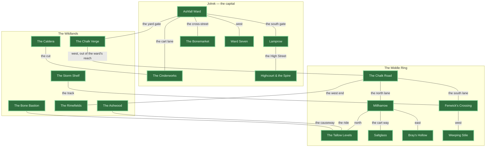

# 12 — An Atlas of Azo

Where everything in the game actually is, and which of it you can stand on.

`docs/11_world_of_azo_and_the_kings_contracts.md` is the geography and the plot; it was written
before any of it shipped and it describes the world as intended. This document describes the
world as **built**, derived from `src/`. Per the README's rule — where the docs and the code
disagree, the code wins — the code is the only source consulted here for anything load-bearing.

> **`docs/11` §8 is stale.** It says *"there is no wildland map"*. There is one now: the Chalk
> Verge. Everything else in §8 still holds.

---

## The three states a place can be in

Every entry below carries one of these. The distinction is the entire point of the document.

| State | Meaning |
|---|---|
| 🟢 **Walkable** | An `AreaDef` in `src/district/areas/`. You roam it in 3D, on real ground, with collision. |
| 🟡 **Arena only** | Fights happen *there* — a registered `EncounterDef` names it — but it is a combat grid, not a place. You never walk to it; you accept a contract and the board loads. |
| ⚪ **Named only** | Appears in flavour text or dialogue. Nothing in code references it as a location. |

**Nineteen named places. All nineteen are walkable, and thirty-seven rooms open off them.**

A room is an `AreaDef` like any other, with `indoor` set: you walk through a door drawn on a
building's face and the room mounts as its own area, lit at the night anchor whatever the clock
says, with no ceiling and a steeper camera. §2.8 says what is in them.

---

## 1. The world at a glance


```mermaid
graph TD
  subgraph JOLREK["Jolrek — the capital"]
    ASH["Ashfall Ward"]
    LAM["Lamprow"]
    BON["The Bonemarket"]
    CIN["The Cinderworks"]
    HIGH["Highcourt & the Spire"]
    W7["Ward Seven"]
  end

  subgraph MID["The Middle Ring"]
    ROAD["The Chalk Road"]
    MILL["Millharrow"]
    TAL["The Tallow Levels"]
    SALT["Saltglass"]
    BRAY["Bray's Hollow"]
    FEN["Fenwick's Crossing"]
    WEEP["Weeping Stile"]
  end

  subgraph WILD["The Wildlands"]
    VERGE["The Chalk Verge"]
    CAL["The Caldera"]
    ASHW["The Ashwood"]
    RIME["The Rimefields"]
    SHELF["The Storm Shelf"]
    BAST["The Bone Bastion"]
  end

  ASH ---|"the yard gate"| VERGE
  ASH ---|"the south gate"| LAM
  VERGE ---|"west, out of the ward's reach"| ROAD
  ROAD ---|"the north lane"| MILL
  MILL ---|"north"| TAL
  MILL ---|"the cart way"| SALT
  MILL ---|"east"| BRAY
  ROAD ---|"the south lane"| FEN
  FEN ---|"west"| WEEP
  ROAD ---|"the west end"| RIME
  ASHW ---|"the ride"| TAL
  SHELF ---|"the track"| FEN
  BAST ---|"the causeway"| TAL
  CAL ---|"the cut"| CIN
  ASH ---|"the cross-street"| BON
  ASH ---|"the cart lane"| CIN
  ASH ---|"west"| W7
  LAM ---|"the High Street"| HIGH

  classDef walk fill:#2f6f3e,stroke:#8fdca4,stroke-width:3px,color:#eaffef
  class ASH,VERGE,LAM,ROAD,BON,CIN,HIGH,W7,MILL,TAL,SALT,BRAY,FEN,WEEP,CAL,ASHW,RIME,SHELF,BAST walk
```

**The same thing in one sentence, for anyone reading this in a terminal:** every named place in
Azo is now walkable and every edge on that graph is a crossing you can take on foot — nineteen
areas and eighteen crossings, from the Caldera in the west to the Storm Shelf in the east. It was
three edges and four places not long ago — Ashfall through the yard-wall gate onto the Chalk Verge,
Ashfall through the south gate into Lamprow, and the Verge west onto the Chalk Road — and every
other connection above is fiction the player travels by accepting a contract.

---

## 2. The walkable world

> **The maps below are the first build's.** Every outdoor place has grown since -- by PR #39, and
> again in Wave 15, where the city wards doubled and gained quarters of their own. The grids in
> `src/district/areas/*.ts` read as maps, row by row with notes, and `worldbuild-todo.md` Wave 15
> records what each area grew into. What this section says about *why* each place is shaped the
> way it is still holds.

The four places with ground under them. All four are `defineArea` calls; `TILE = 4` world units,
and every coordinate below is in world units as the code writes them.

They are deliberately not four versions of the same thing. Ashfall has pavement and a Warden and
nothing roaming it; the Verge has roaming packs and no pavement at all; **Lamprow has both**, which
makes it the only ward where you can watch a pack's cone go dark as you step up onto the flags; and
the **Chalk Road** is a corridor rather than a room, built long so that three roam circles can
overlap on one stretch and a Combat Ring has something to pull.

### 2.1 Ashfall Ward 🟢

`src/district/areas/ashfall.ts` — 20 × 20, `safety: 'sidewalk'`, `horizon: 'city'`

```
     col 0         1         2
         0123456789012345678901
row  0   WWWWWWWWWWWWWWWWWWWW     the canal
     1   WWWWWWWWWWWWWWWWWWWW
     2   ##cccccccccccccccc##     quay
     3   ##cccc......cccccc##     the sealed yard
     4   ##cccccccccccccccc##
     5   ##VVVVVVVVVVVVVVVV##     yard wall — the GATE is here, col 11
     6   #cccccccccSSccccccc#
     7   #ccBBBBBBcSScBBBBBB#
     8   #cc......cSSc......#     west: warehouse yard (the Warden)  east: back alley
     9   #cc......cSSc......#
    10   #cc......cSSc......#
    11   #ccBBBBBBcSScBBBBBB#     ARTIFICER (west)      FIELD JOURNAL (east)
    12   #SSSSSSSSSSSSSSSSSS#     the cross-street
    13   #SSSSSSSSSSSSSSSSSS#
    14   #ccBBBBBBcSScBBBBBB#     APOTHECARY (west)     VIVARIUM (east)
    15   #ccBBBBBBcSScBBBBBB#
    16   #ccccccccSSSScccccc#     Vex, the Dispatcher
    17   ##cccccSSSSSSSScccc#     the plaza — SPAWN, and the bounty board
    18   ###ccccSSSSSSSScc###
    19   ####################
```

| Char | Tile | Walk | Safe |
|---|---|---|---|
| `S` | sanctioned walkway | ✅ | ✅ **no Warden may see you here** |
| `c` | cobbles | ✅ | ❌ |
| `.` | broken cobbles | ✅ | ❌ |
| `#` | scrub verge | ✅ | ❌ |
| `W` | canal | ❌ | — |
| `B` | building | ❌ | — (4.8–7.0 tall, split silhouette, chimneys) |
| `V` | yard wall | ❌ | — (3.2 tall, unbroken) |

**What stands in it**

| Thing | Where | Note |
|---|---|---|
| Spawn | `(4, 30)` | the plaza, in sight of Vex |
| Vex, the Dispatcher | `(-2, 27)` | Dispatch — the board's owner |
| Bounty board | `(12, 29)` | all three tier posters |
| The Ironworks Artificer | door `(-18, 9.4)` | forge: schematics, ascension, splicing |
| The Field Journal | door `(22, 9.4)` | bestiary / threat ledger |
| The Apothecary | door `(-18, 14.6)` | |
| The Vivarium | door `(22, 14.6)` | companions; the Ignis Trial is taken from here |
| The Warden's beat | `(-24,-6) → (-8,-6) → (-8,2) → (-24,2)` | clockwise round the warehouse yard — see §2.7 for what happens when it catches you |
| Gas lamps | ×10, all on `S` tiles | **the light *is* the safe zone** — they must line up |
| Crates | ×4 | kept clear of the patrol rectangle so it never snags |

**Its four graffiti lines**, anchored to explicit walls rather than to a door's array index:

| Text | Wall | Faces |
|---|---|---|
| `THE ENGINES EAT OUR MARROW` | `(-18, 8.05)` | south |
| `THE CENSUS COUNTS DOWN` | `(22, 8.05)` | south |
| `VANE'S LIGHT IS OUR DARK` | `(-18, 15.95)` | north |
| `DON'T CARRY IT IN` | `(22, 15.95)` | north — *should* be Highcourt's last wall, late-campaign only |

`safety: 'sidewalk'` makes this the only place in the game where the law protects you. The four
trades sit on the cross-street, two facing north and two facing south, so a new Commander can
walk the entire guided lap without once stepping off the pavement. Leaving it is a choice.

### 2.2 The Chalk Verge 🟢

`src/district/areas/chalkVerge.ts` — 24 × 16, `safety: 'none'`, `horizon: 'treeline'`

Deliberately **oblong**. Ashfall is square and every grid routine assumed that silently until
`extractRects` was taught otherwise; an oblong second area is what keeps the assumption from
creeping back.

```
     col 0         1         2
         012345678901234567890123
row  0   TTTTTTTTTTTTTTTTTTTTTTTT   the treeline, north
     1   TT####..####..####..##TT
     2   T#,,,,,,,,,,,,,,,,,,,,#T   the north track
     3   T#,,,,RR,,,,,,,,RR,,,,#T
     4   T#,,,,RR,,,,,,,,RR,,,,#T
     5   T#,,,,,,,,,,,,,,,,,,,,#T
     6   T#..,,,,,,TT,,,,,,,,..#T   the middle thicket
     7   T#..,,,,,,TT,,,,,,,,..#T
     8   T#,,,,,,,,,,,,,,,,,,,,#T
     9   T#,,,,RR,,,,,,,,RR,,,,#T
    10   T#,,,,RR,,,,,,,,RR,,,,#T
    11   T#,,,,,,,,,,,,,,,,,,,,#T   the south track
    12   T#....,,,,,,,,,,,,....#T
    13   TT####..####..####..,,TT   the gate approach — SPAWN at col 20
    14   TTTTTTTTTTTTTTTTTTTT,,TT   the cut back to the ward
    15   TTTTTTTTTTTTTTTTTTTTTTTT
```

| Char | Tile | Walk |
|---|---|---|
| `,` | chalk track | ✅ |
| `#` | scrub | ✅ |
| `.` | spoil | ✅ |
| `R` | rock outcrop | ❌ (2.2–3.6, lumpy, unsplit) |
| `T` | thicket | ❌ (4.0–5.4, tall enough to break a sightline) |

**There is no `S`.** Nothing here is safe ground, and the absence is the design rather than an
oversight — `safety: 'none'` hides the zone chip and the danger vignette entirely instead of
pinning them to EXPOSED for as long as you are here. Out here nothing is watching you because
nothing needs to be; the things on this road do not require a warrant. It gets no gas lamps for
the same reason: lamps *are* the safe zone in Ashfall, so lighting this place with them would
be a lie. Its light comes from the packs and the banked fire at the trailhead.

**What stands in it**

| Thing | Where | Note |
|---|---|---|
| Spawn / trailhead | `(34, 22)` | also where a **lost** fight puts you back |
| Hunt signpost | `(26, 14)` | the twelve Wild Hunts, and the only place the cooldowns are legible |
| Chalk-Road Scavengers | `(-10, 0)`, roam 9 | novice pack |
| The Verge Strays | `(0, 8)`, roam 9 | novice pack |
| Spoil-Heap Hollows | `(6, -4)`, roam 9 | adept pack |
| Crates | ×3 | spoil and abandoned kit |

The three roam circles **overlap deliberately**, and they used to be spread precisely so they
could not — two packs converging on one player was a fight nothing modelled, and the contact
handler was first-come. The **Combat Ring** models it now:

- Walk into a pack off the pavement and your input locks while a ring of light expands from
  the contact point to five units over **2.5 seconds**.
- Any other pack the ring reaches in that window is **pulled in** — capped at two, and a
  third is ignored rather than queued, because being jumped by four things at once is a loss
  with extra steps.
- **The grid then forms on the road itself.** No screen wipe and no swap to a separate board:
  the arena is laid on real district tiles inside the circle, the camera swings from the walk
  framing down to a fixed tactical one, and the Commander and their beast take their places at
  the near edge. The word BATTLE used to flash here to cover the cut to a 2D canvas; there is
  no cut to cover any more. See §2.6.
- There is no pre-combat beat for a pack: an ambush that stops to ask which cards you would
  like is not an ambush.
- Each pulled pack sends the squad its reinforcement budget buys, arriving together at the
  start of **Round 2**, and pays its own spoils. You are compensated **+1 banked Bone and +1
  card per pack pulled**, at the start of your round-two turn.
- Win and every pack that was in the fight goes off the road on the same ten-minute clock.
  Lose and all of them are still standing where you left them.

Out here nothing suppresses a pack's cone, because there is no `S` to stand on. That is what
makes the verge the place the mechanic is taught.

### 2.3 Lamprow 🟢

`src/district/areas/lamprow.ts` — **22 x 20**, `safety: 'sidewalk'`, `horizon: 'city'`,
two rows of the lighters' cut along the north edge.

The ward that pays for its own light. It keeps Ashfall's legend unchanged — the same flags,
cobbles, weeds, canal, terraces and yard wall — because two Jolrek wards should be built out of
the same materials and differ in their plan, not their stone.

**Why it is walkable ground.** It is the only place in the world with **pavement and packs at
once**. Ashfall has a Warden and nothing roaming; the Verge has crews and no pavement; neither
shows what the walkway is actually worth. Here the High Street runs the full width of the map
with the Sink below it, and *both* roam circles reach up over the kerb — so a cone goes out the
moment you step up onto the flags and comes back on the moment you step down.

| Band | Rows | What is there |
|---|---|---|
| The cut | 0–1 | Water, impassable. Trees along the bank at row 2 |
| The quay and wharf lane | 2–3 | Open cobbles the width of the ward |
| The bonded warehouse / lighters' yard | 4–7 | A `B` terrace west, open yard east, a `V` wall on the east corner — **the Warden's beat** |
| The back lane | 8–9 | Cobbles and a second terrace |
| **The High Street** | 10–11 | `S` flags, cols 0–20, **open at the west end** — the mouth back to Ashfall |
| The step down | 12 | Cobbles |
| **The Sink** | 13–16 | Two small blocks, otherwise broken ground — **both packs live here** |
| South lane | 17–19 | Cobbles, then grass |

| | Position |
|---|---|
| Spawn | `(-26, 2)` — on the flags, and it must be: a seizure returns you to the spawn-seeded safe spot |
| Warden beat | `(2,-22) → (30,-22) → (30,-14) → (2,-14)`, clockwise round the yard |
| **The Lampwick Gutter Crew** | `(0, 12)`, roam 7 — novice |
| **The Tithe-Takers** | `(10, 14)`, roam 7 — adept |
| Lamps | 7, every one on High Street flags at `z = 6` |
| Exit | `(-42, 4)` → Ashfall `(26, 32)`. No gate: the frame `world.ts` builds is an east–west wall, wrong for a street leaving the west edge |

The two circles sit 10.2 apart against 14 of combined reach, so the Ring can pull one crew into
the other's fight; and both reach `z = 5` and `z = 7` against a kerb at `z = 8`.

### 2.4 The Chalk Road 🟢

`src/district/areas/chalkRoad.ts` — **32 x 12**, `safety: 'none'`, `horizon: 'treeline'`,
no water. The longest map in the game, and the first tile of the Middle Ring you can stand on.

The atlas already called the Verge "the first wild stretch of the Chalk Road"; this is the same
road further out. Ploughed strips either side, hedgerows north and south, and nothing sanctioned
anywhere on it.

**Why the shape.** A road is a corridor with sightlines down it, so the fighting happens where
those sightlines break. Waystones are set in pairs at rows 5 and 7 and **never on row 6**, which
keeps the artery open end to end while giving three roam circles something to hide behind.

| Band | Rows | What is there |
|---|---|---|
| Hedgerow | 0 | Impassable, the whole width |
| Ploughed strips | 1–3 | `field` paint, broken by two north–south hedge stubs |
| North verge | 4 | Grass with weeds spilling into it |
| **The road** | 5–7 | `chalk` track, cols 1–31. Waystone pairs at rows 5 and 7; **row 6 always clear** |
| South verge | 8 | Grass |
| Ploughed strips | 9–10 | One more hedge stub |
| Hedgerow | 11 | Impassable |

| | Position |
|---|---|
| Spawn | `(54, 2)` — the east trailhead, where a lost fight puts you back |
| **The Waywatch** | `(-30, 2)`, roam 10 — novice |
| **Hedgerow Vermin** | `(-16, 4)`, roam 10 — novice |
| **The Freight-Pickers** | `(-26, -4)`, roam 10 — adept, and the only three-body all-ranged pack in the game |
| Exit | `(62, 2)` → Verge `(-42, -8)`. No gate — it is the same road, and the join is only where the fields start |
| West end | Open. The road runs out of the cut into the Rimefields, which makes it the only map you can cross without stopping |

Pair distances are **14.1 / 7.2 / 12.8** against 20 of combined reach — far tighter than the
Verge. The seven-unit pair is what makes a two-pull something you can walk into on purpose, and
the third crew is close enough to be reached by a ring with room and refused by one without,
which is the `MAX_PULLS` cap where it can actually be seen.

### 2.5 The crossings

Every way between two outdoor places, and the numbers most likely to drift -- which is why they are
written from the area files, not typed:

<!-- atlas-crossings:begin — written by scripts/atlas-maps.ts; do not edit by hand -->

| From | To | Hotspot | Arrives at |
|---|---|---|---|
| Ashfall Ward | The Chalk Verge | (0, -27.6) | (40, 30) |
| Ashfall Ward | Lamprow | (0, 95.6) | (-88, -4) |
| Ashfall Ward | The Bonemarket | (106, 6) | (-88, -8) |
| Ashfall Ward | The Cinderworks | (-106, -26) | (98, 0) |
| Ashfall Ward | Ward Seven | (-106, 30) | (86, -2) |
| Lamprow | Ashfall Ward | (-92, -4) | (0, 92.4) |
| Lamprow | Highcourt & the Spire | (92, -4) | (-78, 0) |
| The Bonemarket | Ashfall Ward | (-94, -8) | (102, 8) |
| The Cinderworks | Ashfall Ward | (102, 0) | (-102, -26) |
| The Cinderworks | The Caldera | (-102, 0) | (102, -2) |
| Highcourt & the Spire | Lamprow | (-82, 0) | (88, -4) |
| Ward Seven | Ashfall Ward | (90, -2) | (-102, 30) |
| The Chalk Road | The Chalk Verge | (114, 2) | (-84, -6) |
| The Chalk Road | Millharrow | (-34, -22) | (-2, 86) |
| The Chalk Road | Fenwick's Crossing | (38, 22) | (-2, -56) |
| The Chalk Road | The Rimefields | (-114, 2) | (110, -2) |
| Millharrow | The Chalk Road | (-2, 98) | (-34, -14) |
| Millharrow | The Tallow Levels | (-2, -98) | (-2, 58) |
| Millharrow | Saltglass | (-118, -2) | (82, 8) |
| Millharrow | Bray's Hollow | (118, -2) | (-70, 0) |
| The Tallow Levels | Millharrow | (-2, 74) | (-2, -86) |
| The Tallow Levels | The Ashwood | (-26, -74) | (-6, 94) |
| The Tallow Levels | The Bone Bastion | (-102, -6) | (74, -2) |
| Saltglass | Millharrow | (90, 8) | (-98, -2) |
| Bray's Hollow | Millharrow | (-78, 0) | (98, -2) |
| Fenwick's Crossing | The Chalk Road | (-2, -66) | (38, 14) |
| Fenwick's Crossing | Weeping Stile | (-102, -6) | (50, 4) |
| Fenwick's Crossing | The Storm Shelf | (102, -6) | (-86, -6) |
| Weeping Stile | Fenwick's Crossing | (70, 2) | (-82, -2) |
| The Chalk Verge | Ashfall Ward | (40, 34) | (0, -24.6) |
| The Chalk Verge | The Chalk Road | (-90, -6) | (108, 2) |
| The Caldera | The Cinderworks | (118, -2) | (-98, 0) |
| The Ashwood | The Tallow Levels | (-6, 110) | (-26, -62) |
| The Rimefields | The Chalk Road | (126, -2) | (-106, 2) |
| The Storm Shelf | Fenwick's Crossing | (-102, -6) | (82, -6) |
| The Bone Bastion | The Tallow Levels | (90, -2) | (-86, -6) |

<!-- atlas-crossings:end -->

Only the two **gates** carry a collider, and only Ashfall has them: a gate is the Magistracy
sealing something, and the Magistracy does not seal open country. Both gate meshes face
north–south because that is the only orientation `world.ts` builds — an unrotated
`PlaneGeometry(8, 4.6)` with an 8 x 1.2 collider — which is why the Lamprow crossing is cut
through Ashfall's **south** edge rather than its east.

The gate collider is **explicit data on the exit**, not derived. It used to be computed as a
stride north of the hotspot, which is true of the ward's yard wall and false of any doorway
facing the other way — in the verge that put the wall between the arrival tile and the way out.

---

### 2.6 The fight happens where you were standing

A fight picked up on the road is now played **in the district**, on the ground the ring closed
on. There is no screen swap. The 2D isometric board still exists and is still what a Bounty
Board contract opens; what changed is that the road no longer borrows it.

**How the board finds somewhere to stand.** The combat grid and the district grid share a tile
pitch — `TILE` world units either way — so the arena is snapped onto real district tiles rather
than floated over them. `combat/WorldBoard.ts` scans every window of the area's own ASCII grid
for one that fits the encounter's footprint, scored by distance from the ambush, and takes the
nearest clear one.

"Clear" is narrower than "walkable", deliberately: grass, field, verge and broken cobble are
all fine ground to have a fight on, and demanding walkable ground would rule out most of the
Chalk Road, whose road proper is three rows deep against encounters that want up to nine. Only
**buildings and open water** disqualify a tile.

Every pack shares one 7×6 arena, and every area that roams packs can seat it cleanly — asserted
in `worldBoard.test.ts` against the actual pack list rather than assumed. **Ashfall cannot**,
and does not need to: it roams nothing, and the only fight that starts there is the Warden's.
Its best 7×6 window clips the corner of one terrace, three tiles of forty-two, and those
buildings simply fade out of the way through the same occluder machinery that already fades a
wall standing between the camera and the player.

**What the descent does**, over about two seconds:

| | |
|---|---|
| The grid | Blooms outward from the centre in squares, drawn as light *on* the road so the paving still shows through underneath |
| The camera | Walk framing (fov 28, pitch 50, distance 22) → tactical (fov 42, pitch 42, distance ~36 for a pack arena), yaw snapped to **zero** |
| The bodies | The Commander and their beast walk to the near edge — off the grid but on the field, the same geometry the 2D board draws its portraits in |
| The fog | Scaled down, and this one is not cosmetic — see below |
| The street | Packs and the Warden hold still; the walking HUD hides |

Yaw goes to zero rather than to a diagonal. The 2D board is a 2:1 diamond and matching it was
the obvious move, but the grid out here is laid on district tiles and is therefore
world-axis-aligned: at yaw zero its rows run straight across the screen, with the enemy's home
rows at the top and the player's at the bottom.

**The fog override is load-bearing.** `FogExp2` attenuates by `1 - exp(-(density × distance)²)`.
The walk camera sits 22 units out; framing a whole arena needs about 36. At Lamprow's authored
density of 0.036 that is **95% of the board's contrast gone** — the grid is simply not visible.
So each area's density is scaled to hit a fixed legible depth while the board is up, and
restored on the way out. It is a scale rather than an absolute so every area keeps its own
character: the Chalk Road needs no correction at all and stays the clearest place in the game.

**What was reused, and what is new.** Almost all of it was reused. `CombatSession` is a pure
reducer; `EntityViewMap` already stored positions as fractional *tile* coordinates;
`TargetingController` speaks only `Coord` and has no camera at all; the `Hud` is DOM. `Fx` — the
whole effects layer — asks a camera four questions, none of them isometric, so naming that set
`FxCamera` was enough to run it verbatim over a perspective projection. New: three drawing
layers (`BoardMesh` for the ground, `BodyLayer` for the bodies, `OverlayCanvas` for what floats
above), the placement search, and the descent.

### 2.7 What a Warden does when the cone catches you

It used to be an **arrest**: a flash reading SEIZED, a teleport back to the last flagstone, and
nothing owed. That was deliberate — a lesson rather than a tax, because charging the Pact there
punishes the one player who went to find out what the rule meant, which is precisely the player
who was doing it right.

It is now a **fight**. The Warden serves `warden_writ` — *The Warden's Writ* — and the circle
opens on **the Warden**, not on you.

| | |
|---|---|
| The squad | `anvil_lord` + three `vanguard_footman` — 4+2+2+2 on the same ten-point ladder every pack is costed on |
| Arena | 7×6, `victory: 'rout'`: clear the detail and it is over |
| Filed as | a `PackDef`, so it inherits the budget re-derivation in `packs.test.ts` and the eight balance playouts. It is the one pack in the game never placed on a map |
| Cooldown | the same ten-minute hunt clock, so a beaten Warden does not re-arrest you on the walk home |

**The lesson survives the change.** Losing still returns you to `lastRefuge`, which in a ward
with pavement *is* the last flagstone — so a loss costs the walk back, exactly as the arrest
did. What changed is that the rule now has something behind it.

**Packs stay candidates for that circle**, and that is not an oversight. A Warden only ever
catches you *off* the pavement, which is precisely where packs are live — so an arrest that
drags a gutter crew in with it comes free, out of machinery that already exists, and is the
best thing that can happen in this ward.

**The old escort is still the fallback.** If a contract is already open against your name the
writ cannot be served, and rather than nothing happening you are escorted back onto the flags —
which is what the arrest always was.

### 2.8 Places you can enter

Every trade, every contract site that named a building, and every "somewhere under here" the
dialogue used to gesture at is a room now. The rules the rooms follow, so that the next one can
follow them too:

- **A door is an exit with a leaf.** `ExitSpec.door` puts a plank, iron, arch, cave or hatch leaf
  on a solid tile's face, with an optional sign glyph over it (`signs.ts`); the hotspot stands a
  stride in front. A door can be shut by the Chronicle (`when`) and says why (`lockedReason`):
  the Tithe Office until the tithe is collected, the pump house until the north field is answered
  for, the Customs House until the riot.
- **The three trades are benches inside rooms** (`benches.ts`): the Artificer's anvil in the
  Ironworks, the Apothecary's counter, the Vivarium's yard. The Field Journal is not a building
  any more; it is **J**, from anywhere, and an entry on the Esc menu.
- **Everything else is a registry addressed into an area by id**, the sites idiom:
  `notices.ts` (notices, plaques, gravestones, ledgers, books — the first open one per spot wins,
  so a plaque can change its text once a contract is walked), `caches.ts` (opened once per
  character, paid through the errand purse, gated by contract or by a flag a notice raised),
  `forage.ts` (herbs, fungi, ore, comb, bone, reeds, ember; regrow on the street clock; some bite,
  with a pack that already lives nearby), `rests.ts` (a bed advances the clock for a fee and does
  not heal). None of them is a new noun on `AreaProps`.
- **Nobody lives in the Wildlands or on the Road**, still, and a test still says so. Their rooms
  are caves and a hut with a crew denned in each, and their readables are stones, because nobody
  out there is accountable for a notice.
- **Fights happen in rooms now.** The cellar count, the cistern, the granary's flooded end, the
  Undercroft, the barn, the inn cellars, and five wild dens hold their contract or their pack
  behind a door. A room that hosts one keeps an eight-by-nine clear floor for the board.

| Ward | Rooms |
|---|---|
| Ashfall Ward | the Ironworks (Artificer's bench, cellar), the Apothecary (bench, the Clinic's cot), the Vivarium (bench), the Records Office, the Toll House, the Counting House (after `curfew_breakers`), the Chapel of the Quiet Flame, the Cinder Cup |
| Lamprow | the Lamp-oil House, the Tithe Office (after `lamprow_tithe`), the Sink cellars (**Tithe-Takers** inside) |
| The Bonemarket | the market hall, the pawnshop |
| The Cinderworks | the Foundry Hall (`dynamo_flats` inside), the Poster's shed (`poster_work` inside) |
| Ward Seven | the cistern (`fouled_cistern` inside), the back-alley clinic (`clinic_quota` inside) |
| Highcourt | the Spire lobby (`the_summons` at its doors), the Smoke-Eater's Rest (`smoke_eaters_rest` at the bench), the Undercroft (`relocation_train`, `undercroft_census`, `the_quiet_below`) |
| The Chalk Verge | the shepherd's bothy |
| The Chalk Road | the toll waystation |
| Millharrow | the Mill, the drowned granary (`drowned_granary` inside) |
| The Tallow Levels | the pump house (after `tallow_blight`) |
| Saltglass | the Glasshouse (a Pyre stall), the Customs House (after `saltglass_riot`) |
| Bray's Hollow | the barn (`warrant_of_distraint` inside) |
| Fenwick's Crossing | the toll house, the coach inn, and down the hatch the cellars (`cellar_clearance` inside) |
| Weeping Stile | the chapel |
| The Caldera | the lava tube (**Hollows** denned) |
| The Ashwood | the poacher's hide (**Freight-Pickers** denned) |
| The Rimefields | the ice cave (**Strays** denned) |
| The Storm Shelf | Pylon Nine's base (**Hedgerow Vermin** denned) |
| The Bone Bastion | the great barrow (**Hollows** denned) |

### 2.9 Every map, as it stands

Every outdoor place, drawn from its own area file by `scripts/atlas-maps.ts` rather than copied
out of it: the grid row by row with the note the file keeps beside each row, the legend in the
words the file uses for each tile, and what stands in it. `atlasMaps.test.ts` draws them again
and fails if this section has drifted from the grids, so a map here is the map in the game. One
character is one tile, four world units across; coordinates are world units from the middle of
the map, as the code writes them. Rooms are not drawn: each is one board-sized room, and §2.8
says what is in them.

<!-- atlas-maps:begin — written by scripts/atlas-maps.ts from the area files; do not edit by hand -->

#### Jolrek

##### Ashfall Ward

`ashfall.ts` — 54 × 50 — `safety: 'sidewalk'` — `horizon: 'city'` — `sky: 'ash'`

```
      0         1         2         3         4         5
      012345678901234567890123456789012345678901234567890123
   0  #DDDDDDDccDDDDDDDcDDDDDDDDDDDDDDDDDDcDDDDDDDccDDDDDDD#   THE FAR BANK: the bonded warehouses, backs to the edge, dead-end lanes between
   1  #DDDDDDDccDDDDDDDcDDDDDDDDDDDDDDDDDDcDDDDDDDccDDDDDDD#
   2  #DDDDDDDccDDDDDDDcDDDDDDDDDDDDDDDDDDcDDDDDDDccDDDDDDD#
   3  #DDDDDDDccDDDDDDDcDDDDDDDffffDDDDDDDcDDDDDDDccDDDDDDD#   the customs square, where the Ash Bridge comes over
   4  cccccccccccccccccccccccccffffccccccccccccccccccccccccc   the back lane
   5  ........ccDDDDDDDcDDDDDDcffffcDDDDDDczzzzzzzcccDDDDDDc   the barge slip (west)          the bond          the coal staithes (east)
   6  ........ccDDDDDDDcDDDDDDcffffcDDDDDDczzzzzzzcccDDDDDDc
   7  ........ccDDDDDDDcDDDDDDcffffcDDDDDDczzzzzzzcccDDDDDDc
   8  ........cccccccccccccccccffffccccccccccccccccccccccccc   the far quay
   9  ........cccccccccccccccccffffccccccccccccccccccccccccc
  10  ........cccccccccccccccccccccccccccccccccccccccccccccc
  11  WWWWWWWWWWWWWWWWWWWWWWWWWWffWWWWWWWWWWWWWWWWWWeeWWWWWW   the canal -- the Ash Bridge (middle), the tanners' footbridge (east)
  12  WWWWWWWWWWWWWWWWWWWWWWWWWWffWWWWWWWWWWWWWWWWWWeeWWWWWW
  13  cccccccccccc#cccccccccccccccccccccccccccc#cccccccccccc   the wharf
  14  ............#cTTTTcc..............ccBBBcc#ffffffffffff   the timber wharf    TOLL HOUSE   the sealed yard   the boathouse    the hide steps
  15  .kkk........#cTTTTcc..............ccBBBcc#ffffffffffff   the boat shed
  16  .kkk........#ccccccc..............ccccccc#llllllllllll   the quay road, and the Toll House door                  behind the tanneries
  17  #############VVVVVVVVVVVVVVVVVVVVVVVVVVVV#HHHlHHHHlHHH   the yard wall -- a gate in it, and the road to the Verge
  18  cccccccccccc#cccccccccccccSSccccccccccccc#HHHlHHHHlHHH   the cart lane, west to the Cinderworks
  19  ............#cBBBBBBBBccccSSccccBBBBBBBBc#llllllllllll   the north blocks                                        TANNERY ROW
  20  .QQ.........#c........ccccSScccc........c#HHlppppplAAA   THE ROPEWALK   the warehouse yard (the Warden)   the back alley   the pits, THE TANNERY
  21  .QQ.....kkk.#c.CCCC...ccccSScccc........c#HHlppppplAAA   the ropemaker   COUNTING HOUSE, inside the yard
  22  .QQ.....kkk.#c.CCCC...ccccSScccc........c#HHllllllllll
  23  .QQ.........#c........ccccSScccc........c#RRRlRRRRlRRR   the tenements
  24  .QQ.........#cBBBBBBBBccccSSccccBBBBBBBBc#RRRlRRRRlRRR   IRONWORKS (west)          RECORDS OFFICE (east)
  25  .QQ.........#cBBBBBBBBccccSSccccBBBBBBBBc#llllllllllll
  26  .QQ.........#SSSSSSSSSSSSSSSSSSSSSSSSSSSS#SSSSSSSSSSSS   the cross-street, on east to the Bonemarket
  27  .QQ.........#SSSSSSSSSSSSSSSSSSSSSSSSSSSS#SSSSSSSSSSSS
  28  .QQ.....kkk.#cBBBBBBBBccSSSSSSccBBBBBBBBc#RRRlRRRRlRRR   the tar shed    APOTHECARY (west)         VIVARIUM (east)    THE ROOKERIES
  29  .QQ.....kkk.#cBBBBBBBBccSSSSSSccBBBBBBBBc#RRRlRRRRlRRR
  30  .QQ.........#cccccSSSSSSSSSSSSSSSSSSccccc#lllllllllRRR   the plaza
  31  ............#cccccSSSSSSSSSSSSSSSSSSccccc#RRl.....lRRR   the Rookery court
  32  cccccccccccc#cccccSSSSSSSSSSSSSSSSSSccccc#RRl.....llll   the lane out to Ward Seven
  33  #############cccccSSSSSSSSSSSSSSSSSSccccc#RRl.....lRRR
  34  #...........#cccccKKKKKcSSSSSScUUUUUccccc#RRRRlRRRlRRR   the paupers' ground   THE CHAPEL   the south road   THE CINDER CUP
  35  #...........#cccccKKKKKcSSSSSScUUUUUccccc#RRRRlRRRlRRR
  36  #...........#c.........cSSSSSSc.........c#llllllllllll   the graves                           the tavern yard
  37  #...........#c.........cSSSSSSc.........c#RRRRRRlRRRRR
  38  #############VV..VVVVVVVSSSSSSVVVVVV..VVV#######l#####   the old south wall: the lych gap, the arch the road goes through, the garden gap
  39  ###############..#######SSSSSS########################   CHAPEL HILL (west)        the south road        ASH GARDENS (east)
  40  #hhOOOOhhhhhhhh..hhhhhh#SSSSSS#ggg#ggg#ggg#ggg#ggg#kk#   the ossuary                                      the gardeners' shed
  41  #hhOOOOhhhhhhhh..hhhhhh#SSSSSS#ggg#ggg#ggg#ggg#ggg#kk#
  42  #hhhhhhhhhhhhhh..hhhhhh#SSSSSS########################
  43  #hhhhhhhhhhhhhh..hhhhhh#SSSSSS#ggg#ggg#...#ggg#ggg#gg#
  44  #.......................SSSSSS#ggg#ggg#...#ggg#ggg#gg#   the path across the hill
  45  #hhhhhhhhhhhhhh..hhhhhh#SSSSSS########################
  46  #hhhhhhhhhhhhhh..hkkkhh#SSSSSS#...#ggg#ggg#ggg#ggg#gg#   the sexton's cottage
  47  #hhhhhhhhhhhhhh..hkkkhh#SSSSSS#...#ggg#ggg#ggg#ggg#gg#
  48  ########################SSSSSS########################
  49  VVVVVVVVVVVVVVVVVVVVVVVVVVVVVVVVVVVVVVVVVVVVVVVVVVVVVV   the ward wall, and the gate to Lamprow in it
```

| Tile | What it is | Walk | Safe | Stands |
|---|---|---|---|---|
| `S` | sanctioned walkway — SAFE, no Warden may see you here | ✅ | ✅ |  |
| `c` | cobbles — danger | ✅ |  |  |
| `.` | broken cobbles — danger, weeds through the joints | ✅ |  |  |
| `#` | scrub verge — danger | ✅ |  |  |
| `W` | canal — impassable | ❌ |  |  |
| `B` | building footprint — impassable, tall | ❌ |  | terrace, 4.8–7 tall |
| `V` | yard wall — impassable, low | ❌ |  | wall, 3.2 tall |
| `T` | the Toll House — impassable; brick, a stack | ❌ |  | terrace, 5.6 tall |
| `C` | the Counting House — impassable; dressed stone, taller than its neighbours | ❌ |  | hall, 7.6 tall |
| `K` | the chapel — impassable; stone, one unbroken mass | ❌ |  | hall, 6.8 tall |
| `U` | the Cinder Cup — impassable; timber over plaster, a chimney always going | ❌ |  | shopfront, 5.4 tall |
| `f` | flagstone — the customs square, the hide steps, the Ash Bridge | ✅ |  |  |
| `e` | planking — the tanners' footbridge | ✅ |  |  |
| `l` | the Row's mud — Tannery Row's lanes, and what is in them | ✅ |  |  |
| `z` | coal dust — the staithes on the far bank | ✅ |  |  |
| `h` | churchyard turf — Chapel Hill | ✅ |  |  |
| `g` | allotment beds — Ash Gardens | ✅ |  |  |
| `p` | tanning pits — impassable; sunk in the pit yard | ❌ |  |  |
| `D` | bonded warehouse — impassable; brick, the Magistracy's seal on every door | ❌ |  | warehouse, 5.2–6.6 tall |
| `H` | tannery — impassable; timber, a chimney more often than not | ❌ |  | warehouse, 4.4–5.4 tall |
| `A` | the Tannery — impassable; the one with a door you can use | ❌ |  | warehouse, 5.4 tall |
| `R` | tenement — impassable; the Rookeries, timber and tall | ❌ |  | terrace, 5.4–6.8 tall |
| `Q` | the Ropewalk — impassable; long, low sheds | ❌ |  | warehouse, 3.2–3.6 tall |
| `k` | cottage — impassable; the ropemaker, the sexton, the sheds | ❌ |  | cottage, 3.8–4.4 tall |
| `O` | the ossuary — impassable; stone, windowless, full | ❌ |  | hall, 4.2 tall |

- **Spawn** (0, 26).
- **Ways out:** The Chalk Verge from (0, -27.6), arriving (40, 30); Lamprow from (0, 95.6), arriving (-88, -4); The Bonemarket from (106, 6), arriving (-88, -8); The Cinderworks from (-106, -26), arriving (98, 0); Ward Seven from (-106, 30), arriving (86, -2); The Ironworks Artificer (a room) from (-36, 5.4), arriving (0, 22); The Records Office (a room) from (36, 5.4), arriving (0, 18); The Apothecary (a room) from (-36, 10.6), arriving (-4, -18); The Vivarium (a room) from (36, 10.6), arriving (-4, -18); The Toll House (a room) from (-44, -34.6), arriving (0, 16); The Counting House (a room) from (-40, -6.6), arriving (0, 16); The Chapel of the Quiet Flame (a room) from (-26, 34.6), arriving (0, -20); The Cinder Cup (a room) from (26, 34.6), arriving (0, -20); The Tannery (a room) from (102, -10.6), arriving (0, 14).
- **People:** Dispatcher Vex (-6, 24); the gate sentry (6, 92); the lamplighter (-2, 8); the cobbler, keeping hours: 08:00 (-18, 30) · 19:00 (70, 28); the crier, keeping hours: 07:00 (12, 80) · 12:00 (-33, -82) · 17:00 (18, 30).
- **Wardens:** 2 beats, (-48, -17) → (-22, -17) → (-22, -5) → (-48, -5); (70, -22) → (94, -22) → (94, -10) → (70, -10).
- **Landmarks:** bell tower (-56, 74); crane (-82, -45).
- **Passers-by:** up to 8 by day, on 4 lanes.
- **Lamps** 20; **sights** 14.

##### Lamprow

`lamprow.ts` — 48 × 40 — `safety: 'sidewalk'` — `horizon: 'city'` — `sky: 'ash'`

```
      0         1         2         3         4
      012345678901234567890123456789012345678901234567
   0  VVVVVVVVVVVVVVVVVVVVVVVVVVVVVVVVVVVVVVVVVVVVVVVV   THE GASWORKS: the works wall along the edge
   1  ccGGGGGGGGGGGGcccckkkkccccffffffffffccGGGGGGGGcc   the retort house (west)   the office   the holder yard   the purifiers (east)
   2  ccGGGGGGGGGGGGccccccccccccffffffffffccGGGGGGGGcc
   3  ccGGGGGGGGGGGGccccccccccccffffffffffccGGGGGGGGcc
   4  cczzzzzzzzzzzzccccccccccccffffffffffcc........cc   the coal                                                 the spent lime
   5  cczzzzzzzzzzzzccccccccccccffffffffffcc........cc
   6  cccccccccccccccccccccccccccccccccccccccccccccccc   the works quay
   7  WWWWWWWWWWWWWWWWWWWWWWWWffWWWWWWWWWWWWWWWWWWWWWW   the lighters' cut -- the lighters' bridge across it
   8  WWWWWWWWWWWWWWWWWWWWWWWWffWWWWWWWWWWWWWWWWWWWWWW
   9  cccccccc#cccccccccccccccccccccccccccccc#cccccccc   the quay
  10  cccccccc#cccccccccccccccccccccccccccccc#cccccccc   the wharf lane
  11  #BBBBBB##cBBBBBBBBccOOOOccccccccBBBBBBc##BBBBBB#   the chandlers (west)   bonded warehouse   LAMP-OIL HOUSE   the yard   the Lighters' Hall   the lamp stores (east)
  12  #BBBBBB##cBBBBBBBBccOOOOccccccccBBBBBBc##BBBBBB#
  13  ........#cBBBBBBBBcccccccccccccccccccVc##BBBBBB#   the chandlers' yard (the second Warden)   the lighters' yard (the Warden)
  14  ........#cc.......ccccccccccccccccccVVc#........
  15  ........#cc.......cccccccccccc........c#........   the back lane
  16  #BBBBBB##cBBBBBBBBccXXXXXXccBBBBBBBBBBc##BBBBBB#   the north terraces, and THE TITHE OFFICE
  17  #BBBBBB##cBBBBBBBBccXXXXXXccBBBBBBBBBBc##BBBBBB#
  18  SSSSSSSSSSSSSSSSSSSSSSSSSSSSSSSSSSSSSSSSSSSSSSSS   THE HIGH STREET — lit, sanctioned, and run on to both edges
  19  SSSSSSSSSSSSSSSSSSSSSSSSSSSSSSSSSSSSSSSSSSSSSSSS
  20  cccccccc#cccccccccccccccccccccccccccccc#cccccccc   the step down
  21  #kkk#kkk#cBBBBBB..............BBBBBBccc#........   cottages (west)   the Sink, and its tenements; the cellar hatch on the west one   THE DITCHES (east)
  22  #kkk#kkk#cBBBBBB..............BBBBBBcccdddddddd.
  23  #gggggg##cc...........................c#........
  24  #gggggg##cc...........................cd.ddddddd
  25  cccccccc#cccccccccccccccccccccccccccccc#........   the south lane
  26  #kkkkkk##cccBBBBBBBBcccccccccBBBBBBBBccdddddddd.   the lighters' cottages
  27  #kkkkkk##cccBBBBBBBBcccccccccBBBBBBBBcc#........
  28  #gggggg##c...........cccccc...........cd.ddedddd   their gardens
  29  #gggggg##c...........cccccc...........c#........
  30  cccccccc#ccccccccccccccccccccccccccccccddddddd..
  31  ########################################........   the verge
  32  #######################################d..dddddd
  33  #####################...........................   the verge
  34  #gggg#gggg#gggg#kkkkdd.ddddddd.ddddddd.ddddddd.d   the allotments and the potting shed (west)             where the Sink drains (east)
  35  #gggg#gggg#gggg#kkkk#.......................kkk.
  36  ####################dddddd.ddddddd.dddeddd.ddddd
  37  #gggg#gggg#gggg#gggg#..kkk......................
  38  #gggg#gggg#gggg#ggggd.dddddddd.dddddddd.ddddddd.
  39  #####################...........................
```

| Tile | What it is | Walk | Safe | Stands |
|---|---|---|---|---|
| `S` | sanctioned walkway — SAFE, no Warden may see you here | ✅ | ✅ |  |
| `c` | cobbles — danger | ✅ |  |  |
| `.` | broken cobbles — danger, weeds through the joints | ✅ |  |  |
| `#` | scrub verge — danger | ✅ |  |  |
| `W` | the lighters' cut — impassable | ❌ |  |  |
| `B` | building footprint — impassable, tall | ❌ |  | terrace, 4.8–7 tall |
| `V` | yard wall — impassable, low | ❌ |  | wall, 3.2 tall |
| `O` | the Lamp-oil House — impassable; timber, a stack always going | ❌ |  | warehouse, 5.2 tall |
| `X` | the Tithe Office — impassable; dressed stone, like every Magistracy counter | ❌ |  | hall, 7.2 tall |
| `G` | the gasworks — impassable; brick, tall, and a stack on every roof | ❌ |  | warehouse, 6–6.8 tall |
| `k` | cottage — impassable; the lighters', the office, the sheds | ❌ |  | cottage, 3.8–4.4 tall |
| `f` | flagstone — the holder yard, and the lighters' bridge | ✅ |  |  |
| `z` | coal — the works' heap | ✅ |  |  |
| `g` | garden — the cottage plots and the allotments | ✅ |  |  |
| `d` | drain — impassable; the ditches the Sink runs out through | ❌ |  |  |
| `e` | a board — over a drain, where somebody laid one | ✅ |  |  |

- **Spawn** (-52, -2).
- **Ways out:** Ashfall Ward from (-92, -4), arriving (0, 92.4); Highcourt & the Spire from (92, -4), arriving (-78, 0); The Lamp-oil House (a room) from (-8, -26.6), arriving (0, 16); The Tithe Office (a room) from (-4, -6.6), arriving (0, 16); The Sink Cellars (a room) from (-44, 13.4), arriving (0, 16).
- **People:** the pit hand (-20, -6); the tithe clerk, keeping hours: 09:00 (6, -6) · 14:00 (-28, -62) · 19:00 (6, -6); the lamplighter (26, -6); the urchin (-30, -6); the butcher (-8, -2); the printer (-44, -6); the lighter's boy (44, -2).
- **Crews:** The Lampwick Gutter Crew, by night: roaming (-10, 6), 7 out; The Tithe-Takers, by night: roaming (2, 8), 7 out; The Wick-Thieves, by night: a beat (-36, -58) → (6, -58) → (6, -70) → (-36, -70).
- **Wardens:** 2 beats, (6, -25) → (30, -25) → (30, -17) → (6, -17); (-90, -26) → (-68, -26) → (-68, -18) → (-90, -18).
- **Landmarks:** gasholder (28, -66).
- **Passers-by:** up to 6 by day, on 4 lanes.
- **Lamps** 15; **sights** 12.

##### The Bonemarket

`bonemarket.ts` — 48 × 36 — `safety: 'none'` — `horizon: 'city'` — `sky: 'ash'`

```
      0         1         2         3         4
      012345678901234567890123456789012345678901234567
   0  BBBBBBBBBBBBBBBBBBBBBBBBBBBBBBBBBBBBBBBBBBBBBBBB   the outer range
   1  BuuuuuKKKKuuuuuuKKKKuuuuuuuuKKKKuuuuuuKKKKuuuuuB   THE SHAMBLES: the lairage pens and the killing sheds
   2  BuuuuuKKKKuuuuuuKKKKuuuuuuuuKKKKuuuuuuKKKKuuuuuB
   3  BccccccccccccccccccccccccccccccccccccccccccccccB   the Shambles lane (a crew of Knacker's Lads walks it at night)
   4  BdddddddddddedddddddddddeddddddddddedddddddddddB   the gutter, boarded in three places
   5  B..............................................B   the offal yard
   6  BBBBBBccBBBBccBBBBBBBBBBccBBBBBBBBccBBBBBBBBBBBB   the north range, with three ways down through it
   7  B.....ccBccccccccccccccccccccccccccccccBkkk.kkkB   KNACKER'S LANE (west: the knacker's yard)            THE RAG LANES (east)
   8  B.KKK.ccBc.TTTTT.cc.TTTTTTT.cc.TTTTT.ccBkkk.kkkB   stall rows, backed onto the range
   9  B.KKK.ccBccTTTTTccccTTTTTTTccccTTTTTcccB.......B
  10  B.....ccBmmmmmmmmmmmmmmmmmmmmmmmmmmmmm.c.kk.kk.B   the market floor begins
  11  B.....ccBmm.TTTTTT.mmmm.TTTTT.mmmm.TTT.B.kk.kk.B
  12  B.....ccBmmmTTTTTTmmmmmmTTTTTmmmmmmTTTmB...k...B
  13  B.....ccBmmmmmmmmmmmmmmmmmmmmmmmmmmmmmmBkk.k.kkB
  14  B.....ccBAmmmmmmHHHHHHHHHHHHHHHHmmmmmmABkk.k.kkB   THE MARKET HALL, between the arcade's last pillars
  15  cccccccccmmmmmmmHHHHHHHHHHHHHHHHmmmmmmmB...k...B   the way in, off the ward -- across the lane the second crew walks
  16  cccccccccmmmmmmmHHHHHHHHHHHHHHHHmmmmmmmB.kkkkk.B
  17  BBBBBBccBAmmmmmmHHHHHHHHHHHHHHHHmmmmmmAB.kkkkk.B
  18  BBBBBBccBmmmmmmmmmmmmmmmmmmmmmmmmmmmmmmB.......B   the Hall's door, on its south face
  19  B.....ccBmm.TTTT.mmmmm.TTTTTTT.mmmm.TT.Bkk.k.kkB   rag-and-bone dead ends off the lane
  20  BBBBBBccBmmmTTTTmmmmmmmTTTTTTTmmmmmmTTmBkk.k.kkB
  21  BBBBBBccBcccccccccccccccccccccccccccc..B...k...B   the south lane
  22  BBBBBBccBc.TTTTTT.cc.TTTTT.ccccc.PPPP.cc.kk.kk.B   THE PAWNSHOP, east
  23  B.....ccBccTTTTTTccccTTTTTcccccccPPPPccB.kk.kk.B
  24  BBBBBBccBccccccccccccccccccccccccccccccB.......B   the back lane
  25  BBBBBBccB.........cccccccccc...........Bkkk.kkkB   west: the bone-boiler's yard   east: the eaves
  26  BBBBBBccB.........cccccccccc...........Bkkk.kkkB
  27  B.....ccB.........cccccccccc...........B.......B
  28  BBBBBBccBccccccccccccccccccccccccccccccBkkk.kkkB
  29  BBBBBBccBBBBBB..BBBBBBBBBBBBBB..BBBBBBBBBBBBBBBB   the south range, the lane and two gaps through it
  30  B..............................................B   THE GLUE WORKS: the yard
  31  B...GGGGGGGGGG...dddddddddd...GGGGGGGGGGG......B   the works, the vats between them
  32  B...GGGGGGGGGG...dddddddddd...GGGGGGGGGGG......B
  33  BccccccccccccccccccccccccccccccccccccccccccccccB   the tallow lane
  34  B..kkkkkk.............kkkkkk........kkkkkkkkk..B   the tallow sheds
  35  BBBBBBBBBBBBBBBBBBBBBBBBBBBBBBBBBBBBBBBBBBBBBBBB   the outer range
```

| Tile | What it is | Walk | Safe | Stands |
|---|---|---|---|---|
| `m` | market floor — trodden dirt over the old paving | ✅ |  |  |
| `c` | cobbles — the lanes, still swept | ✅ |  |  |
| `.` | weeds — the corners nobody trades in, and the yards | ✅ |  |  |
| `T` | stall row — impassable, low, taken whole so a row reads as a row | ❌ |  | stall, 1.9–2.4 tall |
| `A` | arcade pillar — impassable, tall and narrow | ❌ |  | wall, 5.4 tall |
| `H` | the Market Hall — impassable; stone, the arcade with its roof back on | ❌ |  | hall, 7 tall |
| `P` | the pawnshop — impassable; plaster, one storey | ❌ |  | shopfront, 4.6 tall |
| `B` | the ranges — impassable, the buildings that box the ward in | ❌ |  | terrace, 4.4–6.4 tall |
| `u` | the pens — lairage mud, trodden to soup | ✅ |  |  |
| `K` | a killing shed — impassable; timber, and the knacker's the same | ❌ |  | warehouse, 4.2–5 tall |
| `d` | the gutter — impassable; the Shambles' channel, and the glue vats | ❌ |  |  |
| `e` | a board — over the gutter | ✅ |  |  |
| `k` | a shed — impassable; the rag lanes' sorting sheds, the tallow sheds | ❌ |  | cottage, 3.2–3.8 tall |
| `G` | the glue works — impassable; brick, a stack always going | ❌ |  | warehouse, 5.6–6.4 tall |

- **Spawn** (-48, -8).
- **Ways out:** Ashfall Ward from (-94, -8), arriving (102, 8); The Market Hall (a room) from (0, 1.4), arriving (0, 20); The Pawnshop (a room) from (44, 14.6), arriving (0, -16).
- **People:** the lamplighter (-50, -42); the alchemist (-22, 4); the bone-boiler (-40, 32); the knacker (-84, -30); the rag-sorter (80, -34).
- **Crews:** The Knacker's Lads, by night: a beat (-80, -58) → (80, -58); The Knacker's Lads, by night: a beat (-68, -40) → (-68, 40).
- **Landmarks:** bell tower (44, -8).
- **Passers-by:** up to 6 by day, on 4 lanes.
- **Lamps** 11; **sights** 12.

##### The Cinderworks

`cinderworks.ts` — 52 × 40 — `safety: 'none'` — `horizon: 'city'` — `sky: 'ash'`

```
      0         1         2         3         4         5
      0123456789012345678901234567890123456789012345678901
   0  BBBqqBBBBBBBBBBBBBBBBBBBBBBBBBBBBBBBBBBBBBBBBBBBBBBB   the barracks wall
   1  aaaqqabbbbbbbbbbaabbbbbbbbbbbaabbbbbbbbbbaabbbbbbbba   THE BARRACKS: back-to-backs for the works' hands
   2  aaaqqabbbbbbbbbbaabbbbbbbbbbbaabbbbbbbbbbaabbbbbbbba
   3  cccffccccccccccccccccccccccccccccccccccccccccccccccc   the barracks lane, over the channel
   4  aaaqqabbbbbbbaabbbbbbbbbbbaabbbbbbbbbaabbbbbbbbbbbaa
   5  aaaqqabbbbbbbaabbbbbbbbbbbaabbbbbbbbbaabbbbbbbbbbbaa
   6  aaaqqaaaaaaaaaaaaaaaaaaaaaaaaaaaaaaaaaaaaaaaaaaaaaaa   the drying green, and the pump
   7  ...qqcc..BBBBBBBBccBBBBBBBBBBBBBBBccBBBBBBBaaaaaaaaa   the north range, with two ways down through it
   8  ...qqcc..BccccccccccccccccccccccccccccccccBaaHHHaaaa   THE QUENCH CHANNEL (west), the slag bank beyond it        THE SCRAPYARD (east)
   9  ...qqcc..BcFFFFcFFFFcYYYYYYYYYYcFFFFcFFFFcBaaHHHaakk   furnace houses, and THE FOUNDRY HALL between them
  10  ...qqcc..BcFFFFcFFFFcYYYYYYYYYYcFFFFcFFFFcBaaHHHaakk
  11  ...qqcc..BcccccccccccYYYYYYYYYYcccccccccccBaaaaaaaaa
  12  ...qqcc..BccccccccccccccccccccccccccccccccBaaaaaaaaa   the Hall's door, onto the lane
  13  ...qqcc..BssssssssssssssssssssssssssssssssBaaaaaHHHa   the casting floor
  14  ...qqcc..BsssssaaasssssssssssssssaaassssssBaaaaaHHHa
  15  ...qqcc..BssssssssssssssssssssssssssssssssBaaaaaHHHa
  16  ...qqcc..BssssssssssssssssssssssssssssssssBaaaaaaaaa
  17  ...qqcc..BsssHHHHHHssssssssssssHHHHHHsssssBaaaaaaaaa   the heaps
  18  ...qqcc..BsssHHHHHHssssssssssssHHHHHHsssssBaaaaaaaaa
  19  sssffssssssssssssssssssssssssssssssssssssscccccccccc   west over the channel bridge, out to the Caldera; east, up to the ward
  20  sssffssssssssssssssssssssssssssssssssssssscccccccccc
  21  ...qqcc..BaaaaaaaaaaaaaaaaaaaaaaaaaaaaaaaaBaaaaaaaaa   the ash yards
  22  ...qqcc..BaaaaaWWWWaaaaHHHHHHaaaaWWWWaaaaaBaHHHaaaaa   the cooling ponds, and the middle heap
  23  ...qqcc..BaaaaaWWWWaaaaHHHHHHaaaaWWWWaaaaaBaHHHaaaaa
  24  ...qqcc..BaaaaaaaaaaaaaaaaaaaaaaaaaaaaaaaaBaHHHaaaaa
  25  ...qqcc..BccccccccccccccccccccccccccccccccBakkaaaaaa   the south cart lane
  26  ...qqcc..BcPPPPcccFFFFccccFFFFccccFFFFccccBakkaaaaaa   THE POSTER'S SHED, west, and the south furnaces
  27  ...qqcc..BcPPPPcccFFFFccccFFFFccccFFFFccccBaaaaaHHHa
  28  ...qqcc..BccccccccccccccccccccccccccccccccBaaaaaHHHa   the rail spur
  29  ...qqcc..B................................BaaaaaHHHa   the slag terraces
  30  ...qqcc..Ba...aaaa...aaaaaaaa...aaaa...aaaBaHHaaaaaa
  31  ...qqcc..BaaaaaaaaaaaaaaaaaaaaaaaaaaaaaaaaBaHHaaaaaa
  32  ...qqcc..BBBBBBBBBBBaaBBBBBBBBBBBBBBaaBBBBBaaaaaaaaa   the south range, with two ways down through it
  33  aaaqqaaaaaaaaaaaaaaaaaaaaaaaaaaaaaaaaaaaaaaaaEEEEEEa   THE RAIL YARD: ballast, three tracks, the wagons standing, the engine shed (east)
  34  rrrrrrrrwwwwwwrrrrrrrrrrrrrrrrwwwwwwrrrrrrrrrEEEEEEr
  35  aaaqqaaaaaaaaaaaaaaaaaaaaaaaaaaaaaaaaaaaaaaaaEEEEEEa
  36  rrrrrrrrrrrrrrwwwwwwwwrrrrrrrrrrrrrrrrwwwwwwrrrrrrrr
  37  aaaqqaaaaaaaaaaaaaaaaaaaaaaaaaaaaaaaaaaaaaaaaaaaaaaa
  38  rrrrrrwwwwwwrrrrrrrrrrrrwwwwwwwwrrrrrrrrrrrrrrrrrrrr
  39  aaaqqaaaaaaaaaaaaaaaaaaaaaaaaaaaaaaaaaaaaaaaaaaaaaaa
```

| Tile | What it is | Walk | Safe | Stands |
|---|---|---|---|---|
| `s` | casting floor — clinker, vitrified where it ran | ✅ |  |  |
| `a` | ash yard — what falls, and stays fallen | ✅ |  |  |
| `.` | slag terrace — broken ground past the spur, still warm | ✅ |  |  |
| `c` | cart lane — cobbles, the only maintained ground | ✅ |  |  |
| `W` | cooling pond — impassable | ❌ |  |  |
| `F` | furnace house — impassable, tall, and chimneyed almost every time | ❌ |  | hall, 5.6–8.2 tall |
| `Y` | the Foundry Hall — impassable; dressed stone over the casting floor, stacked | ❌ |  | hall, 8.6 tall |
| `P` | the poster's shed — impassable; timber, one storey | ❌ |  | cottage, 4.6 tall |
| `H` | slag heap — impassable, low and broad, taken whole | ❌ |  | rock, 2.4–3.4 tall |
| `B` | the ranges — impassable, the ward wall | ❌ |  | terrace, 4.6–6.8 tall |
| `b` | the barracks — impassable; plaster back-to-backs | ❌ |  | terrace, 4–4.8 tall |
| `q` | the quench channel — impassable | ❌ |  |  |
| `f` | an iron bridge — over the channel | ✅ |  |  |
| `r` | track — the rails, on their ties | ✅ |  |  |
| `w` | a wagon — impassable; standing on a track | ❌ |  | plain, 2.4–2.8 tall |
| `E` | the engine shed — impassable; brick | ❌ |  | hall, 6.4 tall |
| `k` | a sorting shed — impassable; timber | ❌ |  | cottage, 3.4–3.8 tall |

- **Spawn** (30, 0).
- **Ways out:** Ashfall Ward from (102, 0), arriving (-102, -26); The Caldera from (-102, 0), arriving (102, -2); The Foundry Hall (a room) from (0, -30.6), arriving (0, 20); The Poster's Shed (a room) from (-52, 22.6), arriving (0, -16).
- **People:** the lamplighter (-50, -46); the foundry smith (-30, -22); the glassblower (18, -22); the potter (10, -26); the ash-yard hand (-6, 26); the carter (34, 22).
- **Crews:** The Slag Rats, by night: a beat (-70, 62) → (70, 62); The Slag Rats, by night: a sentry at (-82, -8); Chalk-Road Scavengers, by night: roaming (86, 40), 7 out.
- **Landmarks:** furnace stack (86, -30).
- **Passers-by:** up to 6 by day, on 4 lanes.
- **Lamps** 8; **sights** 12.

##### Highcourt & the Spire

`highcourt.ts` — 42 × 46 — `safety: 'none'` — `horizon: 'city'` — `sky: 'drizzle'`

```
      0         1         2         3         4
      012345678901234567890123456789012345678901
   0  BBBBBBBBBBBBBBBBBBBBBBBBBBBBBBBBBBBBBBBBBB   the outer range
   1  BpAAAAAAAAAAppppppppppppppppppAAAAAAAAAApB   THE ARCHIVE (west)        THE BEACON COURT and its statues        THE ANNEXE (east)
   2  BpAAAAAAAAAAppppppppppppppppppAAAAAAAAAApB
   3  BpAAAAAAAAAAppppppppppppppppppAAAAAAAAAApB
   4  BpAAAAAAAAAAppppppppppppppppppAAAAAAAAAApB
   5  BppppppppppppppppppppppppppppppppppppppppB
   6  BppppVVVVVVppppppppppppppppppppVVVVVVppppB   balustrades, mirrored
   7  BppppppppppppppppppppppppppppppppppppppppB
   8  BppppppBBppBBBBBBBBBBBBBBBBBBBBppBBppppppB   the old north range, two ways up through it
   9  BppIpppBppppppppppppppppppppppppppBpppIppB   THE COLONNADES, either side of the court: a pillar every other row
  10  BppppppBppppppPPPPPPPPPPPPPPppppppBppppppB   the Spire's footing, and THE LOBBY under it
  11  BppIpppBppppppPPPPPPPPPPPPPPppppppBpppIppB
  12  BppppppBppppppPPPPPPPPPPPPPPppppppBppppppB
  13  BppIpppBppppppPPPPPPPPPPPPPPppppppBpppIppB
  14  BppppppBppppppppppppppppppppppppppBppppppB   the lobby doors, onto the processional
  15  BppIpppBppVVppppppppppppppppppVVppBpppIppB
  16  BppppppBppppppppppppppppppppppppppBppppppB
  17  BppIpppBppppppppppppppppppppppppccBpppIppB
  18  BppppppBccppppppppppppppppppppppppBppppppB
  19  BppIpppBppppppppppppppppppppppppppBpppIppB
  20  BppppppBppVVVVppppppppppppppVVVVppBppppppB
  21  BppppppBppppppppppppppppppppppppppBppppppB
  22  ccccccccppppppppppppppppppppppppppBppppppB   the way down to Lamprow, across the west colonnade
  23  ccccccccppppppppppppppppppppppppppBppppppB
  24  BppppppBppppppppppppppppppppppppppBppppppB
  25  BppIpppBppVVVVppppppppppppppVVVVppBpppIppB
  26  BppppppBppppppppppppppppppppppppppBppppppB
  27  BppIpppBccppppppppppppppppppppppppBpppIppB
  28  BppppppBccccccccccccccccccccccccccBppppppB   the service end; the Rest's door
  29  BppIpppBccRRRRRRcccccccBBBBBBBccccBpppIppB   THE SMOKE-EATER'S REST, west; the service terrace, east
  30  BppppppBccRRRRRRcccccccBBBBBBBccccBppppppB
  31  BppIpppBccccccccccccccccccccccccccBpppIppB
  32  BppppppBcc.ccccccccccccccccccc.cccBppppppB   the Undercroft's door
  33  BppIpppBccUUUUUUcccccccccccccccc.cBpppIppB   THE UNDERCROFT's stair-head
  34  BppppppBccUUUUUUcccccccccccccccc.cBppppppB
  35  BppIpppBccccccccccccccccccccccccccBpppIppB
  36  BppppppBcc.ccccccccccccccccccc.cccBppppppB
  37  BppppppBBBBBccBBBBBBBBBBBBBBccBBBBBppppppB   the old south range, two ways down through it
  38  BccccccccccccccccccccccccccccccccccccccccB   THE BAILIFFS' YARD
  39  BccccccccccccccccccccccccccccccccccccccccB
  40  BccccNNNNNNNNNNccccccccccccNNNNNNNNNNccccB   the Night Bailiffs' barracks, one each side
  41  BccccNNNNNNNNNNccccccccccccNNNNNNNNNNccccB
  42  BccccNNNNNNNNNNccccccccccccNNNNNNNNNNccccB
  43  BccccccccccccccccSSSSSSSSccccccccccccccccB   the court's stables
  44  BccccccccccccccccSSSSSSSSccccccccccccccccB
  45  BBBBBBBBBBBBBBBBBBBBBBBBBBBBBBBBBBBBBBBBBB   the outer range
```

| Tile | What it is | Walk | Safe | Stands |
|---|---|---|---|---|
| `p` | dressed stone — the processional | ✅ |  |  |
| `c` | cobbles — the service lanes at the south end, where the money ran out | ✅ |  |  |
| `.` | weeds — and where it ran out entirely | ✅ |  |  |
| `P` | the Spire — impassable, and the tallest thing anybody has built | ❌ |  | tower, 16 tall |
| `V` | balustrade — impassable, low, symmetrical | ❌ |  | wall, 1.6 tall |
| `R` | the Smoke-Eater's Rest — impassable; timber, on the service end | ❌ |  | shopfront, 5.6 tall |
| `U` | the Undercroft — impassable; the stone stair-head over what is under the court | ❌ |  | hall, 4.2 tall |
| `B` | the court — impassable, the ranges either side | ❌ |  | hall, 7–9.5 tall |
| `A` | the Archive and the Annexe — impassable; stone, windowless where it matters | ❌ |  | hall, 6.4 tall |
| `I` | a colonnade pillar — impassable, tall and narrow | ❌ |  | wall, 5.8 tall |
| `N` | the bailiffs' barracks — impassable; brick | ❌ |  | hall, 5.2 tall |
| `S` | the stables — impassable; timber | ❌ |  | cottage, 3.8–4.2 tall |

- **Spawn** (0, 0).
- **Ways out:** Lamprow from (-82, 0), arriving (88, -4); The Spire Lobby (a room) from (0, -34.6), arriving (0, 20); The Smoke-Eater's Rest (a room) from (-32, 22.6), arriving (0, -20); The Undercroft (a room) from (-32, 38.6), arriving (0, -24).
- **People:** the lamplighter (-34, -42); the court scribe, keeping hours: 08:00 (-48, -62) · 18:00 (-14, -14); the lady of the court (14, -22); the crier (-14, -2); the herald (6, -30); the court tailor (22, -30); the court musician, keeping hours: 10:00 (22, -6) · 19:00 (0, -63); the clerk of works (-14, 22).
- **Crews:** The Night Bailiffs, by night: a beat (-64, -56) → (-64, 52); The Night Bailiffs, by night: a beat (64, -56) → (64, 52).
- **Landmarks:** lighthouse (0, -76).
- **Passers-by:** up to 6 by day, on 4 lanes.
- **Lamps** 11; **sights** 12.

##### Ward Seven

`wardSeven.ts` — 46 × 40 — `safety: 'none'` — `horizon: 'city'` — `sky: 'drizzle'`

```
      0         1         2         3         4
      0123456789012345678901234567890123456789012345
   0  WWWWWWWWWWWWWWWWWWkWWWWWWWWWWWWWWWWWWWWWWWWWWW   THE DROWNED TERRACES: the flood, and what stands out of it
   1  WWXXXXXXXXWWkkkkkkkkkkkkkWWWWWWWWWWXXXXXXXXXWW   the boardwalks along the old terrace fronts
   2  WWWkWWWWWWWWkWWWWWWWWWWWkWggWWWWWWWWWWWWWWkWWW   the island, and the water tower on it
   3  WWWkWWWWWWWWkWWWWWWWWWWWkkkkkkkkkkWWWWWWWWkWWW
   4  WWWkkkkkkkkkkWWWWWWWXXXXXXXXWWWWWkWWWXXXXXkXXW
   5  WWWWWWWWWWWWkWWWWWWWWWWWWWWWWWWWWkkkkkkkkkkWWW
   6  WXXXXXXXXWWWkkWWWWWWWWWWWWWWWWWWkkWWWWXXXXXXXW
   7  WWWWWWWWWWWWkkWWWWWWWWWWWWWWWWWWkkWWWWWWWWWWWW   the cistern -- the two bridges across it
   8  WWWWWWWWWWWWkkWWWWWWWWWWWWWWWWWWkkWWWWWWWWWWWW
   9  WWWWWWWWWWWWkkWWWWWWWWWWWWWWWWWWkkWWWWWWWWWWWW
  10  cccccccccccccccccccccccccccccccccccccccccccccc   the quay; the punt moorings (west)                     the washhouse (east)
  11  .hhh....Bcc.gggggggggggggggggggggg.ccB........   the north bank
  12  .hhh....BckkkkkkkkkkkkkkkkkkkkkkkkkkcB.LLLLLL.   the north boardwalk
  13  ........BcgggWWWWWWWWggggWWWWWWWWgggcB.LLLLLL.   what is left of the water
  14  .hhhhhh.BcgggWWWWWWWWggggWWWWWWWWgggcB.LLLLLL.
  15  .hhhhhh.BckkkkkkkkkkkkkkkkkkkkkkkkkkcB........   the south boardwalk
  16  ........Bccggggggggggggggggggggggg.ccB........
  17  cccccccccccccccccccccccccccccccccccccccccccccc   the ring lane, on through both old walls
  18  ........BcVVVVVccccccMMMMccccccVVVVVcB........   the wall round the basin, and THE PUMP HOUSE
  19  ggggggggBccccccccccccMMMMccccccccccccccccccccc   the soak (west)                              the way out, east to the ward
  20  ggggggggBccccccccccccccccccccccccccccB........   the pump house door, onto the lane
  21  ggWWWgggBccBBBBBcccccBBBBBcLLLLLcccccB........   the terraces, and THE CLINIC
  22  ggWWWgggBccBBBBBcccccBBBBBcLLLLLcccccB........
  23  ggggggggBccccccccccccccccccccccccccccB........   the terrace lane; the clinic door
  24  ggggggggBc..ggggg.ccccc.gggggg.ccccccB........   the south seep, and the drowned graves
  25  gggggWWWBccggggggggccccgggggggggcccccB........
  26  cccccccccccccccccccccccccccccccccccccB........
  27  ggggggggBccBBBBBBccccccccBBBBBBBcccccB..BBBBB.   the drying yard, and its terraces
  28  gWWWggggBccBBBBBBccccccccBBBBBBBcccccB..BBBBB.
  29  gWWWggggBccccccccccccccccccccccccccccB........
  30  ggggggggBcc.ggggggg.cccc.ggggggg.ccccB........   the second seep
  31  ggggggggBccccccccccccccccccccccccccccB........
  32  BBBBBBBBBBBBBBcBBBBBBBBBBBBBBBBcBBBBBBBBBBBBBB   the south range, with two ways down through it
  33  ..............................................   THE NEW CUT: the drain the Magistracy began, boarded twice
  34  WWWWWWWWWWWWWWkWWWWWWWWWWWWWWWWkWWWWWWWWWWWWWW
  35  WWWWWWWWWWWWWWkWWWWWWWWWWWWWWWWkWWWWWWWWWWWWWW
  36  ..............................................
  37  ....................MMMMMM....................   the engine house, with no engine
  38  ....................MMMMMM....................
  39  BBBBBBBBBBBBBBBBBBBBBBBBBBBBBBBBBBBBBBBBBBBBBB   the far range
```

| Tile | What it is | Walk | Safe | Stands |
|---|---|---|---|---|
| `c` | cobbles — the dry lanes, such as they are | ✅ |  |  |
| `.` | weeds — the joints losing the argument | ✅ |  |  |
| `g` | soaked peat — walkable, and it is not pretending otherwise | ✅ |  |  |
| `k` | boardwalk — planks over the peat, the one thing the ward built for itself | ✅ |  |  |
| `W` | open water — impassable | ❌ |  |  |
| `V` | low wall — impassable, the barrier round the basin | ❌ |  | wall, 2.2 tall |
| `M` | the pump house — impassable; stone, the Magistracy's one answer | ❌ |  | hall, 5.4 tall |
| `L` | the clinic — impassable; limewashed plaster, one storey | ❌ |  | cottage, 4.4 tall |
| `B` | terrace — impassable | ❌ |  | terrace, 4.2–6 tall |
| `X` | a drowned terrace — impassable; broken walls standing out of the flood | ❌ |  | wall, 1.2–2.8 tall |
| `h` | cottage — impassable; the punters' | ❌ |  | cottage, 3.6–4.2 tall |

- **Spawn** (0, -10).
- **Ways out:** Ashfall Ward from (90, -2), arriving (-102, 30); The Cistern (a room) from (0, 1.4), arriving (0, 20); The Back-Alley Clinic (a room) from (26, 13.4), arriving (0, 16).
- **People:** the lamplighter (10, -10); the apothecary (18, 14); the herbalist (-22, -10); the washerwoman (-30, 22).
- **Crews:** What Lives in the Cistern, by night: a beat (-42, -54) → (-42, -74) → (6, -74) → (6, -66) → (42, -66) → (42, -54); What Lives in the Cistern, by night: roaming (-80, 40), 7 out.
- **Landmarks:** water tower (16, -70).
- **Passers-by:** up to 5 by day, on 4 lanes.
- **Lamps** 8; **sights** 12.

#### The Middle Ring

##### The Chalk Road

`chalkRoad.ts` — 58 × 20 — `safety: 'none'` — `horizon: 'treeline'` — `sky: 'pollen'`

```
      0         1         2         3         4         5
      0123456789012345678901234567890123456789012345678901234567
   0  HHHHHHHHHHHHHHHHHHHH,,HHHHHHHHHHHHHHHHHHHHHHHHHHHHHHHHHHHH
   1  HHHHHHHHHHHHHHHHHHHH,,HHHHHHHHHHHHHHHHHHHHHHHHHHHHHHHHHHHH
   2  HHHHHHHHHHHHHHHHHHHH,,HHHHHHHHHHHHHHHHHHHHHHHHHHHHHHHHHHHH
   3  HHHHHHHHHHHHHHHHHHHH,,HHHHHHHHHHHHHHHHHHHHHHHHHHHHHHHHHHHH   the north hedge, and the lane up to Millharrow; fields where the hedges give out (west)
   4  fffffffffffHffffffff,,HHfffffffffWWWWffffHHfffffSSSSSfffff   ploughed strips; THE WAYSTATION; its stables (east)
   5  fffffffffffHfff.ffff,,HHffff.ffffWWWWffffHHfffffSSSSSfffff
   6  fffffffffffHffffffff,,HHfffffffffWWWWf.ffHHffff........fff
   7  fffffffffffHffff..ff,,HHff.ffffff....ffffHHfff............   the waystation's yard, and its graves
   8  #ww#ww#ww##H##.#####,,####################################   the north verge; THE WAGON TRAIN drawn up on it (west)
   9  ,,,,,,,,,,,,,,,,,,,,,,,RR,,,,,,,,,,RR,,,,,,,,,,,,,,,,,,,,,   waystones, set in pairs
  10  ,,,,,,,,,,,,,,,,,,,,,,,,,,,,,,,,,,,,,,,,,,,,,,,,,,,,,,,,,,   THE ROAD — never blocked, end to end
  11  ,,,,,,,,,,,,,,,,,,,,,,,RR,,,,,,,,,,RR,,,,,,,,,,,,,,,,,,,,,
  12  ##ww##ww###H#########################,,###################   the south verge, and the lane down to the Crossing; two more wagons (west)
  13  fffffffffffHfffffffffffffHHffffffffff,,fffffffffffffffffff
  14  fffffffffffHffff.ffffffffHHfffff.ffff,,fffffff............
  15  fffffffffffHfffffffffffffHHffffffffff,,fffffffffffffffffff
  16  HHHHHHHHHHHHHHHHHHHHHHHHHHHHHHHHHHHHH,,HHHHHHHHHHHHHHHHHHH   the south hedge
  17  HHHHHHHHHHHHHHHHHHHHHHHHHHHHHHHHHHHHH,,HHHHHHHHHHHHHHHHHHH
  18  HHHHHHHHHHHHHHHHHHHHHHHHHHHHHHHHHHHHH,,HHHHHHHHHHHHHHHHHHH
  19  HHHHHHHHHHHHHHHHHHHHHHHHHHHHHHHHHHHHH,,HHHHHHHHHHHHHHHHHHH
```

| Tile | What it is | Walk | Safe | Stands |
|---|---|---|---|---|
| `,` | chalk track — the road itself | ✅ |  |  |
| `f` | ploughed strip — field, furrowed north-south against an east-west road | ✅ |  |  |
| `#` | grass verge — the margin either side of the track | ✅ |  |  |
| `.` | weeds — where the verge has gone over | ✅ |  |  |
| `H` | hedgerow — impassable, tall and split into a broken line | ❌ |  | foliage, 4–5.4 tall |
| `R` | waystone — impassable, low and taken whole | ❌ |  | rock, 2.2–3.6 tall |
| `W` | the waystation — impassable; timber, the stack cold | ❌ |  | cottage, 4.6 tall |
| `S` | the stables — impassable; the waystation's, timber | ❌ |  | cottage, 3.8–4 tall |
| `w` | a wagon — impassable; the train, drawn up on the verges | ❌ |  | plain, 2.4–2.8 tall |

- **Spawn** (62, 2).
- **Ways out:** The Chalk Verge from (114, 2), arriving (-84, -6); Millharrow from (-34, -22), arriving (-2, 86); Fenwick's Crossing from (38, 22), arriving (-2, -56); The Rimefields from (-114, 2), arriving (110, -2); The Chalk Road Waystation (a room) from (24, -10.6), arriving (0, 14).
- **Crews:** The Waywatch, by day: roaming (-30, 2), 10 out; Hedgerow Vermin: roaming (-12, 4), 10 out; The Freight-Pickers, by night: roaming (-26, -4), 10 out; The Waywatch, by day: a beat (-60, 2) → (40, 2); The Freight-Pickers, by night: roaming (-96, -22), 6 out.
- **Landmarks:** toll bar (-26, -6).
- **Lamps** 0; **sights** 9.

##### Millharrow

`millharrow.ts` — 60 × 52 — `safety: 'none'` — `horizon: 'treeline'` — `sky: 'pollen'`

```
      0         1         2         3         4         5
      012345678901234567890123456789012345678901234567890123456789
   0  TTTTTTTTTTTTTTTTTTTTTTTTTTTT,,TTTTTTTTTTTTTTTTTTTTTTTTTTTTTT   the far hedge; the north road
   1  T#####################cccccc,,ccccccTffffffffffffffffffffffT   THE MILLPOND (west)   THE NORTH END, cottages either side of the road   WINDMILL HILL (east)
   2  T#####WWWWWWWWWWWW####chhhcc,,chhhccTffffffffffffffffffffffT
   3  T###WWWWWWWWWWWWWW####chhhcc,,chhhccTfffffff########fffffffT
   4  T###WWWWWWWWWWWWWW####cccccc,,ccccccTfffffff########fffffffT
   5  T###WWWWWWWWWWWWWW####cccccc,,ccccccffffffff########fffffffT
   6  T###WWWWWWWWWWWWWW####chhhcc,,chhhccTfffffff########fffffffT
   7  T###WWWWWWWWWWWWWW####chhhcc,,chhhccTfffffff########fffffffT
   8  T###WWWWWWWWWWW#######cccccc,,ccccccTfffffff########fffffffT
   9  T##############W######cccccc,,ccccccTffffffffffffffffffffffT   the leat, down from the pond to the race
  10  T##############W######cccccc,,ccccccTffffffffffffffffffffffT
  11  TffffffffffffffWffffffffffff,,fffffffffffffffffffffffffffffT
  12  TTTTTTTTTTTTT#TWTTTTTTTTTTTT,,TTTTTTTTTTTTTTTTTTTTTTTTTTTTTT   north hedge; north, to the Levels
  13  Tcccccccccccc#TW#fffffffffff,,,,fffffffffff##Tc############T   THE GRANARY YARDS (west)                                            THE EAST END
  14  TcGGGGGcGGGGG#TW#fffffffffff,,,,fffffffffff##Tc#hhhhh#hhhh#T
  15  TcGGGGGcGGGGG#TW#fffffffffff,,,,fffffffffff##Tc#hhhhh#hhhh#T
  16  TcGGGGGcGGGGG#TW....#######,,,,,,#######....#Tc#gggggggggg#T
  17  Tcccccccccccc#cbccccccccccc,,,,,,cccccccccccccc#gggggggggg#T   the leat bridge, and a way through each old hedge
  18  Tcccccccccccc#TWBBBBBBccMMMM,,,,,,cBBBBBBBBccTc############T   the north frontages, and THE MILL
  19  TcGGGGGcGGGGG#TWBBBBBBccMMMM,,,,,,cBBBBBBBBccTc##hhhh######T
  20  TcGGGGGcGGGGG#TWcWWWWWWcMMMM,,,,,,cccccccccccTc##hhhh######T   the mill race
  21  TcGGGGGcGGGGG#TWcWWWWWWccccc,,,,cccccccccccccTc##hhhh######T   the mill door
  22  TcGGGGGcGGGGG#TcGGGGGGccBBBBc,,,,cBBBBBBcccccTc############T   THE LOW GRANARY, drowned
  23  Tcccccccccccc#TcGGGGGGccBBBBc,,,,cBBBBBBcccccT#############T
  24  ,,,,,,,,,,,,,,,,,,,,,,,,,,,,,,,,,,,,,,,,,,,,,,,,,,,,,,,,,,,,   THE CROSS — west to Saltglass, east to Bray's Hollow
  25  ,,,,,,,,,,,,,,,,,,,,,,,,,,,,,,,,,,,,,,,,,,,,,,,,,,,,,,,,,,,,
  26  T............#Tcccccccccccc,,,,,,ccccccccccccT#############T   the threshing floor, and the tithe barn                            the crossroads chapel
  27  T............#TcBBBBBccBBBBc,,,,cBBBBBBccBBBcTc############T   the south frontages
  28  T.GGGGGG.....#TcBBBBBccBBBBc,,,,cBBBBBBccBBBcTc############T
  29  T.GGGGGG.....#ccccccccccccc,,,,,,cccccccccccccc###KKKKKK###T
  30  T.GGGGGG.....#TcBBBBBBccBBBB,,,,,,cBBBBBBBBccTc###KKKKKK###T
  31  T.GGGGGG.....#TcBBBBBBccBBBB,,,,,,cBBBBBBBBccTc###KKKKKK###T
  32  T............#Tcccccccccccc,,,,,,ccccccccccccTc###KKKKKK###T
  33  T............#T#....#######,,,,,,#######....#Tc############T
  34  T........GGGG#T##fffffffffff,,,,fffffffffff##Tc#..........#T
  35  T........GGGG#T##fffffffffff,,,,fffffffffff##Tc#..........#T
  36  T........GGGG#T##fffffffffff,,,,fffffffffff##Tc#..........#T
  37  T........GGGG#T##fffffffffff,,,,fffffffffff##Tc#..........#T
  38  T............#T##fffffffffff,,,,fffffffffff##Tc############T
  39  TTTTTTTTTTTTT#TTTTTTTTTTTTTT,,TTTTTTTTTTTTTTTTcTTTTTTTTTTTTT   south, to the Chalk Road
  40  TTTTTTTTTTTTT#TTTTTTTTTTTTT#,,#TTTTTTTTTTTTTTT#TTTTTTTTTTTTT   THE ORCHARDS (west), the cider press      the south road      THE FAIR GREEN, and THE INN
  41  T#########################T#,,####IIIIII###################T
  42  T###################hhhh##T#,,####IIIIII###################T
  43  T###################hhhh##T#,,#############################T
  44  T#########################T#,,##hh#########################T
  45  T#########################T#,,##hh#########################T
  46  T#########################T#,,########YYYYYY###YYYYYY######T   the fair stalls
  47  T#########################T#,,#############################T
  48  T###########################,,#############################T
  49  T#########################T#,,########YYYYYY###YYYYYY######T
  50  T#########################T#,,#############################T
  51  TTTTTTTTTTTTTTTTTTTTTTTTTTTT,,TTTTTTTTTTTTTTTTTTTTTTTTTTTTTT   the far hedge; south, to the Chalk Road
```

| Tile | What it is | Walk | Safe | Stands |
|---|---|---|---|---|
| `,` | chalk street — the crossroads themselves, and the four roads out | ✅ |  |  |
| `c` | cobbles — the yards and frontages either side | ✅ |  |  |
| `f` | ploughed strip | ✅ |  |  |
| `#` | grass | ✅ |  |  |
| `.` | weeds | ✅ |  |  |
| `W` | the mill race — impassable, and below you | ❌ |  |  |
| `B` | town building — impassable | ❌ |  | terrace, 3.6–5.2 tall |
| `M` | the Mill — impassable; timber, the stack going | ❌ |  | hall, 6.4 tall |
| `G` | the granary — impassable; low stone, the water line on it | ❌ |  | warehouse, 3.2 tall |
| `T` | hedgerow — impassable, the town's edge | ❌ |  | foliage, 3.4–4.6 tall |
| `h` | cottage — impassable; the road-heads, the East End, the cider press | ❌ |  | cottage, 3.6–4.4 tall |
| `g` | garden — the East End's | ✅ |  |  |
| `b` | the leat bridge — planks over the leat | ✅ |  |  |
| `K` | the chapel — impassable; stone | ❌ |  | hall, 5.6 tall |
| `I` | the Crossroads Arms — impassable; timber, the stack going | ❌ |  | shopfront, 5.2 tall |
| `Y` | a fair stall — impassable, low | ❌ |  | stall, 1.9–2.3 tall |

- **Spawn** (0, 0).
- **Ways out:** The Chalk Road from (-2, 98), arriving (-34, -14); The Tallow Levels from (-2, -98), arriving (-2, 58); Saltglass from (-118, -2), arriving (82, 8); Bray's Hollow from (118, -2), arriving (-70, 0); The Mill (a room) from (-16, -18.6), arriving (0, 14); The Drowned Granary (a room) from (-44, -6.6), arriving (0, 20); The Crossroads Arms (a room) from (28, 69.4), arriving (0, 14).
- **People:** the miller (6, -10); the farmer, keeping hours: 06:00 (-90, -26) · 15:00 (-10, 2); the baker, keeping hours: 04:00 (14, 14) · 10:00 (62, 70) · 16:00 (14, 14); the brewer, keeping hours: 06:00 (2, -14) · 18:00 (44, 66); the tollman (10, -14).
- **Crews:** The Scarecrow Men, by night: a beat (46, -98) → (110, -98) → (110, -62) → (46, -62); The Scarecrow Men, by night: a beat (-110, 94) → (-22, 94).
- **Landmarks:** windmill (72, -80); water wheel (-26, -22).
- **Passers-by:** up to 7 by day, on 5 lanes.
- **Lamps** 11; **sights** 14.

##### The Tallow Levels

`tallowLevels.ts` — 52 × 40 — `safety: 'none'` — `horizon: 'treeline'` — `sky: 'drizzle'`

```
      0         1         2         3         4         5
      0123456789012345678901234567890123456789012345678901
   0  TTTTTTTTTTTTTTTTTT,,TTTTTTTTTTTTTTTTTTTTTTTTTTTTTTTT   the far thicket
   1  ggWWWWWWWggggggggg,,ggWWWWWWWWggggggggggggggWWWWWWgg   THE REED BEDS, and the ride north into the Ashwood
   2  ggWWWWWWWggggggggg,,ggWWWWWWWWggggggggggggggWWWWWWgg
   3  ggWWWWWWWggggggggg,,ggggggggggggggggggggggggWWWWWWgg
   4  ggggggggggWWWWWWgg,,gggggggggggggWWWWWWWWggggggggggg
   5  ggggggggggWWWWWWgg,,gggggggggggggWWWWWWWWggggggggggg
   6  ggggggggggWWWWWWgg,,gggggggggggggggggggggggggggggggg
   7  TggWWggggTTTTTTTTT,,TTTTTTTTTTggTTTTggTTTTTg#W#ggggT   the old north thicket, with ways through it
   8  TggWWggggTffffffffffffffffffffffffffffffffTg#W#ggggT
   9  TggWWggggTffffffffffffffffffffffffffffffffTg#W#ggggT   THE MAIN DRAIN (west)                                                THE NEW DRAIN, its dykes (east)
  10  TggWWghhgTffffWWWWWfffffffffffWWWWWfffffffTg#W#ggggT   the sluice-keeper's hut
  11  TggWWghhgTggggWWWWWgggggggggggWWWWWgggggggTg#W#ggggT
  12  TggWWggggTgggggggggggggggggggggggggggggggggg#W#ggggT   the north field
  13  TggWWggggTgg##gggggggggggggggggggPPPggggggTg#W#ggggT   THE PUMP HOUSE, on the middle bank
  14  TggWWggggTgggggggggggggggggggggggPPPggggggTg#W#ggggT   the pumping engine, on its ground by the new drain
  15  TggWWggggTggggggggggggggggggggggggggggggggTg#W#ggggT   the pump house door
  16  TggWWggggTWWWWWWWgggggggggggggggWWWWWWWWWWTg#W#ggggT   through the middle
  17  TggSSggggTggggggggggggggggggggggggggggggggTg#W#ggggT   the sluice gates
  18  kkkkkkkkkgggggggggggggggggggggggggggggggggTg#k#ggggT   THE CAUSEWAY — west to the Bone Bastion
  19  kkkkkkkkkgggggggggggggggggggggggggggggggggTg#k#ggggT
  20  TggSSggggTgg##gggggggWWWWggggggg##ggggggggTg#W#ggggT
  21  TggWWggggTggggggggggggggggggggggggggggggggTg#W#ggggT
  22  TggWWggggTWWWWWWWWWgggggggggggggWWWWWWWWWWTg#W#ggggT   through the middle again, but narrower
  23  TggWWggggTggggggggggggggggggggggggggggggggTg#W#ggggT
  24  TggWWggggTgg##ggggggggggggggg##ggggggggggggg#W#ggggT
  25  TggWWggggTggggggggggggggggggggggggggggggggTg#W#ggggT
  26  TggWWggggTggggWWWWWgggggggggggWWWWWgggggggTg#W#ggggT
  27  TggWWggggTffffWWWWWfffffffffffWWWWWfffffffTg#W#ggggT
  28  TggWWggggTffffffffffffffffffffffffffffffffTg#W#ggggT   the rendering yard
  29  TggWWggggTffffffffffffffffffffffffffffffffTg#W#ggggT
  30  TggWWggggTffffffffffffffffffffffffffffffffTg#W#ggggT
  31  TggWWggggTffffffffffffffffffffffffffffffffTg#W#ggggT
  32  TggWWggggTggTTTTTTTTTTTTT,,TTTTTTTTTTTggTTTg#W#ggggT   the old south thicket, with ways through it
  33  Tgggggggggggggggggggggggg,,ggggggggggggggggggggggggT   THE HALF-SUNK VILLAGE
  34  Tggghhhggghhhgggggggggggg,,ggghhhggghhhggggggggggggT   the cottages still standing
  35  Tggghhhggghhhgggggggggggg,,ggghhhggghhhggggggggggggT
  36  TgWWWWWWWWWWWgWKKKKgggggg,,ggggWWWWWWWggWWXXXXWWWWgT   where the ground went under: the chapel, and the ones that are not standing
  37  TgWWWXXXXWWWWgWKKKKgggggg,,ggggWXXXXWWggWWWWWWWWWWgT
  38  TgWWWWWWWWWWWgWKKKKgggggg,,ggggWWWWWWWgggggggggggggT
  39  TTTTTTTTTTTTTTTTTTTTTTTTT,,TTTTTTTTTTTTTTTTTTTTTTTTT   the far thicket; south, to Millharrow
```

| Tile | What it is | Walk | Safe | Stands |
|---|---|---|---|---|
| `g` | soaked ground — walkable, and most of the map | ✅ |  |  |
| `W` | drainage cut — impassable | ❌ |  |  |
| `f` | ploughed strip | ✅ |  |  |
| `#` | grass | ✅ |  |  |
| `,` | chalk track — the road south, and nothing else | ✅ |  |  |
| `P` | the pump house — impassable; stone, the stack cold | ❌ |  | hall, 5 tall |
| `T` | thicket — impassable, the boundary | ❌ |  | foliage, 3.2–4.8 tall |
| `k` | the causeway — cobbled, raised over the drains | ✅ |  |  |
| `S` | a sluice gate — impassable; timber on iron screws | ❌ |  | wall, 2 tall |
| `h` | cottage — impassable; the keeper's hut, the half-sunk village | ❌ |  | cottage, 3.6–4.2 tall |
| `X` | a sunk cottage — impassable; walls standing out of the water | ❌ |  | wall, 1.2–2.6 tall |
| `K` | the chapel — impassable; its west end in the water | ❌ |  | hall, 5 tall |

- **Spawn** (0, -10).
- **Ways out:** Millharrow from (-2, 74), arriving (-2, -86); The Ashwood from (-26, -74), arriving (-6, 94); The Bone Bastion from (-102, -6), arriving (74, -2); The Pump House (a room) from (34, -18.6), arriving (0, 14).
- **People:** the farm girl (-18, -14); the tanner (10, 18); the cobbler (-22, -18); the renderer (-30, 38).
- **Crews:** The Dyke-Wardens, by day: a beat (82, -48) → (82, 48); The Dyke-Wardens, by night: roaming (-40, -66), 7 out.
- **Landmarks:** beam engine (88, -16).
- **Lamps** 4; **sights** 10.

##### Saltglass

`saltglass.ts` — 46 × 36 — `safety: 'none'` — `horizon: 'treeline'` — `sky: 'drizzle'`

```
      0         1         2         3         4
      0123456789012345678901234567890123456789012345
   0  WWWWWWWWWWWWWWWWWWWWWWWWWWWWWWWWWWWWWWWWWWWWWW   the sea
   1  WWWWWWWWWWWWWWWWWWWWWWWWWWWWWWWWWWWWWWWWWWWWWW
   2  ssssssssssssssssssssssssssssssssssssssssssssss   THE SALT PANS, in their ranks between the bunds; the headland (east)
   3  sPPPsPPPsPPPsPPPsPPPsPPPsPPPsPPPsPPPssssssssss
   4  sPPPsPPPsPPPsPPPsPPPsPPPsPPPsPPPsPPPssssssssss
   5  ssssssssssssssssssssssssssssssssssssssssssssss
   6  sPPPsPPPsPPPsPPPsPPPsPPPsPPPsPPPsPPPsskkksssss   the pans that were the works' own; the salt-rakers' shed
   7  sPPPsPPPsPPPsPPPsPPPsPPPsPPPsPPPsPPPsskkksssss
   8  cccccccccccccccccccccccccccccccccccccccccccccc   the quay; the Customs Chain
   9  TsssssssTssHHHHHHsssssssssssXXXXXssssTsssssssT   THE GLASSHOUSE   THE CUSTOMS HOUSE
  10  TKKKssssTssHHHHHHsssssssssssXXXXXssssTsssssssT   THE GLASS KILNS (west)
  11  TKKKssssTssHHHHHHssssssssssssssssssssTsssssssT   the customs house door
  12  TsssssssssssssssssssssssssssssssssssssssGGGGsT   the glasshouse door
  13  TsssssssTssGGGGssssssssssGGGGssssssssTssGGGGsT   the pane ranks
  14  TsssssssTssGGGGssssssssssGGGGssssssssTsssssssT
  15  TKKKssssTssssssssssssssssssssssssssssTsssssssT
  16  TKKKssssTss,,,,,,,,,,,,,,,,,,,,ssssssTsssssssT   a cart way across the flats
  17  TsssssssTssssssssssssssssssssssssssssTsssssssT
  18  TsssssssTsssGGGGGGssssssGGGGGGsssssssTsssssssT
  19  TsssssssT,,,,,,,,,,,,,,,,,,,,,,,,,,,,,,,,,,,,,   the way east, to Millharrow
  20  TsssssssT,,,,,,,,,,,,,,,,,,,,,,,,,,,,,,,,,,,,,
  21  TsssssssTsssGGGGGGssssssGGGGGGsssssssTsssssssT
  22  TsssssssTssssssssssssssssssssssssssssTsssssssT
  23  TsssKKKsTss,,,,,,,,,,,,,,,,,,,,ssssssTsssssssT
  24  TsssKKKsTssssssssssssssssssssssssssssTsssssssT
  25  TssssssssssGGGGssssssssssGGGGssssssssssssssssT
  26  TsssssssTssGGGGssssssssssGGGGssssssssTsGGGGssT
  27  TsssssssTssssssssssssssssssssssssssssTsGGGGssT
  28  TsssssssTccccccccccccccccccccccccccccTsssssssT   the south quay
  29  TsssssssTTTTTTTssTTTTTTTTTTTTTTTTssTTTsssssssT   the old south scrub, two ways through it
  30  TssssssssssssssssssssssssssssssssssssssssssssT   THE WRECK ON THE SALT: the hull, the bow, the stern broken to the ribs
  31  TsssssssssRRRZZZZZZZZZZZZZZZZssssssssssssssssT
  32  TsssssssssRRRZZZZZZZZZZZZZZZsssssssssssssssssT
  33  TssssssssssssssssssssssssssssssssssssssssssssT
  34  TssssssssssssssssssssssssssssssssssssssssssssT
  35  TTTTTTTTTTTTTTTTTTTTTTTTTTTTTTTTTTTTTTTTTTTTTT   the scrub
```

| Tile | What it is | Walk | Safe | Stands |
|---|---|---|---|---|
| `s` | salt crust — the flats | ✅ |  |  |
| `,` | chalk track — the cart ways across them | ✅ |  |  |
| `c` | cobbles — the quay along the pans | ✅ |  |  |
| `W` | brine pan — impassable | ❌ |  |  |
| `G` | fused pane — impassable, tall, thin, and taken whole | ❌ |  | ice, 4.4–5.6 tall |
| `H` | the Glasshouse — impassable; timber, the furnace stack always going | ❌ |  | warehouse, 5.4 tall |
| `X` | the Customs House — impassable; dressed stone, the Magistracy's | ❌ |  | hall, 6 tall |
| `T` | scrub — impassable, the boundary | ❌ |  | foliage, 2.6–3.8 tall |
| `P` | a salt pan — impassable; brine, left for the sun | ❌ |  |  |
| `k` | the rakers' shed — impassable; timber | ❌ |  | cottage, 3.4–3.6 tall |
| `K` | a glass kiln — impassable; stone, fired on driftwood | ❌ |  | cottage, 3.8–4.2 tall |
| `Z` | the wreck — impassable; a hull on the salt | ❌ |  | plain, 2.8–3.2 tall |
| `R` | its stern — impassable; broken open to the ribs | ❌ |  | wall, 1.4–2.6 tall |

- **Spawn** (0, 8).
- **Ways out:** Millharrow from (90, 8), arriving (-98, -2); The Glasshouse (a room) from (-36, -22.6), arriving (0, 14); The Customs House (a room) from (30, -26.6), arriving (0, 14).
- **People:** the fisherman (-14, -38); the pan-wife (14, -26); the chart-maker (-18, -34); the singer (-10, -30).
- **Crews:** The Glass-Pickers, by day: a beat (-80, -50) → (60, -50); The Glass-Pickers, by night: a sentry at (36, 56); The Glass-Pickers, by night: roaming (-78, -2), 6 out.
- **Landmarks:** lighthouse (76, -56).
- **Lamps** 4; **sights** 10.

##### Bray's Hollow

`braysHollow.ts` — 40 × 40 — `safety: 'none'` — `horizon: 'treeline'` — `sky: 'pollen'`

```
      0         1         2         3
      0123456789012345678901234567890123456789
   0  TTTTTTTTTTTTTTTTTTTTTTTTTTTTTTTTTTTTTTTT   the far hedge
   1  T#fffffffffff###############ffffffffff#T   THE NORTH RIM: strips either side, and the stone circle on the crown
   2  T#fffffffffff###############ffffffffff#T
   3  T######################################T
   4  T######################################T
   5  T######################################T
   6  T######################################T
   7  T######TTTTT##TTTTTTTTTTTT##TTTTT######T   the old north hedge, two gaps in it
   8  T######TffffffffffffffffffffffffT######T   the ploughed rim
   9  T######Tff####################ffT######T
  10  T......Tf######################fT######T   OLD BRAY'S FARM (west): the yard, the farmhouse, the dairy        THE ORCHARD (east)
  11  Thhhh..T########################T######T
  12  Thhhh..####..##############..##########T
  13  Thhhh..T#####BBBB###############T######T   THE BARN
  14  T......T#####BBBB###############T######T
  15  T....hhT########################T######T   the barn door
  16  T....hhT###TT############TT#####T######T   a stub of hedge, left standing
  17  T......T########################T######T
  18  T######T###########,,###########T######T
  19  ,,,,,,,,,,,,,,,,,,,,,,,,,,,,,,,,T######T   the lane, west to Millharrow, through the farm
  20  ,,,,,,,,,,,,,,,,,,,,,,,,,,,,,,,,T######T
  21  T######T###########,,###########T######T
  22  T######T########################T######T
  23  Thhh###T#####TT##########TT#####T######T   the byre
  24  Thhh###T########################T######T
  25  T######T###..##############..###T######T
  26  T#PPPP#################################T   the pond
  27  T#PPPP#T########################T######T
  28  T#PPPP#Tf######################fT######T
  29  T#PPPP#Tff####################ffT######T
  30  T######TffffffffffffffffffffffffT######T
  31  T######TffffffffffffffffffffffffT######T
  32  T######TTT##TTTTTTTTTTTTTTTT##TTT######T   the old south hedge, two gaps in it
  33  TffffffffffffffffffffffffffffffffffffffT   THE SOUTH RIM: ploughed strips, a hedge between them
  34  TffffffffffffffffffffffffffffffffffffffT
  35  TffffffffffffffffffffffffffffffffffffffT
  36  TTTTTTTTffTTTTTTTTTTTTTTTTTTTTffTTTTTTTT
  37  TffffffffffffffffffffffffffffffffffffffT
  38  TffffffffffffffffffffffffffffffffffffffT
  39  TTTTTTTTTTTTTTTTTTTTTTTTTTTTTTTTTTTTTTTT   the far hedge
```

| Tile | What it is | Walk | Safe | Stands |
|---|---|---|---|---|
| `#` | grass — the bowl | ✅ |  |  |
| `f` | ploughed rim | ✅ |  |  |
| `,` | chalk lane — the way through | ✅ |  |  |
| `.` | weeds | ✅ |  |  |
| `B` | the barn — impassable; timber, no stack | ❌ |  | cottage, 5.2 tall |
| `T` | hedge — impassable | ❌ |  | foliage, 3–4.4 tall |
| `h` | the farm — impassable; Old Bray's farmhouse, dairy and byre | ❌ |  | cottage, 3.8–4.4 tall |
| `P` | the pond — impassable | ❌ |  |  |

- **Spawn** (0, 0).
- **Ways out:** Millharrow from (-78, 0), arriving (98, -2); Bray's Barn (a room) from (-20, -18.6), arriving (0, 14).
- **People:** old Bray (-14, -10); the child (14, 6); the weaver (-10, -14).
- **Crews:** The Verge Strays, by night: roaming (0, 58), 6 out.
- **Landmarks:** stone circle (0, -64).
- **Lamps** 2; **sights** 10.

##### Fenwick's Crossing

`fenwicksCrossing.ts` — 52 × 34 — `safety: 'none'` — `horizon: 'treeline'` — `sky: 'drizzle'`

```
      0         1         2         3         4         5
      0123456789012345678901234567890123456789012345678901
   0  TTTTTTTTTTTTTTTTTTTTTTTTT,,TTTTTTTTTTTTTTTTTTTTTTTTT   the far hedge; the lane north, to the Chalk Road
   1  T#hhh####################,,######rMMMMM############T   THE FAR BANK: the ferry hut (west)     the lane     THE WATERMILL and its race (east)
   2  T#hhh####################,,######rMMMMM############T
   3  T#ccccccc################,,######b#################T   the north ferry landing
   4  T#ccccccc##############cccccc####r#################T   the bridge's north landing
   5  WWWWWWWWWWWWWWWWWWWWWWW,,,,,,WWWWWWWWWWWWWWWWWWWWWWW   the river, wider now -- THE GREAT BRIDGE across it, and the bridge chapel on it
   6  WWWWWWWWWWWWWWWWWWWWWWW,,,,,,WWWWWWWWWWWWWWWWWWWWWWW   the river
   7  WWWWWWWWWWWWWWWWWWWWWWW,,,,,,WWWWWWWWWWWWWWWWWWWWWWW
   8  TccccccccTcccccccccccccccccccccccccccccccccccccccccc   the bridgehead — the south ferry landing (west)                   the quay (east)
   9  TccccccccTcc.ccccccccccccccccXXXXccc.cccccTffhhhhffT   THE TOLL HOUSE, on the bridgehead; the tollers' lodge (east)
  10  TchhhcccccccIIIIIIcccccccccccXXXXccBBBBBBcTffhhhhffT   THE COACH INN, and the north frontage
  11  TfhhhffffTccIIIIIIcccccccccccccccccBBBBBBccccccccccT   the toll house door
  12  TffffffffTccccccccccccccccccccccccccccccccTccccccccT   the inn door
  13  TffffffffTffffffccccccccccccccccccccffffffTffffffffT
  14  ,,,,,,,,,,,,,,,,,,,,,,,,,,,,,,,,,,,,,,,,,,,,,,,,,,,,   the through street: west to Weeping Stile, east to the Shelf
  15  ,,,,,,,,,,,,,,,,,,,,,,,,,,,,,,,,,,,,,,,,,,,,,,,,,,,,
  16  TffffffffTccccccccccccccccccccccccccccccccTffffffffT
  17  TffffffffTccBBBBBBccccccccccccBBBBBBBcccccTffffffffT   the south frontages
  18  TffffffffTccBBBBBBccccccccccccBBBBBBBcccccTffffffffT
  19  TffffffffTccccccccccccccccccccccccccccccccTffffffffT
  20  Tfffffffffffffffffcc..ccccfffffffffffffffffffffffffT
  21  TffffffffTffffffffffffffffffffffffffffffffTffffffffT
  22  TffffffffTffffffffffffffffffffffffffffffffTffffffffT
  23  TffffffffTffffffffffffffffffffffffffffffffTffffffffT
  24  TffffffffTffffffffffffff....ffffffffffffffTffffffffT   the burying ground, such as it is
  25  TffffffffTffffffffffffffffffffffffffffffffTffffffffT
  26  TffffffffTffffffffffffffffffffffffffffffffTffffffffT
  27  TffffffffTTTTTffTTTTTTTTTTTTTTTTTTTTffTTTTTffffffffT
  28  Tfffffffffffffffffff............fffffffffffffffffffT   the burying ground, grown with the town
  29  Tfffffffffffffffffff............fffffffffffffffffffT
  30  TffffffffffffffffffffffffffffffffffffffffffffffffffT
  31  TTTTTTTTTTTTffTTTTTTTTTTTTTTTTTTTTTTTTffTTTTTTTTTTTT   a hedge between the strips
  32  TffffffffffffffffffffffffffffffffffffffffffffffffffT
  33  TTTTTTTTTTTTTTTTTTTTTTTTTTTTTTTTTTTTTTTTTTTTTTTTTTTT   the far hedge
```

| Tile | What it is | Walk | Safe | Stands |
|---|---|---|---|---|
| `c` | cobbles — the frontages and the bridgehead | ✅ |  |  |
| `,` | chalk street — the through street, and the bridge itself | ✅ |  |  |
| `f` | ploughed strip | ✅ |  |  |
| `.` | weeds | ✅ |  |  |
| `#` | grass — the far bank | ✅ |  |  |
| `W` | the river — impassable | ❌ |  |  |
| `B` | town building — impassable | ❌ |  | terrace, 3.8–5.6 tall |
| `I` | the coach inn — impassable; timber, three stacks | ❌ |  | shopfront, 6.2 tall |
| `X` | the toll house — impassable; dressed stone, Fenwick's | ❌ |  | hall, 5.4 tall |
| `T` | hedge — impassable, the boundary | ❌ |  | foliage, 3.2–4.6 tall |
| `h` | cottage — impassable; the ferry hut, the ferryman's, the tollers' lodge | ❌ |  | cottage, 3.6–4.2 tall |
| `M` | the watermill — impassable; the far bank's, timber | ❌ |  | hall, 5.6 tall |
| `r` | the mill race — impassable | ❌ |  |  |
| `b` | a plank — over the race | ✅ |  |  |

- **Spawn** (0, -6).
- **Ways out:** The Chalk Road from (-2, -66), arriving (38, 14); Weeping Stile from (-102, -6), arriving (50, 4); The Storm Shelf from (102, -6), arriving (-86, -6); Fenwick's Toll House (a room) from (20, -22.6), arriving (0, 14); The Coach Inn (a room) from (-44, -18.6), arriving (0, 18).
- **People:** the innkeeper (-22, -10); the brewer (-6, -6); the bard, keeping hours: 10:00 (10, 6) · 19:00 (-28, -2); the cartographer, keeping hours: 09:00 (-78, -26) · 17:00 (34, -22); the carpenter (-10, -30).
- **Crews:** The Bridge-Tollers, by day: a beat (4, -54) → (4, -30); The Bridge-Tollers, by night: roaming (70, -58), 6 out.
- **Landmarks:** bell tower (-8, -42); water wheel (34, -54).
- **Passers-by:** up to 5 by day, on 4 lanes.
- **Lamps** 4; **sights** 11.

##### Weeping Stile

`weepingStile.ts` — 36 × 40 — `safety: 'none'` — `horizon: 'treeline'` — `sky: 'drizzle'`

```
      0         1         2         3
      012345678901234567890123456789012345
   0  TTTTTTTTTTTTTTTTTTTTTTTTTTTTTTTTTTTT   the wood
   1  TTTTTTTgggCCCggggggggggggggggTTTTTTT   THE HERMIT'S GRAVE FIELD, closed round by the wood; the hermit's cell (west)
   2  TTTTTTTgggCCCgggggggwwgggggggTTTTTTT
   3  TTTTTTTggggggggggggggggggggggTTTTTTT
   4  TTTTTTTggwwggggggggggggggwwggTTTTTTT
   5  TTTTTTTggggggggggggggggggggggTTTTTTT
   6  TTTTTTTTTTTTTTgggggggggTTTTTTTTTTTTT   the ground before the stile
   7  TTTTTTTTTTTTTTTTTTgTTTTTTTTTTTTTTTTT   THE STILE, the one way through the old north thicket; the willow beside it
   8  TTTTTTTggggggwwggggggwwggggggTTTTTTT
   9  TTTTTTTggwwgggggggwwgggggggggTTTTTTT
  10  TTTTTTTggggggggggggggggggggggTTTTTTT
  11  TTTTTTTgwwgggggwwggggggggggggTTTTTTT
  12  TwwwwwwgggCCCCgggggggggggggggTTTTTTT   a path west off the hollow, winding to the drowned well
  13  TwTTTTTgggCCCCgggggggggggggggTTTTTTT
  14  TwTTTTTgggCCCCgggggggggggggggTTTTTTT
  15  TwTTTTTggggggggggggggggggggggTTTTTTT   the chapel door
  16  TwTTTTTggggggggggggggTTggggggTTTTTTT   thicket standing in the open
  17  TwwwTTTggggggggggggggggggggggTTTTTTT
  18  TTTwTTTggwwggggwwggggggggggggTTwwwwT
  19  TTTwTTTggggggggggggggggggggggLTwwwwT   THE LYCH-GATE, where the lane leaves the hollow
  20  TTTwTTTgggggggggggggggggggggg,,wwww,   the lane east, to the Crossing
  21  TTTwTTTgggggggggggggggggggggg,,wwww,
  22  TTTwTTTggggggggggggggggggggggLTwwwwT
  23  TTTwTTTggwwgggggggwwgggggggggTTwwwwT
  24  TDDwTTTggggggggggggggggggggggTTTTTTT   the drowned well
  25  TDDTTTTgwwgggggwwgggggwggggggTTTTTTT
  26  TTTTTTTgggTTgggggggggggTTggggTTTTTTT
  27  TTTTTTTggg..gggggg..gggggggggTTTTTTT
  28  TTTTTTTggggggggggggggggggggggTTTTTTT
  29  TTTTTTTggwwggggwwggggggggggggTTTTTTT
  30  TTTTTTTggggggggggggggggggggggTTTTTTT
  31  TTTTTTTggggggggggggggggggggggTTTTTTT
  32  TTTTTTTTTTTTTTgTTTTTTTTgTTTTTTTTTTTT
  33  TTTTTTTTwwwwwwwwwwwwTTTwwwwwTTTTTTTT   THE SOUTH WOOD, dry at last, thicket standing in it
  34  TTTTTTTTwwwTTTwwwwwwTTTwwwggTTTTTTTT
  35  TTTTTTTTwwwTTTwwwwwwwwwwTTggTTTTTTTT
  36  TTTTTTTTwwwwwwwwTTTwwwwwTTwwTTTTTTTT
  37  TTTTTTTTwwwwwwwwTTTwwwwwwwwwTTTTTTTT
  38  TTTTTTTTTTTTTTTTTTTTTTTTTTTTTTTTTTTT
  39  TTTTTTTTTTTTTTTTTTTTTTTTTTTTTTTTTTTT
```

| Tile | What it is | Walk | Safe | Stands |
|---|---|---|---|---|
| `g` | soaked ground — walkable, most of the hollow | ✅ |  |  |
| `w` | leaf litter — where it is dry enough for the wood | ✅ |  |  |
| `.` | weeds | ✅ |  |  |
| `,` | chalk — the lane east, and the only made ground here | ✅ |  |  |
| `C` | the chapel — impassable; stone, and the roof off it | ❌ |  | wall, 3.8 tall |
| `T` | thicket — impassable, and both the boundary and the obstacles | ❌ |  | foliage, 2.8–4.2 tall |
| `D` | the drowned well — impassable; full to the lip | ❌ |  |  |
| `L` | the lych-gate's posts — impassable | ❌ |  | wall, 3.2 tall |

- **Spawn** (0, -2).
- **Ways out:** Fenwick's Crossing from (70, 2), arriving (-82, -2); The Stile Chapel (a room) from (-24, -18.6), arriving (0, 14).
- **People:** the Census clerk (-6, -10); the hired blade (10, 2).
- **Crews:** The Stile Mourners, by night: a sentry at (2, -58); The Stile Mourners, by night: roaming (-10, 66), 5 out.
- **Landmarks:** great tree (-6, -56).
- **Lamps** 0; **sights** 10.

#### The Wildlands

##### The Chalk Verge

`chalkVerge.ts` — 46 × 30 — `safety: 'none'` — `horizon: 'treeline'` — `sky: 'pollen'`

```
      0         1         2         3         4
      0123456789012345678901234567890123456789012345
   0  TTTTTTTTTTTTTTTTTTTTTTTTTTTTTTTTTTTTTTTTTTTTTT   the far treeline
   1  ###FFFFFF##########,,,,,,,,,,,,,,#####FFFFFF##   THE DOWNS: the sheepfolds (west and east), and the chalk horse cut into the turf between
   2  ###F####F########,,############,,,,###F####F##
   3  ###FF##FF##########,,,,,,,,,,,,##,####FF##FF##
   4  ##################,##,######,##,##############
   5  T#######TTTT##TTTTTTTTTTTTTTTTT##TTTTT#######T   the old treeline, with two ways up through it
   6  T#######TT####..####..####..##BBB###TT#######T   THE BOTHY, under the trees
   7  T##TTT##T#,,,,,,,,,,,,,,,,,,,,BBB,,,#T#######T
   8  T##TTT##T#,,,,,,,,,,,,,,,,,,,,,,,,,,#T#######T   the north track; the bothy door
   9  T#######T#,,,,RR,,,,,,,,,,RR,,,,,,,,####KKK##T   the lime kiln (east)
  10  T#######T#,,,,RR,,,,,,,,,,RR,,,,,,,,#T##KKK##T
  11  T#######T#,,,,,,,,,,,,,,,,,,,,,,,,,,#T##KKK##T
  12  ,,,,,,,,,#..,,,,,,,,,,,,,,,,,,,,,..,#T#######T   the road, on west to the Chalk Road
  13  ,,,,,,,,,#..,,,,,,,,,TT,,,,,,,,,,..,#T#......T   the middle thicket
  14  T#######T#,,,,,,,,,,,TT,,,,,,,,,,,,,#T#......T
  15  T#######T#,,,,,,,,,,,,,,,,,,,,,,,,,,#T#......T
  16  T#PPPP##T#,,,,RR,,,,,,,,,,RR,,,,,,,,#T#######T   the dew pond (west)                                           the lime (east)
  17  T#PPPP##T#,,,,RR,,,,,,,,,,RR,,,,,,,,#T#######T
  18  T#PPPP##T#,,,,,,,,,,,,,,,,,,,,,,,,,,#T###RRR#T   the south track
  19  T#######T#....,,,,,,,,,,,,,,,,,,....#####RRR#T
  20  T#######T#....,,,,,,,,,,,,,,,,,,....#T###RRR#T
  21  TTTT####TT####..####..####..####,,##TT#######T   the gate approach, bottom-right
  22  TTTT####TTTTTTTTTTTTTTTTTTTTTTTT,,TTTT#######T   the cut back to the ward
  23  TTTT####TTTTTTTTTTTTTTTTTTTTTTTT,,TTTT#######T
  24  T#######TTTT,,TTTTTT,,TTTTTTTTTTTTTTTT#######T   the old south treeline, with two ways down through it
  25  T,,,R,,,,,,,,,,,,,,,,,,,,,,R,,,,,,,,,,,,,,,,,T   THE QUARRY: the pit, its faces, and the quarrymen's hut
  26  T,,,R,,,,,,,,,,,,,,,,,,,,,,R,,HHH,,,,,,,,,,,,T
  27  T,,,R,,,,,,,,,,,,,,,,,,,,,,R,,HHH,,,,,,,,,,,,T
  28  T,,,RRRRRRRRRRRRRRRRRRRRRRRR,,,,,,,,,,,,,,,,,T
  29  TTTTTTTTTTTTTTTTTTTTTTTTTTTTTTTTTTTTTTTTTTTTTT   the treeline
```

| Tile | What it is | Walk | Safe | Stands |
|---|---|---|---|---|
| `,` | chalk track — open going | ✅ |  |  |
| `#` | scrub — open going | ✅ |  |  |
| `.` | spoil — open going, broken underfoot | ✅ |  |  |
| `R` | rock outcrop — impassable, low and lumpy | ❌ |  | rock, 2.2–3.6 tall |
| `T` | thicket — impassable, tall | ❌ |  | foliage, 4–5.4 tall |
| `B` | the bothy — impassable; drystone, one stack | ❌ |  | cottage, 3.4 tall |
| `F` | a sheepfold — impassable; drystone, knee high | ❌ |  | wall, 1.2–1.4 tall |
| `P` | the dew pond — impassable | ❌ |  |  |
| `K` | the lime kiln — impassable; stone, always smoking | ❌ |  | cottage, 3.8 tall |
| `H` | the quarry hut — impassable; timber | ❌ |  | cottage, 3.4–3.6 tall |

- **Spawn** (40, 22).
- **Ways out:** Ashfall Ward from (40, 34), arriving (0, -24.6); The Chalk Road from (-90, -6), arriving (108, 2); The Shepherd's Bothy (a room) from (34, -26.6), arriving (0, 14).
- **Crews:** Chalk-Road Scavengers: roaming (-10, 0), 9 out; The Verge Strays, by night: roaming (0, 8), 9 out; Spoil-Heap Hollows, by night: roaming (6, -4), 9 out; Chalk-Road Scavengers, by day: roaming (-30, 46), 6 out.
- **Landmarks:** gibbet (-20, 10).
- **Lamps** 0; **sights** 9.

##### The Caldera

`caldera.ts` — 60 × 52 — `safety: 'none'` — `horizon: 'none'` — `sky: 'embers'`

```
      0         1         2         3         4         5
      012345678901234567890123456789012345678901234567890123456789
   0  RRRRRRRRRRRRRRRRRRRRRRRRRRRRRRRRRRRRRRRRRRRRRRRRRRRRRRRRRRRR   the outer wall
   1  RRRRaaaaaaaaaaaaaaaaaaaaaaaaaaaaaaaaaaaaaaaaaaaaaaaaaaaaRRRR
   2  RRRRooooooooooooooooooooooooooooooooooooooooooooooooOOooaaaR   THE OBSIDIAN FIELDS, glass standing up out of them
   3  RaaaooooOOooooooooooooooOOOoooooooooooooooooooooooooooooaaaR
   4  RaaaooooOOooooooooooooooooooooooooooooooOOooooooooooooooaaaR
   5  RaaaooooooooooooooooooooooooooooooooooooOOooooooooooooooaaaR
   6  RaaaoooooooooooOOoooooooooooooooooooooooooooooooooooooooaaaR
   7  RaaaoooooooooooOOoooooooooooooooooooooooooooooooOOooooooaaaR
   8  RaaaooooooooooooooooooooooooooOOooooooooooooooooOOooooooaaaR
   9  RRRaooooooooooooooooooooooooooOOooooooooooooooooooooooooaaaR
  10  RRRaooooooooooooooooooooooooooooooooooooooooooooooooooooaaaR
  11  RaaaaaaaaaaaaaaaaaaaaaaaaaaaaaaaaaaaaaaaaaaaaaaaaaaaaaaaaaaR
  12  RaaaaaaaaaaaaaRRRRRRaaRRRRRRRRRRRRRRRRRRRRRRRRaaaaaaaaaaaaaR   the old crater wall, the inner basin now: three ways in through it on this side
  13  RafffffffffffaRaaaaaaaaaaaaaaaaaaaKKKKaaaaaaaRacccccccccccaR   THE FUMAROLES (west)                                        the crust towards the fall (east)
  14  RafffffffffffaRaaaaaaaaaaaaaaaaaaaKKKKaaaaaaaRacccccccccccaR
  15  RaffVVfffffffaRaaaaaaaaaaaaaaaaaaaaaaaaaaaaaaRacccccccccccaR
  16  RaffVVfffffffaRaaaaaaRRRRaaaaaaaaRRRRaaaaaaaaRaccccccccRRRRR
  17  RafffffffffffaRaaaaaaRRRRaaaaaaaaRRRRaaaaaaaaRaccccccccRRRRR
  18  RafffffffffffaRaaaaaaffffffaaaffffffaaaaaaaaaRaccccccccRRRRR
  19  RafffffffffffaaaaaassssssssssscssssssssssaaaaRacccccccccccaR
  20  RaffffffVVfffaaaaascsssVVsssssssVVssssssssaaaRacccccccccccaR
  21  RafffffffffffaRaaassssssssssssssssssssssssaaaRacccccccccccaR
  22  RafffffffffffaRaaassssssssssssssssssssssssaaaRacccccccccccaR
  23  RafffffffffVVaRaaascsVVVVssssssscVVVVsssssaaaRacccccccccccaR
  24  RafffffffffffaRaaasccsssssssssccccssssssssaaaRacccccccccccaR
  25  RafffffffffffaRaaascccsssssssscccccsssssssaaasssssssssssssss   the cut, east to the Cinderworks
  26  RafVVffffffffaRaaasccccsssssscccccccssssssaaasssssssssssssss
  27  RafVVffffffffaRaaasccVVVVssscccccVVVVsssssaaaRacccccccccccaR
  28  RafffffffffffaRaaasccccccssccccccccccssscsaaaRacccccccccccaR
  29  RafffffffffffaRaaasccccccssccccccccccssscsaaaRacccccccccccaR
  30  RafffffffffffaRaaasccccVVsscccccVVcccssscsaaaRacccccccccccaR
  31  RafffffffVVffaaaaaassssssssscccssssssssssaaaaRacccccccccccaR
  32  RafffffffffffaaaaaaaaffffffaaaffffffaaaaaaaaaRacccccccccaaaR   THE LAVA FALL, on the east wall
  33  RafffffffffffaRaaaaaaRRRRaaaaaaaaRRRRaaaaaaaaaacccccccccaaaR
  34  RafffffffffffaRaaaaaaRRRRaaaaaaaaRRRRaaaaaaaaaacccccccccaaaR
  35  RafffVVffffffaRaaaaaaaaaaaaaaaaaaaaaaaaaaaaaaRacccccccccccaR
  36  RafffVVffffffaRaaaaaaaaaaaaaaaaaaaaaaaaaaaaaaRacccccccccccaR
  37  RafffffffffffaRaaaaaaaaaaaaaaaaaaaaaaaaaaaaaaRacccccccccccaR
  38  RafffffffffffaRaaaaaaaaaaaaaaaaaaaaaaaaaaaaaaRacccccccRRRRRR
  39  RaaaaaaaaaaaaaRaaRRRRRRRaaRRRRRRRRRRRRaaRRRaaRaaaaaaaaRRRRRR   the old crater wall, its south side
  40  RaaaaaaaaaaaaaaaaaaaaaaaaaaaaaaaaaaaaaaaaaaaaaaaaaaaaaRRRRRR
  41  RaaassssssssssssssssssssssssssssssssssssssssssssssssssssRRRR   THE SURVEY CAMP: the hut fallen in, the line of markers
  42  RaaassssssssssssssssssssssssssssssssssssssssssssssssssssRRRR
  43  RaaassssssssssssssssssssssssssssssssssssssssssssssssssssaaaR
  44  RaaassssssssssssssssXXXXXsssssssssssssssssssssssssssssssaaaR
  45  RaaassssssssssssssssXsssXsssssssssssssssssssssssssssssssaaaR
  46  RaaassssssssssssssssXsssssssssssssssssssssssssssssssssssaaaR
  47  RaaassssssssssssssssssssssssssssssssssssssssssssssssssssaaaR
  48  RRRRssssssssssssssssssssssssssssssssssssssssssssssssssssaaaR
  49  RRRRssssssssssssssssssssssssssssssssssssssssssssssssssssaaaR
  50  RaaaaaaaaaaaaaaaaaaaaaaaaaaaaaaaaaaaaaaaaaaaaaaaaaaaaaaaaaaR
  51  RRRRRRRRRRRRRRRRRRRRRRRRRRRRRRRRRRRRRRRRRRRRRRRRRRRRRRRRRRRR   the outer wall
```

| Tile | What it is | Walk | Safe | Stands |
|---|---|---|---|---|
| `c` | cooled crust — the floor where it set in sheets rather than shattering | ✅ |  |  |
| `f` | sulphur — the bloom a vent leaves on the ash it breathes on | ✅ |  |  |
| `s` | cooled slag — the floor | ✅ |  |  |
| `a` | fallen ash — the skirt, where the walls shed | ✅ |  |  |
| `R` | rock face — impassable, and the whole boundary | ❌ |  | rock, 9–13 tall |
| `V` | vent — impassable, low and taken whole | ❌ |  | rock, 2–3.6 tall |
| `o` | obsidian — the outer floor, set to glass | ✅ |  |  |
| `O` | an obsidian spire — impassable | ❌ |  | rock, 2.6–4.6 tall |
| `X` | the survey hut — impassable; what is left of its walls | ❌ |  | wall, 1–2.2 tall |
| `K` | ash | ❌ |  | rock, 5.5 tall |

- **Spawn** (0, -2).
- **Ways out:** The Lava Tube (a room) from (24, -42.6), arriving (0, 16); The Cinderworks from (118, -2), arriving (-98, 0).
- **Crews:** The Magma Brood: roaming (10, 30), 8 out; The Magma Brood: a sentry at (96, 30); The Magma Brood: prowling the whole area.
- **Landmarks:** lava fall (108, 30).
- **Lamps** 0; **sights** 10.

##### The Ashwood

`ashwood.ts` — 64 × 56 — `safety: 'none'` — `horizon: 'treeline'` — `sky: 'leaves'`

```
      0         1         2         3         4         5         6
      0123456789012345678901234567890123456789012345678901234567890123
   0  TTTTTTTTTTTTTTTTTTTTTTTTTTTTTTTTTTTTTTTTTTTTTTTTTTTTTTTTTTTTTTTT   the wood
   1  TTTlwTTlTTlwwlTTllllwlTlwwlllwwwTTTllTlllllTlwwwllwwwwlllwwllTTT
   2  TTlwwlllllwwwlTTTllwwllwwllllwwwlTlllwwwlllTlll############wwllT
   3  TTlwwlllwwwwwwTTTl#########################TTTl############wwwwT   THE CHARCOAL BURNERS' CLEARING, the huts either end              THE GREAT ASH's clearing (east)
   4  TTlwwTTlwwwwwwlTTl###hhh#############hhh###TTTl############lllwT
   5  TTllllllwwwlTlllll###hhh#############hhh###lTTT############llllT
   6  TTlllllllwwTTTllll#########################llTl############TlllT
   7  TTTlllllwwwTTTlllw#########################wlTl############TTTlT
   8  TTlwwwwwwwwTTlllTl#########################lTTT############TTTlT
   9  TTlwwwwwwwwlTlllTl#########################lTTT############TTTlT
  10  TllwlwlllllTTTlllllwwwllwwlwwllllllllwTTTllTTTTlwlllllwllTTTTTlT
  11  TwwwwllTlllTTllwwwwwwlllwwwwwllllwlTTlTTTlllTTlwwwllllllwwTTTTTT
  12  TwwwwlTTTllTTTwwwwwwllllwwwwwllllwllTTTTllwlTTlwwwlllTllwwlTTTTT
  13  TllllllllllTTTwTTTTTllTTTTTTTTllTTTTTTTTllTTTTTTTlTTTlllwwwlTTTT   the old wood, from here to row 42
  14  TllllwwllllllllTlllllllllllllllllllKKKllllllllllTTTTTllllllTTTTT
  15  TllTlwwwllwwwllTlllllllllllllllllllKKKllllllllllTTTTTlllllTTTTTT
  16  TlllTwwwwwwwwwlTllllllllllllllllllllllllllllllllTlTTTlwllllllTTT
  17  TTlllwwwwwllllwTlllwTTwwwwwwwlTTwwwwwwwlTTwwwlllTllTlllwlllwwwTT
  18  TllllwwwwwlTTTwlllllwwwwww####wllwwwww####wwwllllwllllwwllwwwwlT
  19  Tl###########llllllwwwwwww####wwwwwwww####wwwllllllllwwllwwllwwT   THE WOODCUTTERS' RUINS (west): two cottages down to their walls, the sawpit
  20  Tl###########llTlllwlwwlwlwwwwwlllwwwllwlwwlllllTllwlwwlTTlllllT
  21  Tl#XXXXX#####wlTllTTlwwlTTwwwwwwTTwwwlTTlwwlTTllTll###########lT   THE HUNTING STAND (east)
  22  Tl#X###X###P#wlTlllwwwwwllwwwwwwlwlwwwwllwwwllllTTT###########lT
  23  Tw#X###X#####wwTlllw####wwwwwwwwww####wwwwwwwlllTll###########lT
  24  Tw###########wwTlllw####wwwwwwwwww####wwwwwwwlllTll###########lT
  25  Tw#######pp##wwTllllwllwwwlwwwwwwwwllwwwwllwllllTll###########wT
  26  Tl#######pp##llllllwTTlwwwTTlwwwwwwwTTlwwlTTwllllll###########wT
  27  Tl###########llllllllllwwwllwwwwwwwllwlwwllllllllll#####S#####wT
  28  Tl####XXXXX##wlTlllw..wwwwwwww..wwwwwwww..wwwlllTlw###########wT
  29  Tl########X##wlTllllwwwllwlwwwwlllwwwwwlwwwlwlllTll###########wT
  30  Tl########X##wlTllTTlwwlTTlwwwwlTTlwwwTTwwwlTTllTlT###########wT
  31  Tl###########wwTlllwwwwllwwwwwwllwwwwwlllwwlllllTlT###########lT
  32  Tl###########lwTlllw####wwwwwwwwww####wwwwwwwlllTTT###########lT
  33  Tl###########lwTlllw####wwwwwwwwww####wwwwwwwlllTTT###########TT
  34  TllwlTTllwlwlllTlllwwwlwwwwwwlwllwwwwwwllwwwwlllTTlllllTllllTlTT
  35  TwwwwlllwwwwwllTllllTTwwwwwwwlTTlwwwwwwlTTwwwlllTllwllllTTlTTTlT
  36  TwwwwwwwwwwwwllllllwlwlwwwwwwwlwwwwwwwwwwllwwlllTlwwwlllTTTTTTlT
  37  Twwwwwwwllwllwlllllwwwwwwwwwww,,wwwwwwwwwwwwwlllTwlwwwwllTTlTllT
  38  TlwwwllllTTTTllTlllwwwwwwwwwww,,wwwwwwwwwwwwwlllllllwlllllTllllT
  39  TllwwlllTTTTTTwTllllllllllllll,,llllllllllllllllllTTllllllTllllT
  40  TllwwllllTTTllwTllllllllllllllllllllllllllllllllTwlTlwwlllllllwT
  41  TllllwwllTTTTlwTllllllllllllllllllllllllllllllllTwwwwwwwllwlllwT
  42  TwlTlwwwlTTTTllTllTTTTllTTTTTT,,TTTTTTllTTTTTTllTwwwwwwwllwwwwwT
  43  TwwlllwlTTlllTTTllllTTlwwwTTTT,,wwwllllllTTlwwwwwwwwwwlllwwwwwwT   the ride, on south to the Levels
  44  TllllTTllllllllllllTTTlwwwlllT,,wwwllTTTlTTTlwlwwwwwwTTlwwwwwwwT
  45  TllllTTTllllTllwlllTTTllwllllT,,wwllTTTTTTTTlwlwwwwwlTTTwwwwlwwT
  46  TTllTTTT#############TlllllllT,,wwwlTlTTTTTlllwlllwwwTTlwwlllwlT   the south clearings, a poachers' hide in each
  47  TlTTTTTT#############llllwllll,,llllllllll#############llllwwllT
  48  TlTTTTTT####P########llllwllll,,lllwwlllll########P####llllwwllT
  49  TllllTTl#############llllllTTT,,llllllTTll#############lTTlllwwT
  50  Tlwwllll#############lTTTTTTTT,,wwwlllllll#############lllTllllT
  51  Tlwwwwww#############lTTTTTTTT,,wwwlllllTl#############llTTTTllT
  52  Tlwwwwww#############lllTlTTlT,,lwlllTllTl#############lTTTTTllT
  53  TTwwwwwwllTTTTllwlTTwwlTTlllll,,Tllwllwwll#############lTTTlllTT
  54  TTwwwwwwlTTTTlllllllwwlTTTTTll,,TTlwwwwwwllllTTlllllTTTTTTTlwwTT
  55  TTTTTTTTTTTTTTTTTTTTTTTTTTTTTT,,TTTTTTTTTTTTTTTTTTTTTTTTTTTTTTTT   the wood
```

| Tile | What it is | Walk | Safe | Stands |
|---|---|---|---|---|
| `l` | leaf litter — the floor under the canopy; bare ground is the clearings | ✅ |  |  |
| `w` | leaf litter — the floor, under the canopy | ✅ |  |  |
| `#` | clearing — grass, where light gets down | ✅ |  |  |
| `.` | weeds — the edges of a clearing going over | ✅ |  |  |
| `,` | chalk track — the ride south, out to the Levels | ✅ |  |  |
| `T` | timber — impassable | ❌ |  | forest, 6–9.5 tall |
| `h` | a burners' hut — timber, a chimney on most | ❌ |  | cottage, 3.4–3.8 tall |
| `X` | a ruined wall — impassable; the woodcutters' cottages, down to their footings | ❌ |  | wall, 1–2 tall |
| `p` | the sawpit — gone to rainwater; impassable | ❌ |  |  |
| `S` | the hunting stand — a timber tower on one tile | ❌ |  | tower, 5 tall |
| `P` | a poachers' hide — brush over a frame, low, on one tile | ❌ |  | cottage, 2.6 tall |
| `K` | litter | ❌ |  | rock, 5.5 tall |

- **Spawn** (0, 0).
- **Ways out:** The Poacher's Hide (a room) from (18, -46.6), arriving (0, 16); The Tallow Levels from (-6, 110), arriving (-26, -62).
- **Crews:** The Ashwood Pack: prowling the whole area; The Ashwood Pack: a sentry at (74, -80); The Poacher Band: a beat (-82, -14) → (-100, 40) → (-78, 74) → (74, 74) → (-78, 74) → (-100, 40); The Poacher Band: a sentry at (92, -2).
- **Landmarks:** great tree (84, -88).
- **Lamps** 0; **sights** 12.

##### The Rimefields

`rimefields.ts` — 64 × 46 — `safety: 'none'` — `horizon: 'none'` — `sky: 'snow'`

```
      0         1         2         3         4         5         6
      0123456789012345678901234567890123456789012345678901234567890123
   0  RRRRRRRRRRRRRRRRRRRRRRRRRRRRRRRRRRRRRRRRRRRRRRRRRRRRRRRRRRRRRRRR   the rock
   1  RRRRRRRRRRRRRRRRRRRRRRRRRRRRRRRRRRRRRRRRRRRRRRRRRRRRRRRRRRRRRRRR
   2  RRRRRRRRRRRRRRRRRRRRRRRRRRRRRRRRRRRRRRRRRRRRRRRRRRRRRRRRRRRRRRRR   the north escarpment: THE FROZEN FALLS come off it here, cols 30-35
   3  RRRRRRRRRRRRRRRRRRRRRRRRRRRRRRiiiiiiRRRRRRRRRRRRRRRRRRRRRRRRRRRR
   4  RRRRRRRRRRRRRRRRRRRRRRRRRRRRRRiiiiiiRRRRRRRRRRRRRRRRRRRRRRRRRRRR
   5  RRRRRRRRRRRRdddddddRRRRRRRRRRRiiiiiiRRRdddRRRdRdddRddddddddddddR
   6  RRddRdRRRRRddddddddRRRRRRRRRRRddiidddddddddddddddddddddddddddddR
   7  RdddddddRdddddnnnddRRRRRRRRRRRddiidddddddddddddddddddnnnddnnnddR
   8  RddddddddddddnnnnddRRRRRRRRRRRddiindnnnnnnnnnnnnnnnnnnnnddnnnddR
   9  RddnnndddddnnnnnnddRRRRRRRRRRRddiidnnnnnnnnnnnndnnnddnnddnnnnddR
  10  RddnnndnnnnnnndddddRRRRRRRRRRRddiidnnnnnnnnnnnndnnnddnndnnnnnddR
  11  RddnnndnnnnnnnnddddddddKKKddddddddddddddddddddddddnnnndddnnnnddR   the ice cave, in the escarpment face
  12  RddnnnnnnnnnnnnddddddddKKKdddddddddddddddddddddddnnnnnnniiiiiidR
  13  RddnnnnndddnnnnddddddddddddddddddddddddddddddddddnddddddiiiiiidR
  14  RddiiiiiiiiinnnddddddIIIIddddddddddIIIIddddddddddndddddddddddddR
  15  RddiiiiiiiiinnnddddddIIIIddnndddnddIIIIdddnnnddddnddIIIIIIIddddR
  16  RddddddddnnnnnnddddddddddddnnnnnnddddddddnnnnddddndddddddddddddR
  17  RddddddddnnnnnnddddiiiiiiddnnnnnnddddiiiiiinnddddddddddddddddddR
  18  RdIIIIIddnndnnnddddiiiiiiddddddddnnddiiiiiiddddddddddddddnnnnddR
  19  RdddddddddddnnnddddnnnnddddddddddnndddddddddddddddIIIIIddnnnnddR
  20  RddddddddnnnnnnddddnnnnddIIIIIIddnnddIIIIIIddddddddddddddnnnnddR
  21  RddnnnWWWndnnnnddddnnnnddddddddddnnddddddddddddddddddddddnnnnddR   THE FROZEN CARAVAN (west), where the road runs out
  22  RddWn,,dd,,,,,,dd,,,,,,,,,,,,,,,,,,,,,,,,,,,,,,dd,,,,,,,,,,,,,,,   the Chalk Road, from the east edge to the lead wagon
  23  RddWn,,dd,,,,,,dd,,,,,,,,,,,,,,,,,,,,,,,,,,,,,,dd,,,,,,,,,,,,,,,
  24  RddnnnnndnWWWnnddddnnnnddddddddddnnddddddddddddddnnnnndnnnnnnddR
  25  RddnnndddddddddddddnnnnddIIIIIIddnnddIIIIIIddddddnnnnnnnnnnnnddR
  26  RddnnndddddddddddddnnnnddddddddddnnddddddddddddddnnnnnnnnnnnnddR
  27  RddnnnddIIIIIIdddddiiiiiiddddddddnnddiiiiiidddddddnddddddddddddR   THE MAMMOTH's hollow (east)
  28  RddnnndddddddddddddiiiiiinnnnnnnnnnnniiiiiinnddddndddddddddddddR
  29  RdddnndddddddddddddddddddddnnnnnnddddddddnnnnddddnnddiiiiiiidddR
  30  Rdiiiiiiiiinnnndddddd##ddddnnndnndddd##ddnnddddddnnddiiiiiiidddR
  31  RdiiiiiiiiinnnnddddddIIIIddddddddddIIIIddddddddddndddiiiiiiidddR
  32  RddnnnnnnndnnnnddddddddddddddddddddddddddddddddddndddddddddddddR
  33  RddnnnnnnndnnnnddddddddddddddddddddddddddddddddddnnddddddddddddR
  34  RddnnnnnnnnnnnnddddddddddddddddddddddddddddddddddnnnnnnnnnnnnddR
  35  RdddndnniiiiiiiiiiinnnnnnnnnnnnnnnnnnnnnnddnnnnnnnnnnnnnnnnnnddR   THE TARN (south-west), its huts and holes; the ridges the archers were posted on
  36  RdddiiiiiiiiiiiiiiiiiiinnnnnnnnnnnnndnnnnddnnndnnndddddddddddddR
  37  RddiiiihioiiiiiiihiiiiiinndddddddddddddnnddnnnnnnndddddddddddddR
  38  RdiiiiiiiiiiiiioiiiiiiiiindddddddddddddnnnnnnnnnnnddRRRRRRRRRddR
  39  RdiiiiiiiiiiiiiiiiiiiiiiiiddRRRRRRRRRdddddddddddddddddRRRRRddddR
  40  RdiiiiiiiiihioiiiiiiiiiiinddddRRRRRddddddddddddddddddddddddddddR
  41  RddiiiiiiiiiiiiiiioihiiinnddddddddddddddRRRRRRRRRddndddddddddddR
  42  RdddiiiiiiiiiiiiiiiiiiidddddddddddddddddddRRRRRddddddddddddddddR
  43  RdddddddiiiiiiiiiiiddddddddddddddddddddddddddddddddddddddddddddR
  44  RRRdRdRRRRdRddddRRRRdRdddRdRRddRdRdRRdRddRdRRdRdddRddRRRddRddRdR
  45  RRRRRRRRRRRRRRRRRRRRRRRRRRRRRRRRRRRRRRRRRRRRRRRRRRRRRRRRRRRRRRRR   the rock
```

| Tile | What it is | Walk | Safe | Stands |
|---|---|---|---|---|
| `d` | drift — where the wind put the snow down rather than scouring it | ✅ |  |  |
| `n` | packed snow — most of it | ✅ |  |  |
| `i` | glare ice — swept bare, and darker than the snow around it | ✅ |  |  |
| `#` | frozen scrub — the only living thing | ✅ |  |  |
| `,` | chalk road — the road east, running out into the snow | ✅ |  |  |
| `I` | pressure ridge — impassable, low and broad | ❌ |  | ice, 1.8–2.8 tall |
| `R` | rock — impassable, the boundary | ❌ |  | rock, 7–11 tall |
| `W` | a wagon — impassable; the caravan, frozen where it stopped | ❌ |  | wall, 1.8–2.2 tall |
| `h` | a fishing hut — timber on runners, a stovepipe through the roof | ❌ |  | cottage, 2.8–3 tall |
| `o` | a fishing hole — through the tarn's ice; open water, impassable | ❌ |  |  |
| `K` | snow | ❌ |  | rock, 5.5 tall |

- **Spawn** (0, -2).
- **Ways out:** The Ice Cave (a room) from (-30, -38.6), arriving (0, 16); The Chalk Road from (126, -2), arriving (-106, 2).
- **Crews:** The Hoarhound Pack: roaming (90, 44), 8 out; The Hoarhound Pack: prowling the whole area; The Rime-Archers: a sentry at (-18, 62); The Rime-Archers: a sentry at (78, 58).
- **Landmarks:** frozen falls (6, -78); mammoth (96, 30).
- **Lamps** 0; **sights** 11.

##### The Storm Shelf

`stormShelf.ts` — 52 × 48 — `safety: 'none'` — `horizon: 'none'` — `sky: 'drizzle'`

```
      0         1         2         3         4         5
      0123456789012345678901234567890123456789012345678901
   0  RRRRRRRRRRRRRRRRRRRRRRRRRRRRRRRRRRRRRRRRRRRRRRRRRRRR   the rock
   1  Rhhhhhhhhhhhhhhhhhhhhhhhhhhhhhhh#hhhhhh#hhhh#hhhhhhR
   2  Rhhhhhhhhhhh#h##hhhhhhhhhhhhhh#hhh#hhhhhhhhhhhhhhhhR
   3  Rhhhhhhhh#h#hhhhhhhbbbbbbbbbbbbhhhhhhhhhhhhhhhhhhhhR
   4  RbbbhhhhbbbhhhhbbbhbbbbbbbbbbbbbhhhbbbhhhhbbbhhhbbbR
   5  RbPbhhhhbPbhh#hbPbhbbbbbbbbbbbPbhhhbPbhhhhbPbhhhbPbR   a rank, carried on: the gap at col 23 is where PYLON NINE stands behind it
   6  RbbbhhhhbbbhhhhbbbhbbbbbbbbbbbbbhhhbbbhhhhbbbhhhbbbR
   7  Rhh#hh#hhhhhhhhhhhhbbbbbbbbbbbbhhhhhhhhhhhhhhhhhhhhR
   8  Rbbbhh#hbbb#hhhhhhhbbbbbbbbbbbbhhhhhhhhhhhbbbhhhbbbR
   9  RbPbhhhhbPbhhhh#h#hhhhRRRRRRhhhhhhhhhhhhhhbPbhhhbPbR   Nine's base cut into what is left of the old north face
  10  Rbbbhhhhbbbhhh#hhhhhRRRRRRRRRRhh#hhh#hhhh#bbbhhhbbbR
  11  Rhhh#hhhhhhhhhhhhhhhhhhKKKKhhhhhhhhhhhhhh#hhhhhhhhhR   PYLON NINE's base (the K)
  12  RhhhhhhhhhhhhhhhhhhhhhhKKKKhhhhhhhhhhhhh#hhhhhhhhhhR
  13  Rhhh#hhhhhhhhhhhhhhhhhhhbbbbhhhhhhhhhhhhhhhhhhhhhhhR
  14  RbbbhhhhbbbhhhhbbbhhhhbbbbbbbbbbhhhbbbhhhhbbbhhhbbbR
  15  RbPbhhhhbPbhhhhbPbhhhhbPbbbbbbPbhhhbPbhhhhbPbhhhbPbR
  16  Rbbbhh#hbbbhhhhbbbhhhbbbbbbbbbbbhhhbbbhhhhbbbhhhbbbR
  17  Rhhhhhhhhhhhhhbbhh##bbbbbbbbbb##hhhhbbhh#hhhhhhhhh#R
  18  RbbbhhhhbbbhhhbbbbbbbbbbbbbbbbbbbbbbbbhhhhbbbhhhbbbR
  19  RbPbhhh#bPbhhhbbPbbbbbbPbbbbbbPbbbbbPbhhhhbPbhhhbPbR
  20  RbbbhhhhbbbhhhbbbbbbbbbbbbbbbbbbbhhbbbhhhhbbbhhhbbbR
  21  Rhhhh#hhh#hhhhbhhhhhbbbbbbbbbbbbhhhhbbhhhhhhhhhhhhhR
  22  ,,,,,,,,,,,,hh,,,,,,,,,,,,,,,,,,,,,,,,,,,,,,,,,hhhhR   the track, in from the west edge, on east, and down cols 45-46 to the survey camp
  23  ,,,,,,,,,,,,hh,,,,,,,,,,,,,,,,,,,,,,,,,,,,,,,,,hhhhR
  24  Rbbbhhhhbbb#hhhbbbhhhhbbbbbbhbbbhhhbbbhhhhbbb,,#bbbR
  25  RbPbhhhhbPbhhhhbPbhhhhbPbbbhhbPbhhhbPbhhhhbPb,,hbPbR
  26  Rbbb#hhhbbbhhhhbbbhhhhbbbbbhhbbbhhhbbbhhhhbbb,,#bbbR
  27  Rhhhhhhhh#h#hhhhhh##hhhhbbbbhh##hhhhhhhhhhhhh,,hhhhR
  28  Rbbbh#hhbbbhhhhbbbhhhhbbbbbbbbbbhhhbbbhhhhbbb,,hbbbR
  29  RbPbhhh#bPbhhhhbPbhhhhbPbbbbbbPbhhhbPbhhhhbPb,,hbPbR
  30  Rbbbhhhhbbbhhhbbbbhhbbbbbbbbbbbbhhhbbbhh#hbbb,,hbbbR
  31  Rh#h#hhhhhhhhhbbhh##bbbbbbbbbb##bhhhbbhhhhhhh,,hhhhR
  32  Rbbbhhhhbbbhhhbbbbbbbbbbbbbbbbbbbbbbbbhhhhbbb,,hbbbR
  33  RbPbhhhhbPbhhhbbPbbbbbbPbbbbbbPbbbbbPbhhhhbPb,,#bPbR
  34  Rbbbhhhhbbbhhhbbbbhbbbbbbbbbbbbbbhhbbbhhhhbbb,,hbbbR
  35  Rhhhhhhhhhhhhhhhhhhhhhhhhhhhhhhhhhhhhhhhhhhhh,,hhhhR
  36  Rhhhhhhhhhhhhhhhhhhhhhhhhhhhhhhhhhhhhhhhhhhhh,,hhhhR
  37  Rhhhhhhhhhhhhhh#hhhhhhh#hhhhh#h#hhhhhhhhbbbbbbbbbbbR   THE SURVEY CAMP (south-east), struck
  38  RbbbhhhhbbbhhhhbbbhhhhbbbhhhhbbbhhhbbbhhbbbbbbbbbbbR
  39  RbPbhhhhbPbh#hhbPbhhhhbPbhhhhbPbhhhbPbhhbbbbbXXXXbbR   a rank, carried on
  40  Rbbbhhhhbbbhhhhbbbhhhhbbbhhhhbbbh#hbbbhhbbbbbXbbXbbR
  41  Rhhhhhhh#hhhh#hhhhhhhh#hhhhhhhhhh#hhhhhhbbbbbXbbXbbR
  42  Rbbbhhhhbbbhhhhbbbhhh#bbbhhh#bbbhhhbbbhhbbbbbbbbbbbR
  43  RbPbhhh#bPbhhh#bPbhhhhbPbhhhhbPbhhhbPbhhbbbbbbbbbbbR   a rank, carried on
  44  Rbbbhh#hbbbhhhhbbbhhhhbbbhhhhbbbhhhbbbhhbbbbbbbbbbbR
  45  Rhhhhhhhhhhhhhhhhhhhhhh#hhhhhhhhhhhhhhhhbbbbbbbbbbbR
  46  Rhhhhhhhhhhhhhhh#hhhhhhhhhhhhhhhhhhhhhhhhhh#hhhhhhhR
  47  RRRRRRRRRRRRRRRRRRRRRRRRRRRRRRRRRRRRRRRRRRRRRRRRRRRR   the rock
```

| Tile | What it is | Walk | Safe | Stands |
|---|---|---|---|---|
| `h` | burnt heath — scrub far enough from a footing to have grown back | ✅ |  |  |
| `b` | scorched rock — the shelf | ✅ |  |  |
| `#` | scrub — what grows back between strikes | ✅ |  |  |
| `,` | chalk track — the way west, off the shelf | ✅ |  |  |
| `P` | pylon footing — impassable, tall and very thin | ❌ |  | pylon, 10–12.5 tall |
| `R` | rock — impassable, the boundary | ❌ |  | rock, 5–8 tall |
| `X` | the survey hut — impassable; burnt down to its sills | ❌ |  | wall, 0.6–1.2 tall |
| `K` | blasted | ❌ |  | rock, 5.5 tall |

- **Spawn** (0, -6).
- **Ways out:** Pylon Nine's Base (a room) from (-4, -42.6), arriving (0, 16); Fenwick's Crossing from (-102, -6), arriving (82, -6).
- **Crews:** The Static Swarm: prowling the whole area; The Static Swarm: roaming (70, 78), 7 out; The Pylon-Keepers: a sentry at (-18, -66); The Pylon-Keepers: a sentry at (70, -14).
- **Landmarks:** great pylon (-4, -66).
- **Lamps** 0; **sights** 10.

##### The Bone Bastion

`boneBastion.ts` — 46 × 50 — `safety: 'none'` — `horizon: 'none'` — `sky: 'none'`

```
      0         1         2         3         4
      0123456789012345678901234567890123456789012345
   0  RRRRRRRRRRRRRRRRRRRRRRRRRRRRRRRRRRRRRRRRRRRRRR   the edge
   1  Ro#ttot#ttotootootooootototttttototttt#ttoo#tR
   2  Rot##ttottoootttottottttoottototttttttto#otttR
   3  Ro#oEotoMMMMttt#ttoMMottoootMMMMtooo#tMMMMtttR   paired barrows outside the wall, two ranks; THE OPEN BARROW at cols 18-21
   4  RtooEtttMMMMottot#oMMooo##ooMMMMott##tMMMM#ttR
   5  RtotE#t#ootttttototttotoo#ttoooot###ototo##toR
   6  RtttE#too#ooootttototott#ttt#tttttttottto##ooR
   7  R#otEttotooooMMMMtt#tttMMMMttttttMMMMttt#ot#oR
   8  Rtt#o#oooooooMMMMtttottMMMMtotootMMMMtoo#ttooR
   9  Rot#Etototooottott#ott#ttooottttot##oot#t#ottR
  10  RtttEoot#XXXXXXXXXXXXXXXXXXXXXXXXXXXX#otott##R   the bastion wall
  11  RtotEtttoXtttttttttttttttKKKKtttttttXttttto#tR   the great barrow, in the north wall
  12  RttoE#ottXtttttttttttttttKKKKtttttttX#tttttotR
  13  RtttEtottXttttttttttooottttttttooottXot#tttttR
  14  RtttottooXttttttttttooottttttttooottXtoottotoR
  15  RtttEttt#XttttMMMMttooottMMMMttooottXo#ttttotR
  16  R#otEttotXttttMMMMtttttttMMMMttooottX#ottt#ttR
  17  R#otEottoXtttttttttttttttttttttooottXootott##R
  18  RtttEttttXttttttttMMMMMMtttttttooottXttttttttR
  19  RoooEttttXttttttttMMMMMMtttttooooottXtttttootR
  20  RoooEo#ooXtttttttttttttttttttooooottXotototttR
  21  Roootttt#XttttMMMMtttttMMMMttoooo#ttXtttoototR
  22  Rooo#ttttrttttMMMMttottMMMMttoooo#ttXoottott#R   THE BREACH (west, col 9); the ossuary GATEHOUSE (east, col 37)
  23  RoootttorrrtttttttttottttttttooooottXooot#o##R
  24  Rooo,,,,,,,,,,,,,,,,,,,,,,,,,,,,,,tt,,,,,,,,,,   the causeway, west through the breach and east through the gate
  25  Rooo,,,,,,,,,,,,,,,,,,,,,,,,,,,,,,tt,,,,,,,,,,
  26  RooooooorrrtttttttttottttttttooooottXoooo#ottR
  27  Rooot#ot#rttttMMMMttottMMMMttoooo#ttXo###tttoR
  28  Rooottt#oXttttMMMMtttttMMMMttoooo#ttXtt##tot#R
  29  RoooE#t##XtttttttttttttttttttooooottXttttttotR
  30  RoooEttotXttttttttMMMMMMtttttooooottXt#ttttooR
  31  RttoEtottXttttttttMMMMMMtttttttooottXtooo#ottR
  32  RttoE#tttXtttttttttttttttttttttooottXttt##ttoR
  33  RtttEt#ttXttttMMMMtttttttMMMMttooottXtottotttR
  34  Rto#EttotXttttMMMMttooottMMMMttooottXttttotttR
  35  Rt#oo##toXttttttttttooottttttttooottXo###otttR
  36  RotoEooooXttttttttttooottttttttooottXo#oo#tttR
  37  Rt##EtttoXttttttttttttttttttttttttttXtoottottR
  38  R#ttEtotoXttttttttttttttttttttttttttXot#otoo#R
  39  RtooE##t#XttXXXXXXXXXXXXXXXXXXXXXXttXttttttt#R   the bastion wall, its two posterns
  40  RottEttttttttt#t#oottttttottttoooott#otoo#tt#R
  41  Rottotooo#tt#otttootooto#ttotoottttt#oMMMM#ttR
  42  Rto#E#tototttt##ttotttttt#tottotttttooMMMMottR
  43  R#ttEtttt#ttttoooottttt##tttootto#ttttottttttR
  44  RtttEttoEEttEEEEEEEooEEEEEoEEEEoo#tto#ootoootR   the south siege line
  45  RtotEoottttttttttoot##ttttottotttttttoMMMM#toR
  46  RottEototttt#tMMMMto#oMMMMtttttt##ttttMMMMtooR
  47  Rt#otttttttt#oMMMMoo#tMMMMot#ottttttott#t#ottR
  48  Rt#ttto#totttoto#o#t#totttot#tttotttoo#o#toooR
  49  RRRRRRRRRRRRRRRRRRRRRRRRRRRRRRRRRRRRRRRRRRRRRR   the edge
```

| Tile | What it is | Walk | Safe | Stands |
|---|---|---|---|---|
| `t` | turf — grass over a mound, going grey where the barrow surfaces | ✅ |  |  |
| `o` | bone dust — the ground, and what it is made of | ✅ |  |  |
| `#` | scrub — the little that grows | ✅ |  |  |
| `,` | causeway — chalk, and the only cut ground here | ✅ |  |  |
| `M` | barrow mound — impassable, low and wide | ❌ |  | mound, 2.6–4 tall |
| `X` | bastion wall — impassable, and enormous | ❌ |  | wall, 12–14 tall |
| `r` | rubble — the breach: the wall's own stones, where they fell | ✅ |  |  |
| `E` | earthwork — impassable, low; the besiegers' banks | ❌ |  | mound, 1.2–1.6 tall |
| `R` | rock — impassable, the edge of the field | ❌ |  | rock, 5–7.5 tall |
| `K` | bone | ❌ |  | rock, 5.5 tall |

- **Spawn** (0, -2).
- **Ways out:** The Great Barrow (a room) from (16, -46.6), arriving (0, 16); The Tallow Levels from (90, -2), arriving (-86, -6).
- **Crews:** The Barrow Watch, by night: a beat (-62, 0) → (-84, 0); The Barrow Watch, by day: roaming (-12, -72), 7 out; The Barrow Watch, by day: roaming (62, 76), 6 out; The Barrow Watch, by day: a sentry at (-46, 10).
- **Landmarks:** ossuary (58, -8); ossuary (58, 8).
- **Lamps** 0; **sights** 11.

<!-- atlas-maps:end -->

---

## 3. Jolrek, the capital

A city built upward because Vane taxed the ground. Six named places, and you can walk all six.

| Place | State | What is fought there |
|---|---|---|
| **Ashfall Ward** | 🟢 walkable | `curfew_breakers` (N4), `gutter_dispute` (N9) |
| **Lamprow** | 🟢 walkable | `lamprow_tithe` (N1), `lamplighter_escort` (N3), `debt_collected_minor` (N5); packs **Lampwick Gutter Crew**, **Tithe-Takers** |
| **The Bonemarket** | 🟢 walkable | `bonemarket_vermin` (N2) → binds **Cinder-Wasp Swarm** |
| **The Cinderworks** | 🟢 walkable | `poster_work` (N8); `dynamo_flats` (M7, "the flats") → binds **Kinetic Dynamo**; hunt `hunt_cinderworks_salamander` → **Flue Salamander** |
| **Highcourt & the Spire** | 🟢 walkable | `smoke_eaters_rest` (N6, wager, over the tables of the Rest) → binds **Dolmen Crab**; `relocation_train` (M8, in the Undercroft); `the_summons` (M10, at the lobby's doors) |
| **Ward Seven** | 🟢 walkable | `fouled_cistern` (N7) → binds **Grave-Gargoyle** |

`clinic_quota` (N10) is the back-alley clinic off Ward Seven's basin now, and you fight it inside.

---

## 4. The Middle Ring

Towns and farmland. Seven named places, all of them walkable, hung off the Chalk Road with
**Millharrow as the hub** — the crossroads has a road out of each of its four edges, which is
what turns the Ring from a list into a region.

| Place | State | What is fought there |
|---|---|---|
| **The Chalk Road** | 🟢 walkable | the artery to Jolrek; hunts `hunt_chalk_boar` → **Ferrum**, `hunt_chalk_cut_ram` → **Quarry Ram**; packs **Waywatch**, **Hedgerow Vermin**, **Freight-Pickers**. Its first wild stretch *is* the Chalk Verge |
| **Millharrow** | 🟢 walkable | `chalk_road_toll` (A1), `drowned_granary` (A9) → binds **Obsidian Tortoise**, `waystone_duel` (A10, wager) → binds **Voltbriar Serpent** |
| **The Tallow Levels** | 🟢 walkable | `tallow_blight` (A2) → binds **Crimson Treant**; hunt `hunt_tallow_aurochs` → **Moss Aurochs** |
| **Saltglass** | 🟢 walkable | `saltglass_riot` (A3); hunt `hunt_saltglass_seal` → **Saltglass Seal** |
| **Bray's Hollow** | 🟢 walkable | `warrant_of_distraint` (A4) |
| **Fenwick's Crossing** | 🟢 walkable | `night_freight` (A5), `cellar_clearance` (A7) |
| **Weeping Stile** | 🟢 walkable | `hollow_census` (A8) → binds **Murk Heron** |

`ashwood_poacher` (A6) is fought on the Ashwood fringe — see below. `drowned_granary`, `warrant_of_distraint` and `cellar_clearance` are fought indoors now: the flooded end of the granary, the barn, the inn cellars.

---

## 5. The Wildlands

Six named regions, all walkable. They are the newest ground in the world and the least like
the rest of it — the Caldera and the Rimefields are the only areas with no made surface on them
at all, and the Ashwood is the only one with no visible boundary.

| Region | State | Contracts | Hunts | Packs |
|---|---|---|---|---|
| **The Chalk Verge** | 🟢 walkable | — | signpost to all twelve | **3** — Scavengers, Strays, Hollows |
| **The Caldera** | 🟢 walkable | `caldera_chimera` (M1) → **Chimera of the Caldera** | `hunt_caldera_drake` → **Ignis** | — |
| **The Ashwood** | 🟢 walkable | `ashwood_poacher` (A6, wager) → **Winterthorn Elk**; `wildfire_writ` (M5) | `hunt_ashwood_warden` → **Sylva**; `hunt_ashwood_stag` → **Mortis** | — |
| **The Rimefields** | 🟢 walkable | `rimefield_break` (M2) → **Glacial Juggernaut** | `hunt_rimefield_bear` → **Boreas** | — |
| **The Storm Shelf** | 🟢 walkable | `storm_shelf_binding` (M3) → **Storm-Mantis**; `pylon_nine` (M4) → **Volatile Geist** | `hunt_shelf_lynx` → **Voltara**; `hunt_pylon_kudu` → **Conduit Kudu** | — |
| **The Bone Bastion** | 🟢 walkable | `bone_bastion` (M9) → **Bone Bastion Sovereign** | `hunt_barrow_jackal` → **Barrow Jackal** | — |

`coldwater_duel` (M6) is fought "on ground of her choosing" — the only contract in the game
that names no place at all. The packs column is the open ground; every wild region has a den
behind a door now (§2.8), and the den is where the crew is.

---

## 6. Where the twenty-seven species live

Every species has exactly one acquisition route, and which kind of route it is says everything
about the design: **the wild repeats, the story does not.**

### The twelve on the hunt rotation — repeatable, 10-minute cooldown

| Species | Title | School | Region | Hunt |
|---|---|---|---|---|
| Ignis | Ember Drake | pyre | The Caldera | `hunt_caldera_drake` |
| Flue Salamander | Chimney Fire | pyre | The Cinderworks | `hunt_cinderworks_salamander` |
| Boreas | Frost Bear | frost | The Rimefields | `hunt_rimefield_bear` |
| Saltglass Seal | Harbor Ghost | frost | Saltglass | `hunt_saltglass_seal` |
| Voltara | Storm Lynx | surge | The Storm Shelf | `hunt_shelf_lynx` |
| Conduit Kudu | Pylon Grazer | surge | The Storm Shelf | `hunt_pylon_kudu` |
| Mortis | Carrion Stag | dusk | The Ashwood | `hunt_ashwood_stag` |
| Barrow Jackal | Grave-Digger | dusk | The Bone Bastion | `hunt_barrow_jackal` |
| Sylva | Thorn Warden | bloom | The Ashwood | `hunt_ashwood_warden` |
| Moss Aurochs | Fallow Warden | bloom | The Tallow Levels | `hunt_tallow_aurochs` |
| Ferrum | Vault Boar | bulwark | The Chalk Road | `hunt_chalk_boar` |
| Quarry Ram | Chalk Breaker | bulwark | The Chalk Road | `hunt_chalk_cut_ram` |

Two per school, and **all six founders are on the list including the one you enrolled with** —
a second Ignis is a different eight cards, a different knack, a different constitution, and a
one-in-a-hundred chance of lustrous.

### The fifteen hybrids — bound once each, off a named enemy

| Species | Title | Schools | Bound off |
|---|---|---|---|
| Chimera of the Caldera | Caldera Chimera | pyre + frost | `caldera_chimera` (M1) |
| Cinder-Wasp Swarm | Ember Swarm | pyre + surge | `bonemarket_vermin` (N2) |
| Cinder Shade | Lamp-Eater | pyre + dusk | `coldwater_duel` (M6, wager) |
| Crimson Treant | Ashwood Warden | pyre + bloom | `tallow_blight` (A2) |
| Obsidian Tortoise | Caldera Bulwark | pyre + bulwark | `drowned_granary` (A9) |
| Storm-Mantis | Rime Conductor | frost + surge | `storm_shelf_binding` (M3) |
| Grave-Gargoyle | Black Ice | frost + dusk | `fouled_cistern` (N7) |
| Winterthorn Elk | Rimebloom | frost + bloom | `ashwood_poacher` (A6, wager) |
| Glacial Juggernaut | Icebreaker | frost + bulwark | `rimefield_break` (M2) |
| Volatile Geist | Aether Siphon | surge + dusk | `pylon_nine` (M4) |
| Voltbriar Serpent | Hedge Lightning | surge + bloom | `waystone_duel` (A10, wager) |
| Kinetic Dynamo | Momentum Engine | surge + bulwark | `dynamo_flats` (M7) |
| Murk Heron | Fen Reaper | dusk + bloom | `hollow_census` (A8) |
| Bone Bastion Sovereign | Marrow Bastion | dusk + bulwark | `bone_bastion` (M9) |
| Dolmen Crab | Hedgefort | bulwark + bloom | `smoke_eaters_rest` (N6, wager) |

All fifteen school pairings, each exactly once. A hybrid on a ten-minute timer would flatten
the arc's most particular rewards into a shopping list.

> **The arithmetic the game never states.** A killed apex pays its contract; a bound one pays
> the same contract *and* joins the roster. Every fight in the game that fields a beast can end
> in a binding instead of a kill. The generous reading is the profitable one, and the game
> leaves the player to notice.

---

## 7. The three clocks

| Kind | Count | Repeats? | Where posted | Pays |
|---|---|---|---|---|
| **Story contracts** | 30 | Never — walked once, in tier order | The bounty board, Ashfall | Novice 40 / Adept 85 + 1 shard + 1 core / Master 160 + 3 shards + 2 cores |
| **Wild Hunts** | 12 | Every **10 minutes** of wall-clock | The verge signpost | its own tier's rate, plus the beast |
| **Roaming packs** | 8 | Respawn where they walk | Nowhere — you walk into them | shards + modest coin |
| **The Warden's Writ** | 1 | Every **10 minutes**, same clock as a hunt | Nowhere — it is served on you (§2.7) | adept rate |

When a tier's story arc is exhausted the board falls back to **rolled pools**:
`novice_duelist` (novice); `narrow_ruin`, `glacial_field` (adept); `ignis_trial` (master). These
four are the only registered fights with no geography at all — they are pure arenas, and the
Trial is also reachable straight off the Vivarium.

The hunt cooldown is **wall-clock, not play-time**: it runs down while the game is closed. That
is deliberate — a ten-minute timer that only ticks while you stare at it is a tax on attention,
and this one is meant to be a reason to go do something else in the ward.

---

## 8. What this atlas makes visible

Not a wishlist. Just the honest read of the table above.

1. **Every named place now has ground under it.** Nineteen areas, eighteen crossings, and the
   deepest point in the world — the Ashwood, or the Bone Bastion — sits five crossings from
   Ashfall's plaza. That distance is the thing the walkable world buys that a menu cannot.
2. **Almost none of it has anything in it.** The wards, towns and wilds were built as places to
   walk, and that is all they are: no packs outside the Chalk Road, the Verge and Lamprow, no
   Wardens outside Ashfall and Lamprow, no doors outside the ward, no boards, no signposts. The
   world is a body with most of its contents still to come.
3. ~~**The contracts still do not know the ground exists.**~~ **Resolved.** The board is a
   briefing surface now: a poster names the job, the pay and the ground, and every story
   contract launches from a walk-to site in the ward its fiction names (`district/sites.ts`
   — one site per contract, plus the three regional apex lairs and the epilogue's four).
   Rolled fallback work and the audit keep click-to-launch, deliberately: they are placeless
   arena dice with no geography to walk to.
4. **`DON'T CARRY IT IN` is on the wrong wall.** It belongs on Highcourt's last safe wall,
   late-campaign; it is on Ashfall's Vivarium wall from turn one because the world does not read
   campaign state. Highcourt now exists to put it on.
5. **`docs/11` §8 says there is no wildland map.** There are five, and nothing catches a design
   doc going stale.
6. **The Chalk Verge's signpost is no longer lying.** It posts hunts for the Caldera, the
   Rimefields, the Storm Shelf, the Ashwood and the Bone Bastion, and every one of those is now
   somewhere the road it stands on actually leads.
7. **Nothing verifies how a place *reads*.** The per-area tests check that a grid is rectangular,
   that its crossings are reciprocal, that you can reach an exit from a spawn and that no prop
   stands in a wall — and every one of those caught a real mistake while these fifteen were
   built. None of them can tell whether a place is worth walking across.